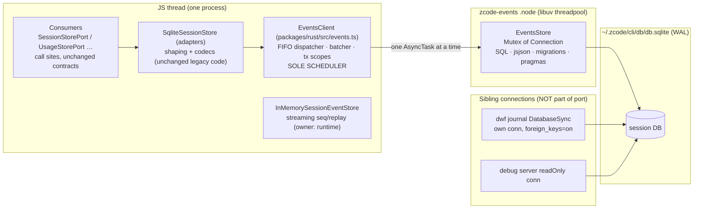

# Rust native port: session persistence store (`zcode-events`)

Status: active. Owner: EventsSpecAuthor (wave-2 spec). Written 2026-09-28 **before** any
implementation code, per `docs/specs/rust-native-ports.md`, `AGENTS.md:3`, and the
architecture-governance rule ("Write or update the spec before implementation … state the
behavior, ownership, invariants, failure semantics, and migration boundary",
`.agents/skills/architecture-governance/SKILL.md:14`; explicit time at `:19`; diagrams
for state/timing per `AGENTS.md:44`).

This wave delivers **only this file**. No crate, wrapper, or consumer code exists yet.

---

## 0. Naming reconciliation: what moves native (umbrella wording vs reality)

The umbrella spec (`docs/specs/rust-native-ports.md`, Wave 2 line) calls this port a
"rusqlite-backed session event store". The repo contains two different things called
"event store":

| Component | Interface | Where | Disk? | Verdict |
|---|---|---|---|---|
| Streaming session event store | `SessionEventStorePort` (`contracts/src/interfaces/session.port.ts:57`) | `InMemorySessionEventStore` — a per-runtime `Map` (`contracts/src/events/in-memory-session-event-store.ts:33-45`; `append` assigns sequence numbers at `:57-71`), constructed at `bootstrap/src/app/create-app.ts:730`, `bootstrap/src/app/workflow-facade.ts:299`, `zcode-protocol/server.ts:240`, `zcode-protocol/workspace-model-runtime.ts:53` | **No.** It is the in-memory seq/replay/retention authority with turn-window eviction (`in-memory-session-event-store.ts:26-32`) | **Stays TS.** A separate component, NOT a fallback: it shares no code path with the durable store; the runtime consumes both *simultaneously* (e.g. `bootstrap/src/app/subagent-observation.ts:41-42` reads `sessionStore.messages` **and** `eventStore.getEvents` in the same call); porting a Map with an injected clock (`now` option, `:16`) across napi buys nothing — it performs zero I/O. |
| Durable session persistence | `SessionStorePort` (`contracts/src/interfaces/session-store.port.ts:1095`), `UsageStorePort` (`:1076`), `LocalSettingStorePort` (`:1085`), `InputHistoryStorePort` (`contracts/src/interfaces/input-history.port.ts:39`), `ScriptWorkflowStorePort` (`contracts/src/workflow/script.ts:308`), plus the dwf journal capability | `SqliteSessionStore` (`adapters/src/storage/session-store/sqlite-session-store.ts:225-233`) over `node:sqlite` `DatabaseSync` (`:2`, opened `:248`) on `~/.zcode/cli/db/db.sqlite` (`paths.ts:6-8`) | **Yes** — messages/parts/sessions/usage/entries/inputs/targets/todos/permissions | **Moves native as crate `zcode-events`.** This is the "session event store" of the umbrella: durable rows for messages, parts, usage, and the durable event rows (checkpoint/rewind/steer) written through `saveSessionEntry`/`saveSessionInput` by `persistDurableSessionEvent` (`core/src/runtime/methods/events.ts:263-422`, gated at `:268`, branches `:270/:275/:320/:357/:386/:420`). |

**Ported component = the whole `SqliteSessionStore` surface on the session DB.** The
crate is named `zcode-events` because the umbrella names it so; within this spec,
"events" means *durable session persistence*. The streaming `SessionEventStorePort`
remains an in-process JS component (owner: the runtime instance), unchanged, not
replaced or shadowed by anything native — invariant 1 forbids *fallbacks*, and two
complementary state owners (live stream vs durable transcript) are not alternatives to
each other.

---

## 1. Motivation (measured evidence)

Structural facts (verified at file:line, 2026-09-28):

1. **Every durable write runs synchronously on the host event loop.** The repo functions
   the store delegates to are `async` but contain no `await`: `saveMessage`
   (`repositories/messages.ts:40-104`), `savePart` (`:113-190`), `pruneUsage`
   (`repositories/usage.ts:335-348`), `messages` (`messages.ts:221-259`). Each call does
   prepare + btree work + a WAL commit inline on the JS thread.
2. **The prune storm.** Every usage upsert is followed by `await pruneUsage(db)`
   (`usage.ts:332` tool, `:163` model, `:256` turn); the pruner runs
   `begin immediate` + 3 `delete`s + `commit` (`usage.ts:340-345`). Upserts fire from 8
   event sites (`core/src/runtime/methods/usage-observability.ts:232, 240, 249, 257, 267,
   278, 299, 313`) plus the per-tool-call aggregate
   (`core/src/runtime/methods/turn-tool-usage.ts:18`) → **3–7 `BEGIN IMMEDIATE … COMMIT`
   cycles per tool call**, each a separate durable commit, all blocking the loop.
3. **Every transcript write also touches the session row**: `saveMessage`/`savePart`
   each run `touchSession` (`messages.ts:100`, `:181`; `repositories/sessions.ts:339-343`).
4. **Reads are heavy and sync**: `messages()` is two full-session `SELECT *` plus
   row-at-a-time `JSON.parse` (`messages.ts:221-259`), consumed by ≥23 files across
   bootstrap/core (resume `core/src/runtime/methods/resume.ts:92-95`, transcript
   `bootstrap/src/session-transcript.ts:47`, forks
   `core/src/runtime/methods/session-fork.ts:817,924,1063,1090`, subagent scans
   `bootstrap/src/app/subagent-observation.ts:41,55,101`, protocol rebuilds
   `zcode-protocol/server-operations.ts:977,1708,1717`, cold merge
   `zcode-protocol-v4/cold-event-merge.ts:74`, …).
5. **No transaction wraps turn transcript writes.** The only `begin immediate` sites are
   fork bundles (`sqlite-session-store.ts:337, 396`), shared-context (`:491, 518`),
   permission full access (`permission-full-access.ts:17`), input ledger
   (`session-inputs.ts:151, 201`), input history (`input-history.ts:40`), todos
   (`todos.ts:30`), usage prune (`usage.ts:340`), migrations
   (`migration-runner.ts:159`). Per-message/part upserts auto-commit individually.

Measured on this workstation (scratch bench under `/tmp/events-spec-bench`, outputs
quoted here; scripts are throwaway):

| Measurement | Method | Result |
|---|---|---|
| Real DB shape | read-only open of `~/.zcode/cli/db/db.sqlite` (295,469,056 bytes) | 111 sessions, 4,241 messages, 25,660 parts, 13,909 `tool_usage`, 3,662 `model_usage`; `journal_mode=wal`; `synchronous=2` (**FULL** — no `PRAGMA synchronous` exists anywhere in `session-store/`, confirmed by grep) |
| `messages()`-equivalent read of the largest session (229 messages / 904 parts) | exact legacy SQL + per-row `JSON.parse` decode, page-cached, node:sqlite | **72.8 ms mean** (n=20) — sync, on the event loop, per call |
| Durable commit floor (WAL class) | `write(8KB) + fdatasync` on the real home filesystem (btrfs/ssd/zstd) | **11.0 / 7.5 / 6.1 / 6.1 ms** across 4 rounds → each legacy per-upsert `COMMIT` is an event-loop stall of this class on this host |
| CPU cost of one usage upsert + prune (tmpfs, fsync excluded) | synthetic DB with the real 13,909 usage rows loaded | 0.083 ms (prune alone 0.021 ms) → the dominant real cost of the storm is the per-commit flush, not the SQL |
| `saveMessage` + `touchSession` (tmpfs) | same DB | 0.088 ms per call (2 statements, 2 implicit commits) |

Conclusion: one tool call in a live turn costs the host loop 3–7 fsync-class commits
plus transcript upserts and touches, and a resume/fork/subagent scan costs ≥70 ms of
dead loop per `messages()` call — all inside async functions that could run on a worker.
The port moves compute + I/O off the loop and fixes the prune storm **by construction**
(§4.2).

---

## 2. Scope

### 2.1 Ported (crate `zcode-events` + wrapper + adapters integration)

- All 5 port interfaces implemented by `SqliteSessionStore`
  (`sqlite-session-store.ts:225-233`): `SessionStorePort`, `UsageStorePort`,
  `LocalSettingStorePort`, `InputHistoryStorePort`, `ScriptWorkflowStorePort`.
- Connection lifecycle: open, WAL/foreign_keys/busy_timeout pragmas, the full migration
  runner (lock acquisition, retries, ledger, checksums, facts, progress), close.
- The SQL execution layer behind every repository function currently under
  `adapters/src/storage/session-store/repositories/{messages,sessions,session-entries,
  session-inputs,todos,local-settings,input-history,permission-full-access,usage,debug}.ts`,
  `adapters/src/storage/session-target.ts`, and the store-class transaction bodies.
- Write batching: consecutive transcript/usage writes commit in one transaction with one
  coalesced prune (§4.2) — a property of the native implementation, not a TS patch.

### 2.2 NOT ported (siblings / non-goals — separate features, never fallbacks)

- **Streaming `SessionEventStorePort` / `InMemorySessionEventStore`** — different owner
  (runtime instance), zero I/O (§0). Unchanged.
- **Dwf journal + introspection** (`repositories/dwf-journal*.ts`) — **ported** as the
  synchronous surface of the same `zcode-events` crate (§14). The domain contract
  `JournalStorePort` is synchronous by design
  (`dynamic-workflow/src/engine/types.ts:878-879`; rationale at
  `repositories/dwf-journal.ts:4-10` and `engine/journal-memory.ts:4-5`: "synchronous
  methods fit node:sqlite's DatabaseSync, and keep the core deterministic"), and its
  consumers probe it synchronously (`bootstrap/src/app/dynamic-workflow-run-journal.ts:44-57`
  plus artifact/workspace/introspection capability probes). Porting therefore keeps the
  methods synchronous: the native `DwfJournal` exposes sync `exec(op, payload)` calls
  over its own rusqlite connection, and the TS files keep only the frozen codecs. The
  journal was opened lazily by `SqliteSessionStore.workflowJournalStore()`, with
  `PRAGMA foreign_keys = on` + `busy_timeout = 5000` (parity with the legacy single
  connection: `foreign_keys` from the migration runner (`migration-runner.ts:137`),
  `timeout: 5000` from `sqlite-session-store.ts:242,248`). A second same-file connection
  is already production reality — the debug server opens `db.sqlite` read-only
  (`debug/server/sources.ts:5,75`).
- **Debug server reads** (`debug/server/sources.ts`) — read-only sibling, untouched.
- **Tasks-index / automation / off-peak DBs** (`packages/services/src/session/*Repo.ts`)
  and **chrome cookies** (`packages/desktop/src/main/chromeCookieManager.ts`) —
  different files, untouched.
- Non-goals: no contract type changes; no change to the streaming event model; no async
  migration of callers beyond the enumerated sites (§5.3); no retry/timeout layer
  anywhere (`AGENTS.md:41` forbids masking sync issues with timeouts).

### 2.3 Sync vs async decision (event-loop rule 4) — all DB ops async

**Every** native operation is an `AsyncTask` (Promise), including small writes: even a
single-statement upsert performs a durable commit whose fsync latency is unbounded
(measured 6–11 ms on this host). Exactly two sync exports, both short primitives with no
I/O:

- `EventsStore` constructor (validates options, allocates state).
- `close()` (marks closed + releases the handle; the connection drops on the worker
  after in-flight tasks drain — §5.3/§5.4-H6).

Reads (`messages`, `messageWithParts`, `listSessions`, `queryAppUsage`, …) are async
with JSON row transfer: measured 72.8 ms for one session (§1); contract shapes stay
identical because the TS codecs still build them (§3.3).

---

### 2.4 Ownership

| Piece | Owner |
|---|---|
| `packages/rust/crates/zcode-events/**`, `packages/rust/src/events.ts`, this spec file | EventsSpecAuthor |
| adapters integration: `sqlite-session-store.ts`, `migration-runner.ts`, `storage/session-store.ts` barrel, the deleted repositories (§5.1) | EventsSpecAuthor |
| consumer files (§5.3), incl. `scripts/shadow-replay.mjs` and bootstrap permission-mode reads | EventsSpecAuthor |
| shared files: `packages/rust/Cargo.toml`, `package.json`, `tsconfig.json`, `src/loader.ts`, `src/index.ts`, `scripts/build-native.sh`, umbrella spec, `architecture-policy.yaml`, `apps/zcode-cli/packages/cli/scripts/build.mjs`, root `package.json` | main session — change requests in §11 |
| dwf-journal files (`dwf-journal.ts`, `dwf-journal-codecs.ts`, `dwf-journal-introspection.ts`, `dwf-journal-artifacts.ts`), `packages/rust/src/events.ts` (journal client), debug server, streaming `InMemorySessionEventStore` | that port's agent (§14); debug server / streaming store untouched |

### 2.5 Invariants (engine rules 1–7 made concrete)

1. **Zero JS fallback.** The only path is `loadEvents()` → `loadNative`
   (`loader.ts:59-75`), which hard-throws when the binary is missing; no try/catch→legacy,
   no env flag, no degraded mode (§8; grep gate §10.5).
2. **Legacy deleted, not disabled.** §5.1 deletion table with verified caller graphs;
   grep proofs §10.5.
3. **No behavior forks.** §3.3 parity table (byte/shape claims) + harness §10.4; every
   intentional difference is enumerated in §9, nothing else.
4. **Event-loop rule.** All DB operations are `AsyncTask`s; the only sync exports are
   the I/O-free constructor and `close()` (§2.3).
5. **Process rule.** The ported feature performs zero child-process spawns. Unported
   siblings (debug-server reads, streaming in-memory event store — §2.2) are separate
   features, documented here, never alternatives.
6. **Abort parity.** §6.
7. **Packaging.** `@zcode/rust` stays esbuild-external (`build.mjs:14` already lists
   it); the `.node` loads only through `loadNative`; staging into desktop/SEA artifacts
   is the sibling wave `rust-native-packaging.md`.

---

## 3. Crate API design

### 3.1 napi surface (exact signatures; pattern follows `crates/zcode-image/src/lib.rs:702-797`: `AsyncTask<T>` + `Task::compute` on the libuv threadpool)

```rust
// packages/rust/crates/zcode-events/src/lib.rs — wave-2 implementation; this is the spec sketch.

#[napi(object)]
pub struct EventsOpenOptions {
  pub db_path: String,
  /// legacy DatabaseSync { timeout } + migration budgets:
  pub startup_lock_timeout_ms: u32,   // default 5_000  (migration-runner.ts:13)
  pub migration_lock_wait_ms: u32,    // default 3_600_000 (migration-runner.ts:45)
  /// test-only, mirrors options.forkCommitFaultAt (options.ts:5-9)
  pub fork_commit_fault_at: Option<String>,
}

#[napi(object)]
pub struct MigrationStepResult {
  /// "progress" | "delay" | "done"
  pub kind: String,
  /// SqliteMigrationProgress as JSON (bootstrap validates it with zcodeStorageStartupStateSchema)
  pub progress: Option<String>,
  pub delay_ms: Option<u32>,
}

/// One unit of store work: named op kind + JSON payload (transport per §3.3).
#[napi(object)]
pub struct StoreOp { pub kind: String, pub payload: String }

#[napi]
pub struct EventsStore { /* Arc<StoreInner>: Mutex<Option<Connection>> + closed/in_tx flags */ }

#[napi]
impl EventsStore {
  #[napi(constructor)]
  pub fn new(options: EventsOpenOptions) -> Self;            // SYNC, no I/O

  /// Runs the native migration state machine to its next yield point (progress | delay | done).
  /// No argument: the frozen migration list is owned by the crate (§4.4).
  #[napi] pub fn migrate_step(&self, migrations: String) -> AsyncTask<MigrateStepTask>;
  //  → Promise<MigrationStepResult>

  /// One write batch: BEGIN IMMEDIATE …ops… [coalesced prune] … COMMIT   (§4.2)
  #[napi] pub fn write_batch(&self, ops: Vec<StoreOp>) -> AsyncTask<WriteBatchTask>;
  //  → Promise<String /* JSON array of per-op results/errors, same length as ops */>

  /// Barrier read (the dispatcher flushes the pending batch first).
  #[napi] pub fn read(&self, op: StoreOp) -> AsyncTask<ReadTask>;   // → Promise<String /* rows JSON */>

  /// Transaction scope for TS-orchestrated legacy transactions (§4.3).
  /// Only the scope owner reaches these — the JS dispatcher is the single scheduler.
  #[napi] pub fn tx_begin(&self) -> AsyncTask<TxTask>;                 // begin immediate
  #[napi] pub fn tx_exec(&self, op: StoreOp) -> AsyncTask<TxExecTask>; // op inside the open tx; rows for reads
  #[napi] pub fn tx_commit(&self) -> AsyncTask<TxTask>;
  #[napi] pub fn tx_rollback(&self) -> AsyncTask<TxTask>;

  /// Marks closed; rejects new calls; already-issued ops drain; connection released after the last task.
  #[napi] pub fn close(&self);                                        // SYNC, no I/O
}
```

- Loaded through `loadNative("zcode-events")` (`packages/rust/src/loader.ts:59-75`) via
  the existing subpath `@zcode/rust/events` → `src/events.ts`
  (`packages/rust/package.json:11` — export already exists, currently dangling).
- **No sync DB calls ever.** No raw-SQL escape hatch: `read`/`tx_exec` take named op
  kinds whose SQL is compiled into the crate (verbatim from the legacy repos), so the
  SQL surface is a closed, reviewable enum — not a node:sqlite clone.
- Multiple `EventsStore` instances (legacy also opened multiple `DatabaseSync`s, e.g.
  `bootstrap/src/sessions.ts:14` beside the app store) each own one connection;
  cross-process writers keep today's semantics (WAL + `BEGIN IMMEDIATE` + busy_timeout).

### 3.2 Operation set (decision 2)

Rule: **one legacy sync unit of atomicity = one op kind** (bodies without their own
transaction), or **one TS-driven transaction scope** (bodies with their own
`begin immediate` where TS decodes/mutates rows in between).

| Family | Single op kinds (SQL ported verbatim) |
|---|---|
| sessions | `createSession`, `updateSession`, `getSession`, `listSessions`, `claimLegacySessionWorkspace`, `repairLegacyRemoteSessionWorkspace`, `repairRemoteSessionPaths`, `setRevert`, `clearRevert` (`repositories/sessions.ts`) |
| messages/parts | `saveMessage`, `removeMessage`, `savePart`, `removePart` (with native copy-legacy merge, §3.3), `messages`, `messageWithParts` (`messages.ts:40-259`) |
| entries/ledger | `saveSessionEntry`, `sessionEntries`, `saveSessionInput`, `markSessionInputPromoted`, `settleSessionInput`, `listSessionInputs`, `getSessionInputById` |
| targets | `readTarget`, `setTarget`, `cloneTargetForFork`, `createTarget`, `updateTargetStatus`, `startTargetRun`, `heartbeatTargetRun`, `finishTargetRun`, `recoverInterruptedTargetRun`, `accountTargetUsage`, `updateTargetSummaryTitle`, `clearTarget` (`session-target.ts`) |
| todos | `readTodos`, `updateTodos` (its `begin immediate` at `todos.ts:30` becomes the op's internal transaction) |
| permissions/local settings | `getProjectPermission`, `saveProjectPermission`, `getProjectPermissionMode`, `saveProjectPermissionMode` (`local-settings.ts`) |
| usage | `recordModelUsage`, `upsertTurnUsage`, `upsertToolUsage`, `pruneUsage`, `queryAppUsage`, `queryTaskUsage` (`usage.ts`) |
| input history | `recordInputHistory` (internal tx, `input-history.ts:40`), `recallPreviousInputHistory` |
| script workflow | the 12 `ScriptWorkflowStorePort` methods (`script-workflow-runs.ts`, `script-workflow-activities.ts`) |
| tx row primitives (usable only under `tx_begin`) | `getAdmittedSessionInputRow`, `setAdmittedSessionInputRow` — the ad-hoc prepared statements from `permission-full-access.ts:28-49` and `session-inputs.ts:137-190` |

Transaction-scope flows (TS orchestration unchanged; each `this.db.…`/repository call
becomes `tx_exec`; own `begin/commit/rollback` become `tx_begin/tx_commit/tx_rollback`):
`createForkedSessionWithMetadata` (`sqlite-session-store.ts:337-381`),
`commitForkBundle` (`:396-470`, incl. `assertForkBundleChildLocal` and the
`forkCommitFaultAt` stages, which stay TS between `tx_exec` calls),
`commitSharedContextImportBundle` (`:491-514`), `transitionSharedContextImport`
(`:518-577`), `commitPermissionFullAccess` (`permission-full-access.ts:6-51`),
`updateSessionInputs` (`session-inputs.ts:137-190`), `promoteSessionInput`
(`session-inputs.ts:191-268`).

Rationale (decision): these bodies `JSON.parse`/modify/re-stringify rows *inside* their
transaction and reuse the frozen legacy codecs/shaping (e.g. `promoteSessionInput`
decodes entries and messages via `codecs.ts` mid-transaction at `session-inputs.ts:220-257`).
Keeping them in TS over a locked transaction scope preserves that logic byte-for-byte
(parity by construction); porting `decodeMessageRow`/`decodeStoredMessage`
(`codecs.ts:84-145`) and the shared-context orchestration into Rust would duplicate the
frozen mappers — the exact risk invariant 3 forbids.

### 3.3 Transport & data-shape parity table (decisions 2, 7; invariant 3)

Everything crossing the boundary is a JSON string (UTF-8); no `#[napi(object)]` domain
payload structs (keeps `@zcode/rust` dependency-free — `packages/rust/package.json` has
no `dependencies` — and keeps the typed layer in TS where the contracts live).

| Direction | Legacy shape | Native shape | Parity claim |
|---|---|---|---|
| Write payload (message/part/session/entry/input/usage/target/todo/…) | TS object shaped by *unchanged legacy shaping code* (user.model projection `messages.ts:45-61`, `model_change`/`subtask` projections `:114-145`) then `encodeJson` (`json.ts:1-3`) | the exact bytes TS produced, stored as the `data` column (usage rows map to columns via serde structs with identical field names/types) | **Byte-identical column text** — TS owns `JSON.stringify`; Rust does zero domain shaping on writes |
| Copy-legacy merge (`saveMessage`/`savePart` with `copyFrom`: SELECT original → `{...data, legacy keys…}` → stringify, `messages.ts:184-203`) | JS object merge + JS stringify | in-crate `jsjson` module: parse into UTF-16 code-unit values, same merge algorithm (existing key keeps position, new key appended in `keys` order), re-stringify with `JSON.stringify` rules (minimal escaping, named control escapes, `\uXXXX` for lone surrogates per well-formed stringify, JS number formatting) | **Byte-identical**, enforced by harness fixtures incl. escapes, non-BMP, lone surrogates, key-present/key-absent; a mismatch is a bug to fix, never an enumerated divergence |
| Read result (`messages()`, `sessionEntries()`, `getSession()`, usage queries, …) | row objects from `db.prepare().all()` (`messages.ts:226-245`) → **TS codecs** build contract objects (`codecs.ts:84-145,158+`, `json.ts:5-7`) | row objects as JSON `[{"col": value,…}, …]` with the same column names and value types (TEXT→string, INTEGER→number, NULL→null; the schema has **zero BLOB columns** — verified by scanning all `sqlite_master` SQL of the real DB), then **the same TS codecs** | **Byte-identical decoded output** (`JSON.stringify(legacy) === JSON.stringify(native)`): same row bytes + same decode code; row-object key order is irrelevant (codecs construct new objects in fixed order) |
| Write results needing read-back (`createSession`, `updateSession`, …) | contract object built by the repo's own read-back | rows JSON + same codec | deep/byte-equal via harness |
| Migration progress | `SqliteMigrationProgress` yielded by `migrationSteps` (`migration-runner.ts:28-38`; yields at `:136-215`) | JSON of the same shape (`phase`, `elapsedMs`, `migration` facts, `migrationId`, `completed`, `total`, `errorCode`, …) | must parse under `zcodeStorageStartupStateSchema` exactly as today (`storage-startup.ts:21-28`); facts follow `databaseMigrationFactsSchema` |
| Errors | node:sqlite errors carrying numeric `errcode` (read by `isSqliteBusyError`, `migration-runner.ts:233-241`) | Rust errors carrying `errcode` (SQLite result code), `migrationId`, `dbPath`, `kind` | `classifyDatabaseStartupError`/`databaseStartupErrorDetails` (`packages/shared/src/database-startup.ts:20-63`) walk `errcode`/`kind`/`cause`; the wrapper re-wraps into `SqliteSessionMigrationError` (`errors.ts:7-22`) so classification is unchanged. Error **message text** may differ — not a contract (no code string-matches it; the only SQLite-pattern match in the repo is the unrelated Node warning filter `runtime-warnings.ts:9-10`) |

Numbers: INTEGER columns are timestamps/counts/sequences (max observed 1.79e12 « 2^53);
`i64 → f64` matches node:sqlite's default number mode (asserted by harness row dumps).

## 4. State owners, explicit time, batching & migration runner (decisions 3, 4, 5)

### 4.1 Owners, event order, idempotency

Owners:



- **Event order (explicit time):** every store call is totally ordered by its JS
  *invocation* order. The dispatcher keeps one FIFO queue and issues **one native task
  at a time**; because legacy op bodies executed synchronously at invocation, FIFO
  dispatch is exactly legacy's execution order. Reads and transaction scopes are
  barriers: a read waits for the in-flight batch; a scope waits for both.
- **Owner/lease:** one `EventsStore` (one connection) per open store is the sole writer
  for this process; cross-process writers are serialized by SQLite itself
  (`BEGIN IMMEDIATE`, busy_timeout 5000) — unchanged from today. The dispatcher, not a
  native lock, is the scheduler; the native `Mutex` is a defensive backstop. No
  timeout-based coordination anywhere (`AGENTS.md:41`).
- **Idempotency keys** (upsert semantics unchanged, `ON CONFLICT`): `message.id`,
  `part.id`, `session.id`, `session_entry.id`, `session_input.id`, usage record `id`,
  `(session_id)` for todos/targets, `(project_id)` for local settings. The dispatcher
  **never retries** a failed op (at-most-once dispatch), so internal replays cannot
  duplicate; caller-visible idempotent flows (e.g. fork command-fact re-commit,
  `sqlite-session-store.ts:399-412`) are the same TS logic as today.
- **Stale-result rule:** no cache exists; a read dispatched after an awaited write is
  guaranteed to observe it (FIFO + batch barrier). A *floating* (never-awaited) write
  may not be visible to a later read — hazard H1 (§5.4).
- **Replay/resume boundary:** resume rebuilds purely from durable rows
  (`resume.ts:72,92-95`); streaming `SessionEvent`s are not durable today and remain
  not durable — restart behavior is unchanged.
- **Delivery kind:** local in-process promises; no IPC/remote delivery semantics apply.

### 4.2 Write batching — the prune storm fixed by design (decision 3)

```mermaid
sequenceDiagram
  participant T as Caller A (stream chunk)
  participant U as Caller B (usage event)
  participant D as EventsClient dispatcher
  participant N as native write_batch
  Note over T,U: both await; ops queue in invocation order
  T->>D: savePart(p1)
  U->>D: upsertToolUsage(u1)
  T->>D: savePart(p2)
  U->>D: upsertToolUsage(u2)
  D->>N: write_batch([savePart p1, upsert u1, savePart p2, upsert u2])
  Note over N: BEGIN IMMEDIATE<br/>op op op op<br/>prune ONCE (batch had usage ops)<br/>COMMIT — one flush
  N-->>D: per-op results
  D-->>T: resolve(p1, p2)
  D-->>U: resolve(u1, u2)
```

- Consecutive non-transactional write ops commit in **one** `BEGIN IMMEDIATE … COMMIT`.
- **Prune coalescing:** legacy runs the 3-DELETE pruner after *each* usage upsert
  (`usage.ts:332,163,256`); the native batch runs it **once per batch** at the batch
  end if any usage op (or the public `pruneUsage` op) occurred — retention deletes
  commute; `beforeTime` = batch-commit time (drift ≤ batch duration, enumerated D2).
  The 3–7 fsync-class commits per tool call collapse into the batch's single commit.
- Promise settlement: an op resolves only after its batch commits; **on batch failure
  the whole batch rolls back and every op in it rejects** (enumerated D1).
- Barrier flush points: any read op, any transaction scope, `close()`.
- `Date.now()` for `time_created`/`time_updated`/`beforeTime` is captured in TS at
  invocation and passed in (legacy also computed it at invocation, inside the body) —
  queue wait never shifts timestamps (hazard H2).

### 4.3 Transaction scopes (sole-owner lock)

`withTransaction(fn)` on the client: flush pending batch → `tx_begin` → run the legacy
TS body with repository calls mapped to `tx_exec` → `tx_commit`/`tx_rollback`. While a
scope is open the dispatcher **holds the queue**: any other caller's op waits until
commit/rollback — reproducing legacy's run-to-completion atomicity and closing the
microtask-yield window that legacy's `await`-between-statements fork methods technically
had (D4). Native side: an `in_tx` flag suppresses implicit `BEGIN` inside ops, so the
same op code serves both batch and scope.

### 4.4 Migration runner split (decision 4 — what stays TS and why)

- **Moves native (compute):** lock acquisition + busy retry/backoff
  (`migration-runner.ts:113-134`), `foreign_keys`/WAL pragmas (`:137-150,247-253`),
  `begin immediate` + ledger create + per-migration checksum (`sha256` of trimmed SQL) +
  SQL exec + ledger insert (`:159-201`), facts inspection (`inspectMigrationKind`,
  `:318-336`), busy_timeout switching (25 ms during migration, restore 5 000 after —
  `:46,66,92`), rollback-on-failure (`:195-198,204-232`).
- **Moves native (data, revision):** the **Migration SQL definitions** — previously
  `migrations.ts` (22 entries, 930 lines) plus `migrations/0020-0022*.ts` (`0020` was a
  pure TS string builder). They now live in `crates/zcode-events/src/migrations.rs` as 22
  frozen constants plus `migration_definitions()`; `0020`'s generated output is frozen
  verbatim (it was constant — it read no live data). `migrate_step` takes no argument and
  no migration SQL text remains in TypeScript. The move is gated on **byte stability**,
  not inspection: `migrations.rs` pins the 22 real `schema_migration` digests
  (`sha256(JS-trim(sql))` read from a production `db.sqlite`) as a test, so any drift
  fails the build instead of surfacing as `checksum_mismatch` on a user's database. This
  supersedes the original “SQL data stays TS” decision, which traded exactly that drift
  risk for authoring convenience; the task-index port made the identical move into
  `schema.rs`. The crate still validates the list shape (non-empty; id regex
  `^[a-zA-Z_0-9-]{1,128}$` per `databaseMigrationIdSchema`) in `validate_migrations`.
- **Stays TS (driver only):**
  - **Step driver + progress + error normalization** — the async loop shape of
    `runSqliteSessionMigrationsAsync` (`:59-97`): consume `migrate_step` results,
    `await onProgress(...)` (required: `storage-startup.ts:31-37` awaits the transport
    flush *before* the next SQL step may run), honor `{delayMs}` on JS timers, wrap
    failures via `normalizeMigrationError`/`lockTimeoutError` (`:259-286`) into
    `SqliteSessionMigrationError` (`errors.ts`).
  - Checksum parity: legacy hashes `sql.trim()` with JS `String.trim`
    (`:296-298`); JS White_Space **includes U+FEFF**, Rust's `str::trim` does not — the
    crate implements JS trim in the checksum path.
- **Deleted sync path:** `runSqliteSessionMigrations` + `waitSync`/`Atomics.wait`
  (`:18,49-57,255-257`) and the two-phase `deferredStartup` constructor
  (`sqlite-session-store.ts:223,238-269`) — a synchronous open would block the loop
  through the whole migration, so it ceases to exist.

---

## 5. Migration boundary (decision 4)

### 5.1 Deleted (invariant 2 — caller graphs verified before listing)

| File / symbol | Evidence of last caller |
|---|---|
| `adapters/src/storage/session-store/repositories/{messages,sessions,session-entries,session-inputs,todos,local-settings,input-history,usage}.ts` | only imported by `sqlite-session-store.ts:92-103` (+ internal cross-imports) |
| `…/repositories/{permission-full-access,debug}.ts` | only `sqlite-session-store.ts:1,92` |
| `adapters/src/storage/session-target.ts` | only `sqlite-session-store.ts:76-77` |
| `createSqliteSessionStore` (sync ctor with sync migrations, `sqlite-session-store.ts:1010-1014`) | only `scripts/shadow-replay.mjs:61` (+ barrel) |
| `SqliteSessionStore.debugMigrationIds()` / `debugCounts()` (`:1001-1007`) + `SessionStoreDebugCounts` | repo-wide grep: zero callers outside `dist/` |
| `SqliteSessionStore.getDatabasePath()` (`:292-294`) | grep: zero callers |
| barrel export `createDwfJournalStore` (`storage/session-store.ts:7`) | zero external callers (`sqlite-session-store.ts:997` was the only use; replaced by the journal's own connection opener) |
| `runSqliteSessionMigrations` sync runner, `waitSync`, `deferredStartup` two-phase ctor | §4.4 |
| all `this.db.prepare/exec` SQL in the store class + deleted repos | SQL text moves into the crate verbatim |

Kept deliberately (shape/sibling, not legacy engines): `codecs.ts`, `rows.ts`, `json.ts`, `paths.ts`
(`getDefaultSessionDbPath`/`ensureParentDir` stay; the wrapper still calls
`maybeThrowStorageFsFault({operation:"sqliteOpen"})` before open, legacy
`sqlite-session-store.ts:244-245`), `fs-fault-injection.ts` (`sqliteRun` hook before
each write batch — the `ZCODE_E2E_FS_FAULTS` contract survives), `errors.ts`,
`options.ts`. The `dwf-journal*.ts` files stay TS for their frozen codecs and typed
ports, but their `node:sqlite` handle is replaced by the native `DwfJournal` (§14).

### 5.2 Rewritten (owner: EventsSpecAuthor — consumer integration files)

- `adapters/src/storage/session-store/sqlite-session-store.ts` — same class name, same
  exported symbols; methods become: shape (legacy code moved here from the deleted
  repos) → client op → decode rows with unchanged `codecs.ts`.
  `workflowJournalStore()` keeps its sync signature over the journal's own connection.
  `forkCommitFaultAt`, `startupLockTimeoutMs`, fault hooks preserved (`options.ts`).
- `adapters/src/storage/session-store/migration-runner.ts` — reduced to types + step
  driver + error normalization (§4.4).
- `adapters/src/storage/session-store.ts` (barrel) — drop deleted exports; keep
  `SqliteSessionMigrationError`, `SqliteMigrationProgress`,
  `AsyncSqliteMigrationOptions`, `SqliteSessionStoreOptions`, `getDefaultSessionDbPath`,
  `openStartupSqliteSessionStore`, `SqliteSessionStore`, dwf introspection types.
- `packages/rust/src/events.ts` (new) — `loadEvents()` + the contract-free
  `EventsClient` (FIFO dispatcher, batcher, tx scopes, `close`). It must not import
  `@zcode/contracts` (dependency-free package); typing lives in adapters.

### 5.3 Consumers changed (exact edits)

| File | Change | Why |
|---|---|---|
| `bootstrap/src/app/session-store.ts:39-46` | `readProjectPermissionMode` becomes async (`await store.getProjectPermissionMode(...)`), drop the `isPromiseLike` guard | **sync→async hazard #1**: the helper deliberately returns `undefined` for promise-returning stores (`:44-45`); unchanged, the persisted permission mode would silently vanish |
| `bootstrap/src/app/create-app.ts:241-243` | `const persistedMode = options.runtimeConfig?.mode ? undefined : await readProjectPermissionMode(...)` | sole caller of the helper |
| `bootstrap/src/sessions.ts:14,38` | `sessionStore = await openStartupSqliteSessionStore(...)` | synchronous open (ctor + Atomics-wait migrations) no longer exists |
| `scripts/shadow-replay.mjs:61` | `const store = await openStartupSqliteSessionStore({ dbPath })` | replaces deleted `createSqliteSessionStore` |
| `bootstrap/src/zcode-protocol/storage-startup.ts`, `runtime-cleanup.ts:62-64`, `zcode-protocol-entrypoint.ts:142`, `session-facade.ts:428` | **no change** | `close()` stays sync (§3.1); facade already `await`s `saveProjectPermissionMode` (port type allows `Promise`, `session-store.port.ts:1092`) |

`close()` staying synchronous is deliberate: `isClosableSessionStore`
(`session-store.ts:17-22`), `closeSessionStore` (`:70-72`), `sessions.ts:26,49`,
`storage-startup.ts:113`, `runtime-cleanup.ts:63` all keep exact behavior.

**Consumer package.json:** none — `adapters/package.json:110` already depends on
`@zcode/rust` (used by the image port, `adapters/src/image/index.ts:10`).

### 5.4 Sync→async hazards enumerated (governance "explicit time")

| # | Hazard | Rule / resolution |
|---|---|---|
| H1 | Legacy bodies completed at invocation; floating (never-awaited) calls were durable immediately | **Rule: every store call must be awaited or explicitly `void`-flushed before any dependent read.** Known sync-assumption sites: only the `LocalSettingStorePort` pair (§5.3). Acceptance includes a grep audit for un-awaited port-method calls |
| H2 | Timestamps shift with queue latency | `nowMs` captured in TS at invocation, passed to ops (§4.2) |
| H3 | Re-entrancy: other ops sneaking between a legacy sync body's statements | FIFO single-in-flight for ops + queue lock for tx scopes (§4.3); harness test: an op issued during an open scope executes after commit (D4 notes legacy's weaker window) |
| H4 | Error timing: sync-throwing methods become rejections | ports were already `async` except `getProjectPermissionMode`/`saveProjectPermissionMode` (§5.3); `workflowJournalStore()`/`close()` stay sync |
| H5 | Read-after-write in the same tick | preserved by batch barriers (stale-result rule §4.1) |
| H6 | `close()` during in-flight ops | close marks closed; ops issued before close drain (their promises settle); later calls reject `store_closed` |
| H7 | Abort window on `commitPermissionFullAccess` | §6 |
| H8 | Batch failure semantics | D1 |

---

## 6. Abort / cancellation parity (invariant 6)

The only port method taking `AbortSignal` is `commitPermissionFullAccess`
(`session-store.port.ts:1153-1161`, `signal?: AbortSignal` at `:1158`; caller pre-checks at
`core/src/runtime/permission-full-access.ts:66`). Legacy semantics:
`signal.throwIfAborted()` then a fully synchronous `begin … commit`, so **no JS could run
between check and commit** — the guarantee stated at
`permission-full-access.ts:5`.

Port rule: the check happens (a) at method entry (legacy's exact position) and (b) at
scope dispatch, immediately before `tx_begin`; once dispatched there is **no re-check**.
Because the scope runs under the queue lock, an abort firing mid-scope does not change
the outcome: the transaction commits and the promise resolves — precisely what legacy
produced for any abort it could not observe (it had zero observation points
mid-transaction). The port therefore does **not** race the promise against the signal:
racing would create the worse divergence "caller sees `AbortError` while the receipt row
committed". Residual window: an abort firing between the dispatch-time check and the
native `BEGIN` beginning execution — bounded by one task dispatch; the outcome
(commit; promise resolves) matches legacy's for post-check aborts. No other port method
accepts a signal, so no other method needs one (no native cancel handle is required;
the `ImageCancelHandle` pattern at `crates/zcode-image/src/lib.rs:32-51` stays an image
concern).

---

## 7. Schema & PRAGMA parity (decision 6)

| Property | Legacy | Port | Note |
|---|---|---|---|
| File | `~/.zcode/cli/db/db.sqlite` (`paths.ts:6-8`), same path resolution incl. `config.storage.sessionDbPath` | identical (native receives the path from TS after `ensureParentDir`) | same file |
| Schema | 22 migrations + ledger `schema_migration` | identical SQL executed by the same native runner from the crate-owned list (§4.4) | ledger rows byte-comparable; the real ledger holds **23** rows — one id absent from this checkout (`0023_code_plan_execution_state`, written by some newer build). The runner only reads *known* ids (`migration-runner.ts:171-198`) and takes the baseline via `ORDER BY id DESC LIMIT 1` (`:165-169`); the native runner must mirror both behaviors — harness asserts identical facts/progress on this very DB |
| Journal mode | WAL via `pragma journal_mode = wal` (`migration-runner.ts:139-150,248`) | same pragma text in the native runner | — |
| `synchronous` | never set → SQLite default **FULL** (measured `synchronous=2` on the real DB) | never set → default FULL | unchanged: same fsync behavior; batching is the win, not weaker durability |
| `foreign_keys` | `= on` per connection (`migration-runner.ts:137`) | `= on` on the native connection **and** on the journal's own connection (§2.2) | per-connection pragma must be re-set on the new journal connection |
| `busy_timeout` | open `timeout: 5000` (`sqlite-session-store.ts:248`), migration `25 ms`↔restore `5000` (`migration-runner.ts:66,92`) | same values, same schedule, native | — |
| SQLite engine version | node:sqlite's bundled SQLite | rusqlite `bundled` (newer) | same file format & pragmas; **cross-version read compatibility between old/new builds is NOT contractually required** — no CI check, no guarantee — but it is expected to hold since the format and settings are unchanged |
| Process sharing | multiple local/remote agents share the file (`sqlite-session-store.ts:246-247`) | unchanged: WAL + `BEGIN IMMEDIATE` + busy_timeout | — |

---

## 8. Failure semantics

- **Binary missing / load failure** → `loadNative` throws the actionable error
  (`loader.ts:59-75`); `loadEvents()` has no try/catch, no env switch, no degraded mode
  (invariant 1). Proof: grep in acceptance.
- **Open failure** → wrapper throws `SqliteSessionMigrationError` (`errors.ts:7-22`,
  `kind: "open_failed"`) built from the native error's `errcode` — classification
  unchanged (`database-startup.ts:20-41`).
- **Migration failure** → rollback first, then a `failed` progress step carrying
  `errorCode`/`sqliteCode`/`migrationId` (legacy order at `migration-runner.ts:204-221`),
  then the normalized error; checksum mismatch → `kind: "checksum_mismatch"` with the
  legacy message (`:300-316`); lock budget exhaustion → `kind: "lock_timeout"`
  (`:279-286`). `SqliteSessionStore.openStartup` closes the store on failure exactly as
  today (`sqlite-session-store.ts:272-287`).
- **Op failure inside a write batch** → batch rolls back; every op in the batch rejects
  with the failing op's error; the dispatcher continues with subsequent ops (legacy:
  a throw never stopped later calls).
- **Transaction-scope failure** → `tx_rollback` from the TS `catch`, error propagates —
  identical structure to today (incl. `forkCommitFaultAt` injected failures).
- **Busy/locked after startup** → native surfaces `errcode` (SQLITE_BUSY primary 5);
  ops do **not** retry (legacy relied on `busy_timeout` only); no new retry policy.
- **Store closed** → calls reject with an actionable `store_closed` error (loud, not
  silent).
- Fault-injection parity: `sqliteOpen`/`sqliteRun` throws keep happening in the TS
  wrapper before open/batches; `forkCommitFaultAt` stages execute inside the native tx
  flow as today.

---

## 9. Divergences enumerated

- **D1 — batch atomicity vs prefix commit.** Legacy: N sequential auto-commits; a
  failure at op k left ops 1..k-1 durable. Port: consecutive writes share one
  transaction; on failure all batch ops roll back and reject together. Enumerated and
  intended (assignment decision 3: batching fixes the storm *by design*); at op level,
  "promise resolved ⇒ durable" still holds; no contract requires prefix-commit on
  failure.
- **D2 — prune timing.** `beforeTime` becomes batch-commit time; drift ≤ batch
  duration on a 30-day retention window (`usage.ts:17`). Idempotent monotone deletes.
- **D3 — error message text.** rusqlite message strings differ from node:sqlite's;
  structured `errcode`/`kind`/`migrationId` are preserved (§3.3); no caller matches
  message text.
- **D4 — nested-begin window closed.** Legacy fork/promote transactions contained
  `await`s between statements (e.g. `sqlite-session-store.ts:417-436`), so a store call
  issued from a competing microtask could hit "cannot start a transaction within a
  transaction". The queue lock serializes instead. Strictly safer; no production
  interleaving is known (drivers run one fork/promote at a time).
- **D5 — close() completion timing.** Legacy `close()` completed `sqlite3_close`
  before returning; port marks closed synchronously and releases the connection after
  in-flight tasks drain. WAL is crash-consistent; durability of issued-but-unsettled
  ops is guaranteed by awaiting them (H1), not by `close`.
- **D6 — abort dispatch window** for `commitPermissionFullAccess` (§6): one task
  dispatch wide; outcome matches legacy's post-check behavior; no racing.
- **D7 — `LocalSettingStorePort` sync members become promises** (§5.3); the contract
  already allows both (`session-store.port.ts:1086-1093`); the one sync-discriminating
  helper is updated in the same change.

---

## 10. Acceptance checklist (implementation wave, checked before merge)

1. Spec (this file) predates implementation in git history.
2. `cargo build --release -p zcode-events` succeeds; `pnpm --filter @zcode/rust build:native`
   emits `packages/rust/zcode-events.<platform>.node`.
3. Direct-load smoke: `node -e "const m=require('./packages/rust/zcode-events.linux-x64-gnu.node'); console.log(Object.keys(m))"`
   lists the §3.1 surface; a second `node -e` opens a `/tmp` copy of the real DB via the
   wrapper, runs `migrate_step` to `done`, and returns `messages()` rows.
4. Parity harness (scratch in `/tmp`, outputs quoted in the delivery report, scripts
   deleted after):
   - row-level: `JSON.stringify(legacyRead()) === JSON.stringify(nativeRead())` for
     `messages`/`messageWithParts`/`sessionEntries`/`getSession`/`listSessions`/usage
     queries over a copy of the real DB (largest session + edge sessions) and fixtures
     (unicode incl. non-BMP, lone surrogates, CRLF text, NULL columns, empty fields);
   - write-level: apply identical op sequences through legacy store and native store to
     two DB copies → `SELECT *` over every table, ordered → byte-equal dumps (esp. `data`
     JSON columns incl. `copyFrom` merge fixtures);
   - tx flows: fork bundle happy path + idempotent re-commit + corrupt-fact error +
     each `forkCommitFaultAt` stage (rollback parity), promote with/without
     shared-context refs + its two error paths, permission full access with
     abort-before-dispatch (no write) and abort-during-scope (commit, legacy parity),
     updateSessionInputs payload patching, input-history trim;
   - migration: open an untouched real-DB copy → same progress sequence/facts/ledger
     rows as legacy (incl. checksum-mismatch and busy-retry paths);
   - ordering: an op issued during an open tx scope executes after commit (D4).
5. Grep proofs: `node:sqlite` gone from `adapters/src/storage/session-store/**` except
   the dwf-journal sibling files; no `runSqliteSessionMigrations`/`Atomics.wait`/
   `deferredStartup`/`createSqliteSessionStore`/`debugCounts`; `loadEvents` has no
   `catch`→legacy shape; no un-awaited port-method calls (H1 audit); `git grep` shows
   deleted files have zero importers.
6. Typecheck: root `pnpm typecheck` (covers `packages/rust`) and
   `pnpm --dir apps/zcode-cli check` (turbo typecheck over adapters/bootstrap/core).
7. `pnpm lint` (oxlint) on owned paths and `pnpm architecture:check --changed` — no new
   violations (consumers import only `@zcode/rust/events`, no deep paths).
8. Startup smoke: launch the CLI against a throwaway DB copy → migration progress
   frames still parse (`zcodeStorageStartupStateSchema`), a turn persists messages/usage
   (batched), `close()` at shutdown.

---

## 11. Shared-file change requests (main session — IRC)

| File | Exact change | Why |
|---|---|---|
| `packages/rust/Cargo.toml` | add to `[workspace.dependencies]`: `rusqlite = { version = "0.37", features = ["bundled"] }`, `sha2 = "0.10"` | crate deps (rusqlite for the engine, sha2 for migration checksums equal to `createHash("sha256")`, `migration-runner.ts:296-298`); `bundled` avoids system-SQLite requirements |
| — `packages/rust/package.json` | **no change needed** (`./events` export exists at `:11`) | verified |
| — `packages/rust/src/loader.ts`, `scripts/build-native.sh`, `tsconfig.json`, `src/index.ts` | **no change** (crate glob build, `include: ["src"]`, index only re-exports loader) | verified |
| — `apps/zcode-cli/packages/cli/scripts/build.mjs` | **no change** (`resolveBuildExternal` already lists `@zcode/rust`, `:14`) | verified |
| — `architecture-policy.yaml` | **no change** (module `zcode-cli` already `requires: [rust]`, `forbidDeepImports` global) | verified |
| `packages/rust/tsconfig.json` + root typecheck list (root `package.json:29`) | **no change** (`include: ["src"]` covers `events.ts`; `packages/rust` already listed) | verified |

No other shared file needs editing for this port. (Lockfile update follows the
Cargo.toml edit — main session's call.)

---

## 12. Risks / blockers

- **R1 — rusqlite fetch/build in CI** (network + `bundled` SQLite compile time). Not
  yet validated in this environment; wave-1 crates already fetch crates.io deps
  (`git2`, `image`), so the mechanism exists; `bundled` adds C compilation time to
  `build:native`.
- **R2 — `jsjson` byte-parity** for the copy-legacy merge is the strictest invariant-3
  surface (lone surrogates, JS number formatting). Mitigation: harness fixtures
  (§10.4); failures are bugs to fix, not divergences.
- **R3 — migration SQL must hash identically** — solved by keeping SQL in TS (§4.4);
  the JS-trim (U+FEFF) detail must be implemented, not assumed.
- **R4 — two writer connections** (native + dwf journal) where legacy had one: WAL +
  busy_timeout make this safe, and a third read-only connection already exists in
  production (`debug/server/sources.ts:75`); contention is bounded by the journal's
  short transactions. Flagged for the implementation report's smoke evidence.
- **R5 — silent behavior loss at `readProjectPermissionMode`** if §5.3 is skipped —
  covered by acceptance (permission mode must still be read at startup; add a harness
  assertion).
- **R6 — cross-wave dependency**: SEA/desktop packaging of the new `.node` belongs to
  `rust-native-packaging.md` (wave 2 sibling); `build-native.sh` already emits it.
- **R7 — floating-call audit (H1)** must be exhaustive; the grep heuristic in §10.5
  plus review of every port-method call site is required before merge.

---

## 13. Evidence appendix (measurements quoted above)

- Real DB: read-only `node:sqlite` open, 2026-09-28 — `{sessions:111, messages:4241,
  parts:25660, tool_usage:13909, model_usage:3662, turn_usage:152, journal_mode:"wal",
  synchronous:2}`; largest session `sess_subagent_agent_e4ba…` (229 messages, 904 parts).
  Migration ledger: 23 rows vs 22 ids in code — extra id
  `0023_code_plan_execution_state` (see §7 schema note).
- Read bench: legacy `messages()` SQL + per-row `JSON.parse`, n=20, mean **72.8 ms**.
- Fsync bench (home btrfs): `write(8KB)+fdatasync` rounds → 11.0, then
  [7.524, 6.103, 6.088] ms.
- Write bench (tmpfs, lower bounds): usage upsert+prune 0.083 ms, prune-only 0.021 ms,
  `saveMessage`+touch 0.088 ms, batched 7 upserts+1 prune 0.308 ms total.
- Harness results will be appended post-implementation (same convention as
  `rust-native-diff.md`).

---

## 14. DWF journal — the synchronous surface of `zcode-events` (added after the wave-2 port)

Wave 2 stopped at the async `SessionStorePort`; the `dwf_*` journal stayed on
`node:sqlite` because `JournalStorePort`
(`dynamic-workflow/src/engine/types.ts:878-919`) is **synchronous by design**. That
rationale is a contract about the *TS domain API*, not about where the SQL runs: a
native `#[napi]` function may be synchronous, so the journal moves to the same crate
without changing the domain contract. This section is the spec for that surface; it was
written before the implementation, per `AGENTS.md:3`.

### 14.1 Scope

- **Ported:** every SQL body in `repositories/dwf-journal.ts`,
  `dwf-journal-introspection.ts`, `dwf-journal-artifacts.ts`; the connection open
  (`foreign_keys = on`, `busy_timeout = 5000`).
- **Stays TS (frozen, not a fallback):** the row ↔ record codecs
  (`dwf-journal-codecs.ts`) and the domain types. The native call returns raw rows as
  JSON (same column names/types as `node:sqlite`), and the same TS codecs build the
  contract records — exactly the row-transport rule of §3.3. `encodeRunStatusPredicate`
  moves into the crate (it is a SQL predicate for a native query), so the TS export is
  deleted.
- **Deleted:** the `node:sqlite` `DatabaseSync` handle in
  `SqliteSessionStore.workflowJournalStore()` (`sqlite-session-store.ts:2247-2256`).

### 14.2 napi surface (sync — the domain contract is sync)

```rust
#[napi]
pub struct DwfJournal { /* Mutex<Connection>, opened in the constructor */ }

#[napi]
impl DwfJournal {
  #[napi(constructor)]
  pub fn new(db_path: String) -> napi::Result<Self>;   // pragmas foreign_keys=on, busy_timeout=5000
  /// One named op; payload and result are JSON strings (the §3.1 `StoreOp` transport).
  #[napi]
  pub fn exec(&self, op: String, payload: String) -> napi::Result<String>;
  #[napi]
  pub fn close(&self);
}
```

The op set is closed (`crate::dwf_journal::dispatch`); there is no raw-SQL escape hatch.
Writes return `"null"`; reads return a JSON `[{col: value, …}, …]` row array; the two
scalar ops (`appendEvent` → sequence, `countNodesByStatus` → the grouped rows) are
documented at their op.

### 14.3 Ownership, ordering, failure

- **Owner:** one `DwfJournal` per `workflowJournalStore()` call — the same one-connection
  ownership the deleted `DatabaseSync` had. The engine and the capability probes are the
  only callers; no other writer shares the handle.
- **Ordering:** calls are synchronous and execute in JS invocation order (the legacy
  property the journal's determinism depends on — no queue, no batching).
- **Idempotency:** identical SQL and `ON CONFLICT` clauses to the deleted files; the
  `sequence` allocation stays the single-statement `coalesce(max(sequence)+1, 0)`
  RETURNING insert.
- **Failure:** the crate's structured `StoreError` envelope (`error.rs`) crosses the
  boundary; the two journal-specific contract errors keep their exact messages
  (`dwf journal: run already exists: <id>`, `dwf journal: unknown run: <id>`,
  `dwf journal: event insert returned no sequence for run: <id>`).
- **Sync-on-the-loop is unchanged:** the legacy bodies ran on the JS loop through
  `DatabaseSync`; the native call does the same work on the same thread. No new blocking
  is introduced (invariant 4's async rule is for the `SessionStorePort`, whose methods
  are contracts-as-promises; this port's methods are contracts-as-sync).

### 14.4 Acceptance

1. Spec (this section) predates the implementation in git history.
2. `rg "node:sqlite|DatabaseSync" apps/zcode-cli/packages/adapters/src` → zero hits.
3. Journal parity harness: run the same op sequence (runs/actors/nodes/events, all
   settlement statuses, `listRuns` filters, life spans, artifacts) through the deleted
   TS bodies and the native surface over two copies of the same fixture DB →
   `JSON.stringify`-equal rows.
4. `cargo test -p zcode-events` covers the SQL against an in-memory/temp DB.
5. Existing consumer suites (`dynamic-workflow`, bootstrap) typecheck and pass.
