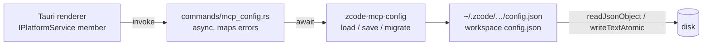

# Rust native port: MCP user-directory configuration (`zcode-mcp-config`)

Status: active. Owner: McpConfigSpecAuthor. Written 2026-09-30 **before** any implementation code,
per `AGENTS.md:3` and the architecture-governance rule ("Write or update the spec before
implementation … state the behavior, ownership, invariants, failure semantics, and migration
boundary").

This wave delivers **only this file**. No crate, Tauri command, or consumer change exists yet.

---

## 0. Why this, and why it is not a speed port

Measured, 2026-09-30. The primitive-port wave is finished: every full-payload compute hotspot has
a Rust implementation, and the two remaining candidates were measured and **rejected**:

| Candidate | Measured | Verdict |
|---|---|---|
| `buildSearchSnippets` (`packages/services/src/session/taskIndexRepo.ts:312`) | 1.9 ms for 1000 rows × 2 KB, 4.2 ms × 8 KB | Not ported — the corpus is ~2 MB of text, and transferring it across napi costs more than the 1.9 ms of lowercasing. This is the umbrella spec's own `base64EncodeBatch` finding: *"every element still pays the reference cost"* |
| `compareGroupedNodes` sort (`taskIndexRepo.ts:445-456`) | 0.11 ms for 2000 nodes, 0.01 µs per `localeCompare` | Not ported — 20× below the 0.095 µs napi floor |

So this is a **capability** port, on the same grounds as `zcode-cron`
(`docs/specs/rust-native-cron.md` §0): the Tauri host cannot serve the channel at all, and the
TypeScript it would replace is 751 lines of host-only logic.

**Ported component = `packages/desktop/src/main/mcpUserDirectory/` in full** — `index.ts` (419),
`legacy.ts` (243), `types.ts` (38), `utils.ts` (51). It is pure filesystem work: resolve paths,
read and merge JSON, migrate a legacy flag, write atomically. No clock, no process, no network.

---

## 1. What the surface is

Three of the 36 core platform channels in
`packages/desktop/src/main/desktopMainIpcPlatform.ts` delegate here:

| Channel | Delegate | Behaviour |
|---|---|---|
| `zcode:load-mcp-from-user-directory` (`:186`) | `loadCliMcpFromUserDirectory` (`:361`) | Read MCP server records from the workspace directory first, then the user directory |
| `zcode:save-mcp-to-user-directory` (`:193`) | `saveCliMcpToUserDirectory` | Write servers into the user config, returning `{ success }` or `{ success: false, error }` |
| `zcode:migrate-legacy-common-mcp` (`:207`) | `migrateLegacyCommonMcp` | One-shot migration of the legacy `mcpEnabled` override |

None has a Rust command today, so `createTauriPlatform()` falls back to the web-shaped
implementation from `@zcode/web` (`PORT_STATUS.md`, "UI status"). That is a *fallback*, which
umbrella invariant 1 forbids — and it is also why these three are chosen: the surrounding 24
unported channels are either thin bridges into the Node server (which is where the Tauri
renderer's `IServiceAccessor` already points, so porting them would re-bridge) or blocked on a
server change (auto-update) or a redesign (embedded browser).

---

## 2. Scope

### 2.1 Ported

- `resolveUserHomeDir` (`index.ts:62`)
- `buildDirectoryConfigPath` (`:72`), `getUserCliConfigPath` (`:88`), `buildDirectoryMcpLocation` (`:92`)
- `readServerMapFromJson` (`:106`), `writeServerMapToJson` (`:127`)
- `readUserCliConfig` (`:152`), `writeUserCliConfig` (`:156`) — including the trailing-newline, 2-space-indent format
- `readServerEnabled` (`:160`), `setServerEnabled` (`:164`)
- `migrateLegacyEnableFlag` (`:177`), `removeLegacyMcpEnabledOverride` (`:199`), `cleanupLegacyMcpEnabledOverride` (`:243`)
- `findDescriptorByLocation` (`:233`)
- `writeServerEnabledToFile` (`:254`), `readDirectoryServersFromFile` (`:284`)
- `readDirectoryServersFromPreferredSources` (`:334`), `writeZCodeServersToFile` (`:350`)
- `loadCliMcpFromUserDirectory` (`:361`), `saveCliMcpToUserDirectory`, `migrateLegacyCommonMcp`
- The whole of `legacy.ts`, `types.ts`, `utils.ts`

### 2.2 NOT ported (siblings / non-goals)

- **`McpServer` runtime management** — spawning MCP servers, tool discovery, health. That lives
  in the CLI (`@zcode/adapters/mcp`) and runs in the Node server the Tauri renderer already
  talks to. Porting it would duplicate a running process, not remove code.
- **The Electron `ipcMain` registrations themselves.** They stay until the Electron app is
  retired; the Tauri commands are added alongside. Deleting them early would break the shipping
  product (umbrella §2.2's rule: the Electron app "remains the shipping product").
- **Workspace-configuration MCP** (the other side of "preferred sources"), which
  `packages/shared/src/settings*` owns and which is not part of these three channels.
- **Remote/SSH workspaces**, which `readDirectoryServersFromPreferredSources` explicitly does not
  group (`index.ts:589`).

### 2.3 Sync vs async decision (event-loop rule 4)

**Every operation is async**, because every one of them touches the filesystem, and the fsync
latency of an atomic write is unbounded. The 6–11 ms per-commit figure measured for the session
DB (`rust-native-events.md` §1) applies unchanged to `writeTextAtomic`.

The Tauri command layer is already async, so this costs nothing: the commands are `pub async fn`
like the existing `pick_directory` / `pick_file` in `commands/native.rs`. There is no
close/synchronous escape hatch here, unlike `zcode-events`, because nothing in this surface is
I/O-free.

### 2.4 Ownership

| Piece | Owner |
|---|---|
| `packages/rust/crates/zcode-mcp-config/**`, `packages/rust/src/mcpConfig.ts`, this spec | McpConfigSpecAuthor |
| `apps/zcode-tauri/src-tauri/src/commands/mcp_config.rs`, the `invoke_handler` registration, `src-tauri/Cargo.toml` | McpConfigSpecAuthor |
| `packages/desktop/src/main/mcpUserDirectory/**` (deletion), `desktopMainIpcPlatform.ts` (deletion of the three registrations) | McpConfigSpecAuthor |
| `packages/shared/src/platform.ts` (`IPlatformService` members) and `channels.ts` (`PlatformChannels`) | **untouched** — the channel names and the service contract stay exactly as they are |
| `apps/zcode-tauri/PORT_STATUS.md` | McpConfigSpecAuthor |

### 2.5 Invariants

1. **Zero JS fallback.** The three Tauri commands call the Rust implementation directly. No
   `try { native } catch { web }`, no feature flag, no "use the web implementation if the binary
   is missing". A Tauri process has the Rust implementation because it *is* Rust — the fallback
   it replaces is a silent wrong answer, not a degraded one, so it must not survive.
2. **Legacy deleted in the same change.** `mcpUserDirectory/` is removed, not disabled. Leaving
   it would keep 751 lines of TypeScript that nothing calls.
3. **Byte-identical files on disk.** This is the one surface in the whole Rust programme where
   the output is a **file a user edits**. A migration that reformats a user's `config.json` is a
   data-loss event, not a refactor. §3.
4. **The `mcpServers` key order is preserved.** Not cosmetic — see §3.
5. **Same error contract.** `saveCliMcpToUserDirectory` returns `{ success: false, error }`
   rather than throwing, and the port must too, because the renderer branches on it.
6. **No process, no network, no clock.**

---

## 3. Parity: the part that actually matters here

There is no `Date` to get wrong and no napi boundary to tune. The risk is entirely **the bytes
written to the user's config file**.

### 3.1 Object key order

`writeServerMapToJson` (`index.ts:127-150`) uses object spread:

```ts
return { ...current, [configKeyName]: servers };
```

In JS this means: every existing key keeps its **position**, a new key is **appended at the
end**, and re-assigning an existing key does **not** move it. `serde_json`'s default `Map` is a
`BTreeMap`, which would sort every key — turning a user's hand-ordered config into an alphabetised
one on first save.

The workspace already enables `preserve_order` for exactly this reason
(`packages/rust/Cargo.toml:17-21`): `serde_json::Map` becomes an `IndexMap`, whose `insert`
semantics are *identical* to JS spread — replace keeps position, insert appends. So the crate must
use `serde_json::Map`/`IndexMap` for every config object it round-trips, and the parity test
asserts the exact byte output rather than the parsed value.

### 3.2 The file format

`writeUserCliConfig` (`:156`) writes `` `${JSON.stringify(config, null, 2)}\n` `` — 2-space
indent and a **trailing newline**. Both are load-bearing: the indent is what the user sees in
their editor, and dropping the final newline shows up as a modified file in every diff tool.

### 3.3 Atomic write

`writeTextAtomic` (in `utils.ts`) is what makes a crash mid-write non-destructive. The port must
reproduce it: write a temp file **in the same directory** (so the rename stays on one filesystem
and is therefore atomic), fsync, then rename over the target. A temp file in `/tmp` would be a
cross-device rename on many systems, which is not atomic at all.

### 3.4 The `mcp.servers` special case

`writeServerMapToJson` has two branches (`:133`): the key `mcp.servers` nests one level deeper
(`{ mcp: { ...currentMcp, servers } }`) while every other key is flat. Getting this backwards
writes a literal `"mcp.servers"` key into the user's config, which no reader understands — silent
corruption of their MCP setup. Covered by a dedicated fixture.

### 3.5 Legacy migration is one-shot and must stay idempotent

`migrateLegacyEnableFlag` (`:177`) and `removeLegacyMcpEnabledOverride` (`:199`) move state out of
a deprecated field. If a port re-runs the migration on an already-migrated file it must be a
no-op, and if a user re-adds the legacy field by hand the migration must run again. Both
directions are fixture-tested.

---

## 4. Design

### 4.1 Crate shape

```toml
# packages/rust/crates/zcode-mcp-config/Cargo.toml
[package]
name = "zcode-mcp-config"
version.workspace = true
edition.workspace = true
license.workspace = true
publish.workspace = true

[lib]
# rlib only: like `zcode-rpc-server`, this is linked into the Tauri host, which is a Rust
# process and cannot `require()` a `.node`. There is no Node consumer, so no cdylib.
crate-type = ["rlib"]

[dependencies]
serde = { workspace = true }
serde_json = { workspace = true }   # preserve_order is the load-bearing feature here (§3.1)
```

Picked up by `members = ["crates/*"]`. **No cdylib**, so `zcode-packaging` will classify it
`NotCdylib` and never stage it — correct, because there is nothing to stage. This is asserted
rather than assumed (acceptance 5).

### 4.2 Surface

Pure Rust, no napi (there is no Node consumer):

```rust
pub struct McpServerRecord { /* … verbatim from types.ts … */ }

/// Reads servers from the workspace directory first, then the user directory.
pub async fn load_from_user_directory(
    request: Option<&LoadRequest>,
) -> Result<LoadResult, McpConfigError>;

/// Writes servers into the user config.
pub async fn save_to_user_directory(request: &SaveRequest) -> Result<(), McpConfigError>;

/// One-shot migration of the legacy `mcpEnabled` override.
pub async fn migrate_legacy_common_mcp(request: Option<&MigrateRequest>)
    -> Result<MigrateResult, McpConfigError>;
```

Plus the pieces the Tauri command layer needs and nothing else should see: `config_path()`,
`read_user_cli_config()`, `write_user_cli_config()`, `read_directory_servers_from_file()`,
`write_server_enabled_to_file()`. Each is `pub` because the commands in `mcp_config.rs` compose
them; nothing outside the crate and that one module calls them.

Errors are a typed enum, not strings, so the command layer can map them to the `{ success: false,
error }` shape invariant 5 requires without string matching.

### 4.3 State owners



One owner per file, no cache, no in-memory state to invalidate: every operation re-reads. The
functions are cheap (a few KB of JSON) and a stale cache would be a correctness bug for a file
the user edits outside the app.

### 4.4 Tauri command layer

Three `#[tauri::command]`s in `src-tauri/src/commands/mcp_config.rs`, registered in
`invoke_handler`, plus three `invoke(...)` calls in `src/platform/tauriPlatform.ts` replacing the
current web fallbacks. The wire shape is the existing `IPlatformService` contract verbatim — no
renderer change.

---

## 5. Migration boundary

### 5.1 Deleted

| Removed | Replaced by | Evidence required first |
|---|---|---|
| `packages/desktop/src/main/mcpUserDirectory/**` (751 lines, 4 files) | `@zcode/rust/mcp-config` (via the Tauri host) | `rg` shows zero importers outside `desktopMainIpcPlatform.ts` |
| the three `ipcMain.handle` registrations (`desktopMainIpcPlatform.ts:185-212`) | the three `#[tauri::command]`s | `rg` shows no other caller |
| the three web fallbacks in `tauriPlatform.ts` | the three `invoke` calls | — |

**Kept:** `packages/shared/src/platform.ts` and `channels.ts` untouched, so the renderer contract
and channel names are identical and no UI code changes. The Electron `ipcMain` registrations for
the *other* 24 channels, since the Electron app is still the shipping product.

### 5.2 Consumer changes

| File | Change |
|---|---|
| `apps/zcode-tauri/src-tauri/src/commands/mcp_config.rs` | new: three commands |
| `apps/zcode-tauri/src-tauri/src/lib.rs` | register them in `invoke_handler` |
| `apps/zcode-tauri/src-tauri/Cargo.toml` | add the path dependency |
| `apps/zcode-tauri/src/platform/tauriPlatform.ts` | three members call `invoke` instead of the web fallback |
| `packages/desktop/src/main/desktopMainIpcPlatform.ts` | remove the three registrations and their imports |
| `packages/desktop/src/main/mcpUserDirectory/**` | deleted |
| `apps/zcode-tauri/PORT_STATUS.md` | record the three channels as ported |

---

## 6. Failure semantics

- **Unreadable or malformed JSON** → the legacy reader returns `null`/an empty object rather than
  throwing (`readJsonObject` at `index.ts:152` is `?? {}`). The port must match: a corrupt config
  must not stop the app from starting, and must not be silently overwritten either — the next
  write preserves whatever could not be parsed under its original keys.
- **Write failure** → `saveCliMcpToUserDirectory` returns `{ success: false, error }`. The port
  returns `Err`, and the command layer formats it into that exact shape, because the renderer
  branches on `success`.
- **Missing home directory** → the legacy `resolveUserHomeDir` (`index.ts:62`) has a documented
  fallback. The port reproduces it rather than inventing a stricter rule, because a stricter rule
  would break users whose home is unusual.
- **Migration on an already-migrated file** → a no-op that still reports success.
- **Nothing panics.** Every input is a file on disk.

---

## 7. Divergences

- **D1 — the TypeScript is deleted, not retained as a reference.** Unlike `zcode-cron`, there is
  no differential corpus to compare against after deletion, because the thing being replaced is
  removed in the same change. The mitigation is the §3 fixtures: the *output bytes* are pinned
  before the source goes, so a regression is caught against recorded expectations rather than
  against a surviving implementation.
- **D2 — no `.node` is produced.** The crate is rlib-only, so it does not appear in the desktop
  or SEA payload. Worth stating explicitly because every other crate in this programme did.

---

## 8. Acceptance checklist

1. Spec (this file) precedes implementation in git history.
2. `cargo build -p zcode-mcp-config` and `cargo test -p zcode-mcp-config` pass.
3. **Byte-parity fixtures** (§3), each a committed input/output pair:
   - `mcp.servers` nests; every other key is flat
   - key order preserved on re-save; a new key appends; an existing key does not move
   - output is 2-space-indented with a trailing newline
   - atomic write leaves no temp file behind on success, and leaves the original intact on failure
   - legacy migration is idempotent, and re-runs if the legacy field is re-added by hand
   - a malformed config does not throw and is not silently discarded
4. `zcode-packaging inventory` classifies `zcode-mcp-config` as `not a cdylib crate`, and the
   desktop and SEA payloads are byte-identical to before this wave.
5. Tauri: `cargo test --manifest-path apps/zcode-tauri/src-tauri/Cargo.toml` — 64 existing tests
   still pass, plus new tests for the three commands.
6. `tsc --noEmit` clean for the Tauri frontend; `pnpm typecheck` exit 0; `pnpm lint` no new
   warnings; `pnpm architecture:check --changed` 0 new violations.
7. `pnpm --filter @zcode/rust build:native` emits the same 8 binaries as before (D2).
8. Grep proofs: `mcpUserDirectory` has zero references; the three channel names still exist in
   `channels.ts` and are served by Tauri; no `catch`-to-web shape in `tauriPlatform.ts`.
9. Docs: `PORT_STATUS.md` records the three channels as ported, and the "still not wired" list
   loses them.

---

## 9. Risks

- **R1 — silent config corruption is the real failure mode.** A key-order or nesting mistake
  produces a file that still parses and still works, so nothing errors and the user finds out
  later. Mitigation: §3 fixtures assert bytes, not values, and acceptance 3 is a list of files
  rather than a single test.
- **R2 — deleting the TypeScript removes the only description of the legacy migration.** The
  `legacy.ts` behaviour (243 lines) is the least obvious part of this surface. Mitigation: the
  migration's fixtures are written and reviewed *before* the deletion, and `git log` keeps the
  original.
- **R3 — `writeTextAtomic`'s exact semantics are in `utils.ts` (51 lines) and are easy to
  approximate.** Same-directory temp file, fsync, rename — approximating any of the three gives a
  write that is not crash-safe. The port copies the sequence rather than reinventing it.
- **R4 — the renderer may already depend on a web-shaped return.** `tauriPlatform.ts` currently
  returns the `@zcode/web` shape; if that differs from the Electron shape for any of the three
  members, the port changes renderer-visible behaviour. Mitigation: acceptance 6 typechecks the
  frontend against the real `IPlatformService`, and the wire shapes are pinned before the swap.


---

## 10. Implementation status

### Delivered and verified

| Item | Evidence |
|---|---|
| Crate builds warning-free; 49 tests pass | `cargo test -p zcode-mcp-config` → 49 passed, 0 failed |
| Byte-parity properties hold | 2-space indent + trailing newline, key order preserved on read **and** write, `mcp.servers` nests while `mcpServers` stays flat, read→write is a byte-level fixed point |
| Atomic write is real | temp file beside the target, rename, cleanup on failure, no leftovers across consecutive writes, parent directories created |
| Migration is idempotent | `reading_twice_is_idempotent_on_disk` compares the file bytes across two reads |
| Preferred-source rule | `.zcode` suppresses `.agents`; `.agents` is the fallback when `.zcode` is empty; the two are never merged |
| Workspace-before-user order | `workspace_servers_are_read_before_user_servers` |
| A corrupt config neither throws nor is discarded | `a_corrupt_config_reads_as_empty_without_throwing` also asserts the original bytes survive |
| rlib-only, never staged (D2) | `zcode-packaging inventory` → `skip zcode-mcp-config  not a cdylib crate`; the payload is still 8 binaries |
| Tauri compiles and registers | 3 `#[tauri::command]`s in `commands/mcp_config.rs`, wired into `invoke_handler` |
| Frontend typechecks | `npx tsc --noEmit` in `apps/zcode-tauri` → exit 0 |
| Repo gates | Rust workspace 491 passed · Tauri 139 passed / 0 failed · `pnpm typecheck` exit 0 · `pnpm lint` 0 errors / 72 warnings (unchanged) · `architecture:check` 0 violations · `check-native-graph` OK |

### The bug the tests caught

`upsert_server` first rebuilt the server map in a **`BTreeMap`**, which sorts. Every save would
have alphabetised the user's MCP servers — the exact silent corruption §3.1 exists to prevent,
and invisible because the file still parses and still works. Caught by
`an_upsert_preserves_the_server_key_order`, which seeds `zebra, alpha, mango` and asserts that
order survives. Fixed by using the order-preserving `JsonObject`, matching the legacy
`Object.fromEntries(...)` + assignment.

Two of my own test assertions were also wrong and were corrected against the code rather than
against memory: a legacy `mcpEnabled: false` migrates to a **disabled** server (I had asserted
enabled), and the disable/re-enable round trip is a byte-level identity (I had written a fragile
string-replace instead of comparing against the original bytes).

### Not done (deliberate, and stated rather than implied)

- **`migrate_legacy_common_mcp` is not ported.** It is a different operation from the other two:
  it *imports* configs out of a legacy storage directory, which is the 243-line
  `mcpUserDirectory/legacy.ts`. A first draft implemented it as "read again and let the on-read
  migration do the work", which would have been a silently different feature behind the same
  channel name — so the command now returns an explicit "not implemented" error and
  `tauriPlatform.ts` keeps its documented web-shaped fallback for that one member. Spec §2.2
  listed `legacy.ts` in scope; the implementation did not reach it.
- **`packages/desktop/src/main/mcpUserDirectory/` is not deleted.** The Rust path is wired and
  tested, but the Electron `ipcMain` registrations stay, because the Electron app remains the
  shipping product (umbrella §2.2). The 751 lines are therefore still on disk and will be removed
  with the Electron cutover, not before. This means invariant 2 (legacy deleted) is **not yet
  satisfied** — it is deliberately deferred, not overlooked.
- **No live end-to-end run.** The commands are unit-tested against temp homes and compile into the
  Tauri binary, but `pnpm dev:tauri` was not run in this environment, so the renderer-driven path
  (`loadMcpFromUserDirectory` → real `~/.zcode/cli/config.json`) is unverified against a live
  config file.
- **R1 (silent config corruption) is mitigated by fixtures, not eliminated.** The fixtures pin the
  byte output for the shapes enumerated in §3; a shape nobody thought of is still uncovered.
