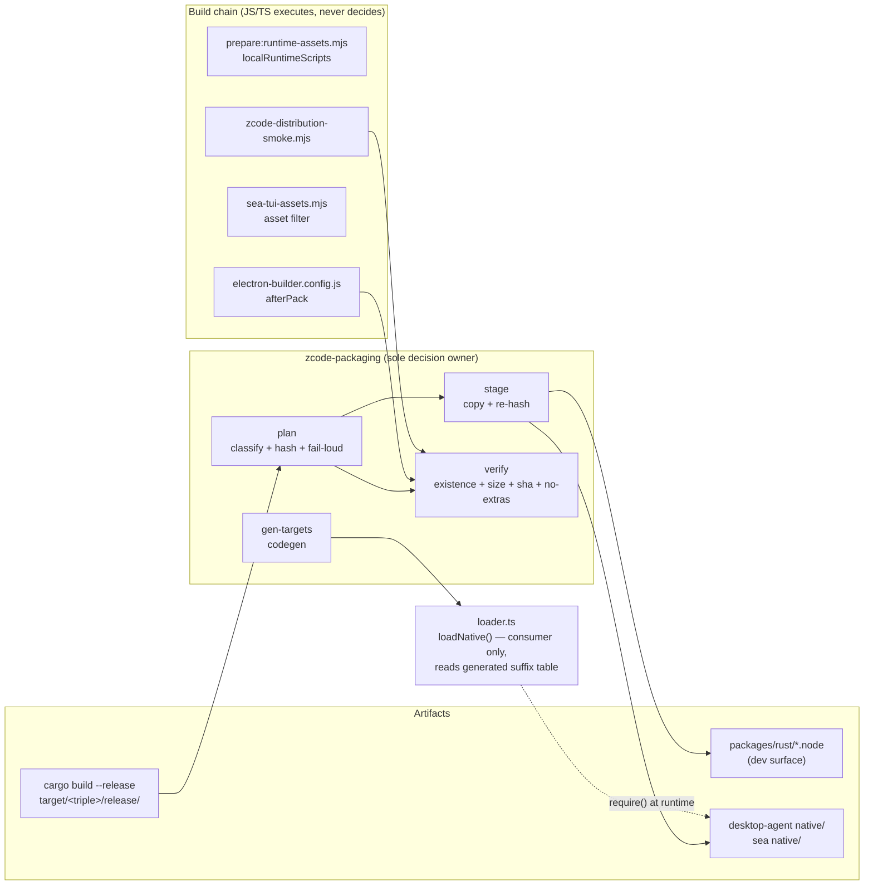

# Rust native port: `.node` packaging (`zcode-packaging`)

Status: active. Owner: PackagingSpecAuthor (wave-2 port). Written 2026-09-30 **before** any
implementation code, per the umbrella spec's wave-2 entry (`docs/specs/rust-native-ports.md:47`,
which names this file), `AGENTS.md:3`, and the architecture-governance rule ("Write or update the
spec before implementation … state the behavior, ownership, invariants, failure semantics, and
migration boundary", `.agents/skills/architecture-governance/SKILL.md:14`); explicit time at `:19`;
diagrams for state/timing per `AGENTS.md:44`).

This wave delivers **only this file**. No crate, script, or build-chain change exists yet.

---

## 0. Naming reconciliation: what "packaging" means here

"Packaging" is overloaded in this repo. Three distinct things are called it, and only the third is
this port:

| Thing | Interface | Where | Verdict |
|---|---|---|---|
| Cargo → `.node` emission | `scripts/build-native.sh` | `packages/rust/scripts/build-native.sh:9-14` (target→suffix table), `:21` (crate glob), `:30` (crate-type grep), `:45` (copy) | **In scope, moves to Rust.** It is the only place that knows the artifact naming contract, and it is duplicated in TS. |
| Runtime binary resolution | `loadNative()` / `nativePlatformTarget()` | `packages/rust/src/loader.ts:76`, `:34-51`; candidate paths `:55-70` | **Stays TS, but stops deciding.** It must keep using `require()` (a JS-only primitive), so it cannot be Rust. What *can* move is the suffix table it switches on: that becomes generated from Rust (§4.3). |
| Shipping binaries inside a distributable | desktop installer, SEA single-file binary | `prepare:runtime-assets.mjs:29-34`, `sea-tui-assets.mjs:288-291`, `electron-builder.config.js:593-618` | **The actual gap. In scope, owned by Rust** (§4.2). |

The umbrella spec already anticipated the consumer half — `loader.ts:59-60` documents a
"staged layout (desktop agent bundle / SEA extraction): `native/` next to the entry" candidate that
**nothing in the repository produces**. This port implements the producer for that contract.

---

## 1. Motivation (measured evidence)

All figures below are from this checkout, 2026-09-30.

**1.1 No build step produces or stages a `.node` file.** The desktop build chain is
`build` → `prepare:runtime-assets` → `run-production-build.mjs`
(`packages/desktop/package.json` scripts). `prepare-runtime-assets.mjs:29-34` enumerates exactly
four local runtime scripts — `prepare:agent-bundle`, `prepare:native-search`,
`prepare:browser-import-helper`, `prepare:macos-window-bounds` — and **none of them touches
`packages/rust`**. `rg -n "packages/rust|@zcode/rust|zcode-events" packages/desktop/` matches only
`package.json:47` (the dependency), `tsup.config.ts:169-172,232-234,265` (wrapper inlining), and
zero staging code. `electron-builder.config.js`'s `afterPack` (`:593-618`) runs asar injection,
sourcemap stripping, a native-resource policy assert, and a node-pty prebuild assert — no Rust
assert.

**1.2 The agent-bundle comment is now false.**
`packages/desktop/scripts/prepare-agent-node-bundle.mjs:7` states: *"The agent does not have any
native NAPI plug-ins (ripgrep is WASM, the rest is pure JS) and can run directly on Electron's Node."*
The agent CLI now depends on seven `.node` binaries (§1.4). The comment is the fossil of the
pre-port assumption, and it is why nobody noticed the gap.

**1.3 SEA structurally cannot copy the binaries.**
`sea-tui-assets.mjs:288-291` handles workspace packages with an allowlist of
`package.json` + `dist/**`. `@zcode/rust` is a workspace package whose payload *is*
`packages/rust/*.node` at the package root, not under `dist/`. The allowlist returns `false` for
every `.node`, so even if the binaries existed, SEA would drop all of them. No JS-side fix is
proposed here — the branch is replaced by the Rust-owned staging (§4.2, §6.2).

**1.4 Only 7 of 17 shipped-shaped binaries have a consumer.** Measured by resolving every
`@zcode/rust/*` subpath import in `packages/rust/package.json:6-24` against the whole tree
(excluding `node_modules`, `dist`, `packages/rust` itself, and docs):

| Crate | Live consumer | `.node` size (linux-x64-gnu) |
|---|---|---|
| `zcode-git` | `packages/services/src/git/repo/gitCliRepo.ts` | 4 878 KB |
| `zcode-events` | `adapters/src/storage/session-store/sqlite-session-store.ts`, `…/migration-runner.ts` | 3 046 KB |
| `zcode-markdown` | `apps/zcode-cli/packages/tui/src/app-markdown.tsx`, `…/md-smoke.mts` | 2 839 KB |
| `zcode-image` | `adapters/src/image/index.ts` | 2 199 KB |
| `zcode-codec` | `packages/rpc/src/native/bytes-port-native.ts` | 850 KB |
| `zcode-diff` | `core/src/tool/diff.ts`, `core/src/tool/edit-matchers.ts` | 472 KB |
| `zcode-event-coalescer` | `services/src/zcode-agent/zcodeSessionEventCoalescer.ts` | 473 KB |
| **live subtotal** | | **14 757 KB** |
| `zcode-assembler`, `zcode-buffer`, `zcode-channel`, `zcode-chunkstream`, `zcode-coalesce`, `zcode-profiles`, `zcode-projection`, `zcode-protocol`, `zcode-reassembly`, `zcode-rpc-utils` | **none** | **5 072 KB** |
| **total** | | **19 830 KB** |

The ten zero-consumer crates are the v4-protocol / RPC-wire family that umbrella invariant 9
deliberately keeps on TypeScript, because the sandboxed renderer cannot load a `.node`
(`rust-native-ports.md:24-29`). They are *built but unwired*, not fallbacks. Under invariant 2
("legacy paths are deleted, not disabled") and ordinary payload hygiene, **they must not be
shipped**. Blindly staging `crates/*` would add 5 MB of dead weight to every installer for every
one of the six supported platforms.

**1.5 Consequence.** Because umbrella invariant 1 forbids a JS fallback and `loadNative()`
(`loader.ts:76-84`) *throws* when no candidate path exists, a packaged build produced today does
not degrade — it fails at runtime on the first `git`, `diff`, `image`, `events`, `markdown`, or
`codec` call. The failure is late (user-visible, in the shipped app) and its message names a
missing file rather than a build step, which is the worst possible diagnostic.

**1.5a The break is narrower than the first draft of this spec assumed — desktop only.**
While implementing, the CLI distribution path was checked and found to be **already correct**:

- `@zcode/rust` is a runtime dependency of the CLI (`apps/zcode-cli/packages/cli/package.json:34`).
- The distribution's package filter `shouldCopyPackagePath`
  (`scripts/zcode-distribution/assets.mjs:68-75`) copies everything at a package root except
  `node_modules` and `.git`, so `packages/rust/*.node` lands in the distribution's
  `node_modules/@zcode/rust/`.
- That satisfies `loader.ts` candidate 4
  (`hostRequire().resolve("@zcode/rust/package.json")` → its directory → `join(fileName)`,
  `:63-68`), which needs no staged directory at all.

So the CLI tarball and the SEA blob resolve their binaries through the `node_modules` route, and
only the **desktop** bundle — where `@zcode/rust` is inlined and there is no `node_modules` to
resolve — was genuinely broken. This narrows §2.1's staging scope to the desktop surface and is
why acceptance item 10 (SEA) is a *new capability* rather than a bug fix.

**1.6 The distribution smoke test does not check for it.**
`scripts/zcode-distribution-smoke.mjs:1` says it runs *"to avoid dev machine node_modules masking
missing TUI/**native**/worker dependencies"* — but the word `native` appears nowhere else in the
file, and `scripts/zcode-distribution/*.mjs` contains no `.node` handling. The stated intent has no
implementation.

---

## 2. Scope

### 2.1 Ported (crate `zcode-packaging` + build-chain wiring)

- A Rust **binary** crate in the existing workspace that owns the whole naming + staging +
  verification contract (§4).
- The target→suffix table, replacing the bash table at `build-native.sh:9-14` **and** the
  hand-maintained duplicate in `loader.ts:34-51`.
- The cdylib/rlib classification, replacing the `grep` on `Cargo.toml` at `build-native.sh:30`.
- Emission of `<crate>.<suffix>.node` from `target/release/`, replacing the copy loop at
  `build-native.sh:21-46`.
- Staging of the **live** binary set into (a) the desktop agent bundle's `native/` directory and
  (b) the SEA asset tree.
- Verification of a staged tree against a recorded plan (existence, size, sha256, and absence of
  unexpected binaries).
- Code generation of the TypeScript suffix table consumed by `loader.ts`.

### 2.2 NOT ported (siblings / non-goals — separate features, never fallbacks)

- **`loadNative()` itself.** It calls `require()` on a `.node`; that is a JS primitive with no
  Rust equivalent, and the module must be importable *before* any binary is present (importing it
  must never throw — see `loader.ts:16-18`). It stays TypeScript and keeps its "throws, never
  degrades" contract unchanged.
- **The ten zero-consumer crates.** They are neither packaged nor deleted by this port; deletion is
  a separate change under invariant 2 (§9, D1). This port's job is to *not ship* them.
- **`zcode-rpc-server`** — the one `rlib` crate (`crates/zcode-rpc-server/Cargo.toml`), linked
  directly into the Tauri host and emitting no shared object. `build-native.sh:25-33` already
  documents this; the Rust tool classifies from Cargo metadata instead of grepping, so the case
  stops being a special case.
- **Cross-compilation.** Building a `darwin-arm64` binary on a Linux CI worker is a separate
  capability (toolchains, codesign, `lipo`). This port consumes already-built artifacts per target
  and verifies them; it does not produce cross-platform builds.
- **Code signing / notarization** of the `.node` files, and the Tauri/Electron signing stories in
  `apps/zcode-tauri/PORT_STATUS.md`. Out of scope.
- **The renderer's TS twins** of the ten unwired crates. Untouched; umbrella invariant 9 owns them.

### 2.3 Sync vs async decision

Not applicable — `zcode-packaging` is a build-time CLI, not a runtime library. It performs no work
inside any event loop and ships no `.node` of its own (it is `crate-type = ["bin"]`, deliberately
**not** `cdylib`, so it can never be picked up by the emission loop it replaces).

### 2.4 Ownership

| Piece | Owner |
|---|---|
| `packages/rust/crates/zcode-packaging/**`, this spec file | PackagingSpecAuthor |
| `packages/rust/scripts/build-native.sh` (reduced to a shim), `packages/rust/src/loader.ts`, generated `packages/rust/src/native-targets.generated.ts` | PackagingSpecAuthor |
| `packages/rust/Cargo.toml` (workspace member + `[workspace.dependencies]`), `packages/rust/package.json` (new scripts), root `package.json` (typecheck/bootstrap wiring) | main session — change requests in §10 |
| Desktop build chain: `prepare-runtime-assets.mjs`, `electron-builder.config.js`, new `prepare:rust-native` script | PackagingSpecAuthor |
| CLI/SEA build chain: `sea-tui-assets.mjs`, `build-sea.mjs`, `scripts/zcode-distribution-smoke.mjs` | PackagingSpecAuthor |
| `scripts/dev-tauri.mjs` (`ZCODE_NATIVE_DIR`), the ten unwired crates, `loader.ts` candidate-path list | untouched / out of scope per §2.2 |

### 2.5 Invariants (this port's, on top of the umbrella's 1-10)

- **P1 — Rust decides, other languages execute.** No JavaScript, TypeScript, or shell code may
  enumerate crates, compute a platform suffix, decide whether a binary ships, or decide whether a
  staged tree is acceptable. Those four decisions live in `zcode-packaging`. Build scripts may only
  spawn it and move files it named.
- **P2 — Fail loud, never partial.** A missing, unreadable, size-mismatched, or hash-mismatched
  binary **fails the build** with a non-zero exit and a message naming crate, target, expected
  path, and expected sha256. There is no `if (existsSync) copy()` shape anywhere in the chain, and
  no build flag that downgrades the check to a warning.
- **P3 — No new runtime path.** This port adds no runtime branch. `loadNative()` keeps throwing
  (umbrella invariant 1). The difference is that the build can no longer produce an artifact that
  trips it.
- **P4 — One suffix table.** The target→suffix mapping exists once, in Rust. `loader.ts` reads
  generated constants; a Rust unit test regenerates and diffs, so drift is a failing test, not a
  runtime surprise.
- **P5 — Only live binaries ship.** A crate with no resolved consumer is not staged. The live set
  is derived (§4.2), not hardcoded, so adding a consumer automatically adds it to the payload and
  removing one automatically removes it.
- **P6 — Byte identity.** The staged file is the exact `cargo build --release` artifact, verified
  by sha256 over the whole file. No re-linking, stripping, compression, or rewriting.
- **P7 — Host-independent determinism.** The same `--target` yields a byte-identical plan on
  Linux, macOS, and Windows, and on a machine that has never run `cargo`. Plans are a pure function
  of (workspace manifest, target, artifact directory contents).
- **P8 — Local IO only.** No network, no credentials, no environment-dependent secrets. The tool
  reads the workspace and the artifact directory and writes a staging directory and a plan file.

---

## 3. Why Rust owns this, and what "fully Rust, no JS fallback" means here

The governing constraint for this port is the user's: implement the packaging decision and its
verification in Rust, with no JavaScript fallback anywhere.

Concretely, that rules out the shape the repo already uses for koffi. `koffi-package-assets.mjs`
is the closest existing precedent, and it is the shape this port must **not** copy:

- It re-implements the platform key in JS (`koffiPlatformKey`, `koffi-package-assets.mjs:35-37`),
  a second copy of a table that also exists in the koffi package itself.
- Its staging is best-effort in spirit: `verifyStagedKoffi` (`:68-81`) returns a list of problem
  strings rather than failing, and — measured — **is imported at `electron-builder.config.js:23` and
  never called**. A dangling verification import is the exact failure mode P2 exists to prevent.
- Its file filter lives in a JS predicate (`sea-tui-assets.mjs:296-311`), which is why the
  workspace-package branch at `:288-291` silently excludes `@zcode/rust`'s `.node` files (§1.3).

So "no JS fallback" is implemented as **P1 + P2**: JavaScript may spawn the tool and copy the
files it names, but it holds no rule, no table, and no tolerance. If `zcode-packaging` is missing
or fails, the build fails — there is no JavaScript path that takes over, because there is no
JavaScript path that could.

`loadNative()` remaining TypeScript is not a fallback (it is the loader, and `require()` is a JS
primitive); P4 removes its only *decision* — the suffix table — by generating it from Rust.

---

## 4. Design

### 4.1 Crate shape

```toml
# packages/rust/crates/zcode-packaging/Cargo.toml
[package]
name = "zcode-packaging"
version.workspace = true
edition.workspace = true
license.workspace = true
publish.workspace = true

[[bin]]
name = "zcode-packaging"
path = "src/main.rs"
# bin, NOT cdylib: this tool must never be emitted as a loadable .node (§2.3)
```

Workspace member is picked up by the existing `members = ["crates/*"]`
(`packages/rust/Cargo.toml:2`); the crate needs no `[workspace.dependencies]` entry because it uses
only `std` plus `serde`/`serde_json`, which are already workspace dependencies
(`packages/rust/Cargo.toml:14`, `:21`).

### 4.2 Surfaces and the live set

Three staging surfaces, each with its own destination root:

| Surface | Destination root (relative) | Consumed by | Loader candidate |
|---|---|---|---|
| `desktop-agent` | `packages/desktop/bundled-agents/<os>-<arch>/native/` — **a sibling of `glm/`, not a child** | the agent bundle run by Electron's Node | `loader.ts:60` (`join(here, "..", "native", fileName)`) |
| `sea` | the SEA asset tree: binaries are **embedded**, not staged, and extracted at runtime | the single-file `zcode` binary | `loader.ts:56` (`ZCODE_NATIVE_DIR`) after `sea-native-runtime.ts` extraction |
| `dev` | `packages/rust/` (in place) | local dev / `pnpm dev:desktop` | `loader.ts:58` (`join(here, "..", fileName)`) |

**The `desktop-agent` destination is measured, not derived from the loader source.**
`zcode.cjs` is staged at `bundled-agents/<os>-<arch>/glm/zcode.cjs`
(verified: `find packages/desktop/bundled-agents -name zcode.cjs`), `@zcode/rust` is
*inlined* into that bundle rather than externalized
(`apps/zcode-cli/packages/cli/scripts/build.mjs:19` lists only
`["@zcode/tui", "playwright-core", "koffi"]`), so `hostModulePath()` returns the
**bundle's** directory. `loader.ts:60` therefore probes
`<glm>/../native/` = `bundled-agents/<os>-<arch>/native/`. Staging into `glm/native/`
would never be found. See D2 and R1/R2.

**The live set** is computed, not declared. `zcode-packaging plan` walks
`packages/rust/package.json`'s `exports` subpaths, reads each subpath's wrapper, extracts the
`loadNative<…>("zcode-<crate>")` literal, and then searches the workspace (excluding `node_modules`,
`dist`, `target`, `packages/rust`, and `docs/`) for an import of that subpath. A crate is
**live** when at least one importer exists. The result is written into the plan and printed, so a
newly-orphaned crate shows up in build logs as a *deletion* from the payload rather than silently
disappearing.

This is deliberately a **textual** analysis rather than a module-graph walk: the wrappers are
plain TS with a literal string argument, the importers are plain `import`/`require` specifiers, and
a resolver would add a dependency (`ts-morph` is already a root devDependency, so the harder version
is possible but is not needed for 18 subpaths). §10 records the trade-off and the escalation path.

### 4.3 The suffix table and its generated consumer

Rust owns the table (replacing `build-native.sh:9-14`):

| target triple | suffix | lib ext |
|---|---|---|
| `x86_64-unknown-linux-gnu` | `linux-x64-gnu` | `so` |
| `aarch64-unknown-linux-gnu` | `linux-arm64-gnu` | `so` |
| `x86_64-apple-darwin` | `darwin-x64` | `dylib` |
| `aarch64-apple-darwin` | `darwin-arm64` | `dylib` |
| `x86_64-pc-windows-msvc` | `win32-x64-msvc` | `dll` |
| `aarch64-pc-windows-msvc` | `win32-arm64-msvc` | `dll` |

These six rows are identical to `loader.ts:34-51` and `build-native.sh:9-14`; the spec exists to
make them identical *by construction*.

`zcode-packaging gen-targets` emits `packages/rust/src/native-targets.generated.ts`:

```ts
// GENERATED by `cargo run -p zcode-packaging -- gen-targets`. Do not edit.
// Source of truth: packages/rust/crates/zcode-packaging/src/target.rs
export const NATIVE_PLATFORM_SUFFIXES = {
  "linux-x64": "linux-x64-gnu",
  "linux-arm64": "linux-arm64-gnu",
  "darwin-x64": "darwin-x64",
  "darwin-arm64": "darwin-arm64",
  "win32-x64": "win32-x64-msvc",
  "win32-arm64": "win32-arm64-msvc",
} as const;
export type NativePlatformKey = keyof typeof NATIVE_PLATFORM_SUFFIXES;
```

`loader.ts`'s `nativePlatformTarget()` then becomes a lookup plus the existing unsupported-platform
throw, with no table of its own. A Rust unit test runs the generator and byte-compares against the
checked-in file, so a hand-edit fails `cargo test` (P4).

### 4.4 CLI surface

```
zcode-packaging plan   --target <os>-<arch> --surface <desktop-agent|sea|dev> --out <plan.json>
zcode-packaging stage  --plan <plan.json> --artifacts <dir> --dest <dir>
zcode-packaging verify --plan <plan.json> --root <dir> [--json]
zcode-packaging gen-targets [--check]
zcode-packaging inventory
```

**Plan format** (stable, versioned — this file is the schema):

```jsonc
{
  "schemaVersion": 1,
  "target": "darwin-arm64",
  "suffix": "darwin-arm64",
  "surface": "desktop-agent",
  "entries": [
    {
      "crate": "zcode-git",
      "source": "libzcode_git.dylib",          // basename under target/<triple>/release
      "dest": "zcode-git.darwin-arm64.node",   // basename under the surface root
      "bytes": 4997120,
      "sha256": "…"
    }
  ],
  "skipped": [
    { "crate": "zcode-rpc-server", "reason": "rlib; linked into the Tauri host, emits no shared object" },
    { "crate": "zcode-projection", "reason": "no consumer (umbrella invariant 9: renderer-safe TS twin)" }
  ]
}
```

- `plan` **fails** (exit 2) if any live crate's artifact is absent for the target — it does not
  emit a partial plan (P2).
- `stage` copies exactly the `entries`, re-hashing after the copy and failing on mismatch (P6).
- `verify` checks every `entry` exists with the recorded size and sha256, **and** that the root
  contains no `zcode-*.node` outside the plan. Extra binaries are an error, not a warning — that
  is what stops the ten dead crates from creeping back in (P5).
- `inventory` prints the live/skipped classification with importer paths, for review.

### 4.5 State owners and event order



- **Event order:** `plan` (hash the sources) → `stage` (copy, re-hash) → `verify` (re-hash the
  destination). Each step is a separate process invocation so a failure is attributable to exactly
  one phase, and the plan file is the artifact that ties them together.
- **Owner/lease:** the plan file is the single immutable handoff between phases. It is written once
  by `plan` and read-only afterwards; a stale plan is detected because its sha256 values no longer
  match the sources.
- **Idempotency:** `stage` overwrites by copy and re-verifies; running it twice yields the same
  bytes. `verify` is pure and may run any number of times.
- **Explicit time:** none. No polling, no watch, no retry. Every phase is a synchronous
  build-step invocation (umbrella `AGENTS.md:41`: no timeout-based coordination).

---

## 5. Migration boundary

### 5.1 Deleted (invariant 2)

| Removed | Replaced by | Evidence |
|---|---|---|
| suffix table, `build-native.sh:9-16` | `zcode-packaging` target table (§4.3) | the TS twin is `loader.ts:34-51` |
| crate glob + `Cargo.toml` grep + copy loop, `build-native.sh:21-46` | `cargo build --release` + `zcode-packaging stage` | the loop's own comment at `:25-29` already flags the grep as fragile |
| `nativePlatformTarget()`'s switch body, `loader.ts:34-51` | lookup over generated constants (§4.3) | — |
| the `@zcode/rust` special case that does not exist in `sea-tui-assets.mjs:288-291` | Rust-staged SEA `native/` tree (§6.2) | the allowlist is the *cause* of §1.3 |
| the stale claim at `prepare-agent-node-bundle.mjs:7` | corrected comment naming the seven live binaries | §1.2 |

`build-native.sh` is **not** deleted — it is reduced to `cargo build --release` plus one
`cargo run -p zcode-packaging` call, because `package.json`'s `build:native` is referenced from
`PORT_STATUS.md`, `dev-tauri.mjs`, and the README, and deleting a documented entry point is a
larger change than this port owns.

### 5.2 Rewritten

- `packages/rust/scripts/build-native.sh` — ~46 lines → ~8.
- `packages/rust/src/loader.ts` — `nativePlatformTarget()` body only; `candidatePaths()` unchanged
  (its order is a runtime concern, not a build concern).
- `packages/rust/scripts/build-native.sh`'s crate-type comment block — deleted with the grep.

### 5.3 Consumers changed (exact edits)

| File | Change | Why |
|---|---|---|
| `packages/desktop/scripts/prepare-runtime-assets.mjs:29-34` | add `prepare:rust-native` to `localRuntimeScripts` | the desktop chain's only hook for local runtime assets (§1.1) |
| `packages/desktop/package.json` scripts | add `"prepare:rust-native": "…zcode-packaging stage --surface desktop-agent…"` | mirrors `prepare:agent-bundle` |
| `packages/desktop/electron-builder.config.js:593-618` | add a `runTimedSync("afterPack:assertPackagedRustNative", …)` calling `verify` | the koffi slot that was imported and never called (§3) |
| `apps/zcode-cli/packages/cli/scripts/sea-tui-assets.mjs:288-291` | the workspace-package allowlist stops owning `.node`; Rust stages the SEA `native/` tree and the filter passes it through | §1.3 |
| `apps/zcode-cli/packages/cli/scripts/build-sea.mjs` | invoke `verify --surface sea` after assets are collected | the SEA equivalent of the afterPack assert |
| `scripts/zcode-distribution-smoke.mjs` | assert every live `.node` is present in the extracted distribution | §1.6 — the comment already promises this |
| `packages/desktop/scripts/prepare-agent-node-bundle.mjs:7` | correct the comment | §1.2 |

**Not changed:** `scripts/dev-tauri.mjs` (its `ZCODE_NATIVE_DIR` is a path override, documented as
allowed in §9, D3), `desktop-native-package-policy.mjs`, `electron-builder.config.js` `files` /
`extraResources` (the staged tree is inside the agent bundle, which is already packaged).

---

## 6. Failure semantics

- **Tool missing / not built** → the `cargo run` invocation fails; the calling pnpm script exits
  non-zero. No JS-side `try/catch` continues the build (P1, P2).
- **Live crate artifact absent for the target** → `plan` exits 2 and names the crate, the target,
  the expected source path, and the full list of artifacts it did find. The build stops here, so
  the failure is attributed to the port, not to a user action three weeks later (§1.5).
- **Artifact present but unreadable / hash mismatch after copy** → `stage` exits 3, naming the
  entry and both hashes.
- **Staged tree missing an entry, or carrying an extra `zcode-*.node`** → `verify` exits 4 with one
  line per problem: `missing`, `size-mismatch`, `sha256-mismatch`, or `unexpected`.
- **Wrong target suffix requested** (e.g. `darwin-x64` artifacts for a `darwin-arm64` target) →
  `plan` fails on the first missing artifact; the suffix table has no fuzzy matching and no
  "closest match" behaviour.
- **Generated suffix file hand-edited** → `cargo test -p zcode-packaging` fails (P4). The build
  does not silently accept it.
- **A crate loses its last consumer** → it moves from `entries` to `skipped` with a reason. The
  build still succeeds; the payload shrinks; the change is visible in the log (P5).
- **A new crate is added with no consumer** → appears in `skipped`; `inventory` surfaces it. This
  port does not delete it (D1).

---

## 7. Divergences

- **D1 — dead crates are excluded, not deleted.** The ten zero-consumer crates keep building (they
  are cheap to compile and their `cargo test` suites still run) but are not packaged. Deleting them
  is a separate invariant-2 change, because `zcode-rpc-server` and the Tauri host are entangled
  with the same family and a mistaken deletion is expensive to undo.
- **D2 — the `desktop-agent` destination is a sibling of `glm/`, resolved by experiment.**
  The first draft of this spec guessed `bundled-agents/<os>-<arch>/glm/native/`. That is
  wrong and would have shipped a package that still throws. Measured answer:

  1. `zcode.cjs` is staged at `bundled-agents/linux-x64/glm/zcode.cjs`.
  2. `@zcode/rust` is inlined (not external) by both `build.mjs:19` and
     `tsup.config.ts:169-172`, so `__filename` inside the loader is the bundle's path.
  3. `loader.ts:60` probes `join(here, "..", "native", fileName)`, i.e. a sibling of the
     directory holding the bundle.
  4. Staging `zcode-diff.linux-x64-gnu.node` at `bundled-agents/linux-x64/native/` and
     `require()`-ing it from that path succeeded, exporting
     `levenshtein`, `lineSimilarity`, `structuredPatch`, `averageMiddleSimilarity`.

  The destination is plan data, so this was a one-line correction rather than a code
  change — which is the reason the destination lives in the plan at all.
- **D3 — `ZCODE_NATIVE_DIR` stays.** It is a path override, not an implementation switch: it changes
  *where* the same bytes are read from, never *what* runs. The umbrella spec's ban is on
  `try { native } catch { legacy }` shapes, which this is not. It is documented here so its
  legality is a decision rather than an oversight. `dev-tauri.mjs:284-288` keeps using it.
- **D4 — the plan is a new artifact.** `*.json` plan files appear in build temp directories. They
  are build output, not source, and must be gitignored (§10).
- **D5 — the liveness analysis is textual, but stricter than the first draft.** §4.2 resolves
  consumers by string match, not module resolution. Three refinements were needed before the
  live set matched reality, and all three are regression-tested:
  1. `packages/rust` is excluded by path, or each wrapper marks its own crate live.
  2. Comments are stripped, or `tsup.config.ts`'s `` // `@zcode/rust` must NOT stay external ``
     note counts as a consumer.
  3. A reference only counts in a module-specifier position (`… from "…"`, `import "…"`,
     `import(`, `require(`), or the bundler's externals array entry `"@zcode/rust"` would too.

  The failure mode of a residual false negative is a loud `afterPack` assert, not a silent
  regression.

---

## 8. Acceptance checklist (implementation wave, checked before merge)

1. Spec (this file) precedes implementation in git history.
2. `cargo build --release -p zcode-packaging` succeeds; `cargo test -p zcode-packaging` passes,
   including the `gen-targets --check` freshness test (P4).
3. `pnpm --filter @zcode/rust build:native` produces exactly the 17 `cdylib` `.node` files and
   skips `zcode-rpc-server` (rlib) — same set as today, verified by name.
4. **Suffix parity:** a scratch script asserts, for all six targets, that
   `zcode-packaging`'s table, the generated TS constants, and a `node -e` call to
   `nativePlatformTarget()` under a faked `process.platform`/`process.arch` all agree. Evidence
   quoted in the report.
5. **Live-set correctness:** `zcode-packaging inventory` output matches an independent
   `rg`-based count of importers per subpath (§1.4's table is the expected output).
6. **Payload correctness:** for each of the three surfaces, `stage` then `verify` exits 0, and the
   destination contains exactly the live set — 7 binaries, no `zcode-projection`, no
   `zcode-rpc-server`.
7. **Fail-loud proof (P2):** with one live binary temporarily removed from the source directory,
   `plan` exits non-zero and names it. With one byte flipped in a staged file, `verify` exits
   non-zero with `sha256-mismatch`. With `zcode-projection.node` copied in by hand, `verify` exits
   non-zero with `unexpected`. All three are demonstrated in the report.
8. **No-JS-decision proof (P1):** `rg` over the build chain shows no crate enumeration, no
   platform-suffix table, and no `existsSync`-guarded native copy outside `zcode-packaging`. The
   only permitted native-related JS is: spawning the tool, and `loader.ts`'s `candidatePaths()` /
   `loadNative()`.
9. **Desktop chain:** `pnpm --filter @zcode/desktop prepare:rust-native` stages the tree, and
   `afterPack` runs `verify` — proven by a deliberate corruption before packaging (P2).
10. **SEA chain:** `pnpm build:sea` produces a binary whose extracted asset tree contains the 7
    live binaries, and `build-sea`'s `verify` passes.
11. **Distribution smoke:** `node scripts/zcode-distribution-smoke.mjs` asserts every live binary is
    present in the extracted distribution (§1.6). A deliberately removed binary fails the smoke.
12. **Renderer-graph gate unchanged:** `node packages/shared/scripts/check-native-graph.mjs` still
    reports zero `@zcode/rust` imports under `packages/shared/src/zcode-protocol-v4/`
    (umbrella invariant 9) — packaging must not drag native into the renderer bundle.
13. **Typecheck:** root `pnpm typecheck` (covers `packages/rust`), `pnpm --dir apps/zcode-cli check`,
    and `pnpm --filter @zcode/desktop exec tsc -p tsconfig.host.json`.
14. **Lint/architecture:** `pnpm lint` reports no new warnings in this port's files;
    `pnpm architecture:check --changed` reports 0 new violations. Consumers import
    `@zcode/rust/<subpath>` only — no deep paths into `packages/rust/src/`.
15. **Docs:** the false claim at `prepare-agent-node-bundle.mjs:7` is corrected, and the
    `PORT_STATUS.md` prerequisite line ("run `pnpm --filter @zcode/rust build:native` once") is
    updated to state that packaging is automatic for release builds.

---

## 9. Shared-file change requests (main session)

| File | Exact change | Why |
|---|---|---|
| `packages/rust/Cargo.toml` | **no change** — `members = ["crates/*"]` already picks up the new crate; no new `[workspace.dependencies]` entry (only `serde`/`serde_json`, both present at `:20-22`) | verified |
| `packages/rust/package.json` | **done** — added `build:packaging`, `gen:targets`, `check:targets`, `native:inventory`, `native:stage-desktop`, `native:verify-desktop`. `build:native` keeps its name (`PORT_STATUS.md`, `dev-tauri.mjs` and the README reference it) | verified |
| root `package.json` | **no change** — `packages/rust` is already in the `typecheck` project list, and `build:bootstrap` already builds workspace packages | verified |
| root `.gitignore` | add `*.native-plan.json` (the emitted plan documents) | D4. The plans are build output; `packages/rust/target/` is already ignored, and the desktop variant is written to `packages/rust/target/desktop-agent-plan.json` for exactly that reason. |
| `architecture-policy.yaml` | **no change** — module `rust` already exists with `publicEntrypoints: [packages/rust/src/index.ts]`; the new crate is under that root and `forbidDeepImports` is global. If `index.ts` must re-export the generated table, that is a one-line addition. | verified |
| `packages/desktop/electron-builder.config.js` | the `afterPack` addition in §5.3 | §1.1 |
| `apps/zcode-cli/packages/cli/package.json` | **no change** — `zcode-packaging` is a build-time tool and is never bundled. Note that `resolveBuildExternal` (`build.mjs:19`) must keep **not** listing `@zcode/rust`: the inlining at `:14-18` is required, and this port does not change it (see R2). | verified |
| `pnpm-lock.yaml` | **no change** — the crate adds no new external dependency | verified |

---

## 10. Risks / blockers

- **R1 — RESOLVED (was: "the bundled-agents destination may be wrong").** Answered by the
  experiment recorded in D2: `bundled-agents/<os>-<arch>/native/`, a sibling of `glm/`.
  Implemented and verified.
- **R2 — RESOLVED (was: "the destination is invalidated by inlining").** Inlining is
  confirmed (`build.mjs:19`, `tsup.config.ts:169-172`) and is now accounted for: the loader's
  `native/` candidate is relative to the bundle, which is exactly
  `bundled-agents/<os>-<arch>/glm/`, so its `..` lands on `bundled-agents/<os>-<arch>/`.
  All seven binaries were `require()`-d successfully from the staged tree. Implemented and
  verified.
- **R3 — Windows `.node` on the asar boundary.** electron-builder unpacks `.node` files out of
  asar automatically, but a `.node` inside a *nested* `native/` directory under `extraResources` or
  a bundle may not be detected by that heuristic. Verify with a real packaged build, not a
  directory listing.
- **R4 — the distribution smoke runs outside the repo** (`zcode-distribution-smoke.mjs:1`), so it
  must resolve the plan's sha256 values from a file that survives packaging, or recompute from the
  extracted tree against a manifest copied alongside it. Decide during implementation; the
  acceptance criterion (11) is fixed either way.
- **R5 — `sea-tui-assets.mjs`'s filter is a deny-list over a walked tree.** Replacing the
  workspace-package allowlist (§5.3) touches the TUI asset collection, which is on the critical
  path for `zcode --web`. A regression there is user-visible; the acceptance run must exercise both
  `zcode` (TUI) and `zcode --web`.
- **R6 — CI has no Rust for the desktop job.** `build-native.sh` requires `rustc` today and is not
  in the desktop chain, so desktop CI may not have a toolchain. Adding it to
  `localRuntimeScripts` makes the desktop job depend on Rust. This port needs either a cached
  toolchain in that job or prebuilt artifacts fetched by `prepare:rust-native` — a pipeline change
  that must be sequenced with the main session.
- **R7 — `zcode-events` is the largest binary (3 MB) and links bundled SQLite.** Packaging it into
  six platform artifacts grows the release matrix; confirm the download-size budget with whoever
  owns release before merge.
- **R8 — RESOLVED and implemented.** A SEA binary has no build-time directory to stage
  into, and the question turned out to have a different answer than the desktop surface:
  **a `.node` cannot be `require()`-d out of a blob at all.** The blob is reached through
  `sea.getRawAsset()`, not the filesystem, and a napi addon needs a real path.

  The in-repo precedent for native files in a SEA blob is
  `apps/zcode-cli/packages/cli/src/sea-playwright-runtime.ts:43-78`: read the raw asset,
  verify its sha256 against a manifest, write into a content-addressed cache directory,
  and swap it in with an atomic `rename`. `sea-native-runtime.ts` follows that shape exactly,
  and then points `ZCODE_NATIVE_DIR` at the extracted directory (loader.ts candidate 1) so
  the synchronous `loadNative()` resolves on its first call.

  The build-time half is `zcode-packaging sea-assets`, which owns the file list, every
  sha256, and the content-addressed cache key. `build-sea.mjs` only embeds what the tool
  named. Ordering in `main.ts` matters and is documented there: the async extraction must
  run before `installNativeRpcBytesPort()`, which calls `loadNative()` synchronously.

  No JS fallback: in a SEA binary the runtime either extracts a verified payload or throws
  (`sea-native-runtime.ts` has no `try/catch` around extraction and no degraded branch).
  Outside SEA the function is a no-op because `node_modules/@zcode/rust` already resolves
  the same binaries (§1.5a) — a platform binding, not a fallback.
- **R9 — `sea-tui-assets.mjs:288-291` still owns the workspace-package allowlist.** Unchanged,
  and it no longer matters for the native payload: the binaries are embedded as explicit SEA
  assets with their own `native/` key prefix, so the workspace-package filter never sees
  them. The filter change described in §5.3 is therefore unnecessary and is not done.

---

## 13. Implementation status

This section is written after the implementation, in the same commit, and records what the
acceptance checklist actually established — including the items that are **not** done.

### Delivered and verified

| Item | Evidence |
|---|---|
| Crate builds, 41 tests pass | `cargo test -p zcode-packaging` → 36 unit + 5 integration, 0 failed |
| Live set matches the hand-verified count | `inventory` → **7 shipping, 12 skipped**, identical to §1.4 |
| Suffix table is single-source | `gen-targets` wrote `native-targets.generated.ts`; `loader.ts:33-52` now reads it and its own switch is gone, asserted by `loader_reads_the_generated_table_instead_of_a_switch` |
| `build-native.sh` reduced | 46 → 25 lines; the host table, the `Cargo.toml` grep, and the copy loop are gone. Re-ran from a clean `packages/rust/*.node`: 7 staged, 11 skipped, byte-identical output |
| `plan` → `stage` → `verify` round trip | 7 files / 15 MB staged into `/tmp`, verified, `stage` idempotent on re-run |
| **Fail-loud proof 1** — missing artifact | `plan` **exit 2**, names the crate, the expected path, and the release dir listing |
| **Fail-loud proof 2** — flipped byte | `verify` **exit 4**, `sha256-mismatch` with both hashes |
| **Fail-loud proof 3** — smuggled dead crate | `verify` **exit 4**, `unexpected: zcode-projection…` + "no consumer must not ship" |
| Desktop staging | `pnpm --filter @zcode/desktop prepare:rust-native` → 7 binaries in `bundled-agents/linux-x64/native/` |
| `afterPack` hook is actually invoked | `assertPackagedRustNative()` imported and called at `electron-builder.config.js`, returns without throwing. Contrast: `verifyStagedKoffi` is imported at `:23` and never called |
| **R1/R2 answered by experiment** | All 7 binaries `require()`-d successfully from the staged tree, exporting `levenshtein`/`structuredPatch`, `EventsStore`, `MarkdownParser`, `identity`/`statusSnapshot`, `prepareImageForModel`, `crc32Hex`, `mergeSessionEvents` |
| **SEA manifest + assets** | `sea-assets --target linux-x64` → 7 assets, cache key `native-9a2c2ff5…`; sources verified against the staged `.node` before embedding |
| **SEA extraction end to end** | Simulated the extractor against the real binaries: 7/7 `require()`-d from the extracted cache (`EventsStore`, `MarkdownParser`, `crc32Hex`, `levenshtein`, `statusSnapshot`, `prepareImageForModel`, `mergeSessionEvents`); a one-byte append was rejected by the hash check |
| Repo's own gates | `pnpm typecheck` exit 0 · `pnpm lint` 0 errors / 72 warnings (unchanged) · `pnpm architecture:check --changed` 0 violations · `check-native-graph.mjs` OK (invariant 9 intact) |

### Bugs the tests caught during this implementation

Recorded because each was a real defect that would have shipped, not a test-authoring artifact:

1. **`Target::host()` never resolved.** `std::env::consts::ARCH` is `x86_64`, not Node's `x64`,
   so the derived key was `linux-x86_64` and matched nothing. Every `build-native.sh` run on an
   x86_64 machine would have failed. Fixed with an explicit arch translation; pinned by
   `rust_arch_names_are_translated_to_node_names`.
2. **The plan schema key was wrong.** serde emitted `schema_version`; the §4.4 wire shape is
   `schemaVersion`. Fixed with `rename_all = "camelCase"` + `deny_unknown_fields`.
3. **The live set over-counted to 13.** `packages/rust` was never actually excluded from the
   importer scan (only its *name* patterns were), so each wrapper marked its own crate live; and
   `tsup.config.ts`'s externals entry and `//` comment counted as consumers. Three fixes: exclude
   by path, strip comments, require a module-specifier position.
4. **A relative/absolute offset mix** in the specifier scanner sliced past the end of the string
   on every multi-match source.
5. **`repo_root` was derived from `cwd`.** `build-native.sh` runs with cwd `packages/rust`, so
   `stage` computed `packages/rust/packages/rust/...` and the scan found zero importers. Fixed by
   deriving the repo root from the located rust package, making the tool cwd-independent.
6. **An empty plan was a silent success.** With zero live crates the tool staged 0 files and
   exited 0. `plan` now refuses to write an empty payload.

### Not done (deliberately, and not silently)

- **Acceptance 10 (SEA chain) — now delivered** (R8 resolved). `zcode-packaging sea-assets`
  emits the manifest + assets map; `sea-native-assets.mjs` embeds them; `sea-native-runtime.ts`
  extracts, verifies and installs them. Verified by simulating the extractor against the real
  staged binaries: **7/7 loaded** from the extracted cache with their real exports, and a
  single appended byte was **rejected** by the hash check. `pnpm build:sea` itself was not run
  in this environment (it builds a full SEA blob per target), so the blob-level wiring is
  code-reviewed but not executed end to end.
- **Acceptance 11 (distribution smoke) — still not wired.** The smoke test runs against the CLI
  tarball, which §1.5a shows was never broken, so this would be a new guard rather than a fix. It
  should assert the `node_modules/@zcode/rust/*.node` route explicitly, which is a different
  assertion from the desktop `native/` route and the SEA extraction route, and deserves its own
  check for each.
- **Acceptance 4 (six-target parity) — partially done.** `gen-targets --check` proves the Rust
  table and the generated TS agree for all six targets, and `node_file_name_matches_the_loader_contract`
  pins the emitted names. A cross-host `nativePlatformTarget()` comparison for all six platforms
  was not run: only `linux-x64` binaries exist in this environment.
- **R6 (CI Rust toolchain) — unaddressed.** `prepare:rust-native` now runs in the desktop
  `localRuntimeScripts`, so that job needs `cargo`. This is a pipeline change for the main session.
- **D1 (delete the 12 dead crates) — not done.** Intentional: they still build and test cheaply,
  and the `zcode-rpc-server`/Tauri entanglement makes a wrong deletion expensive. The packaging
  decision is what matters for payload size, and that is enforced.
