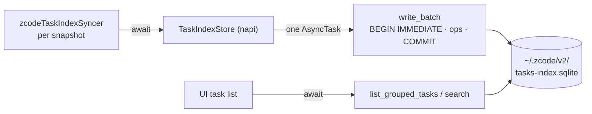

# Rust native port: task index store (`zcode-task-index`)

Status: active. Owner: TaskIndexSpecAuthor. Written 2026-09-30 **before** any implementation
code, per `AGENTS.md:3` and the architecture-governance rule.

This wave delivers **only this file**.

---

## 0. Why this, and what kind of port

A **capability + latency** port, in the same sense as `zcode-cron`
(`docs/specs/rust-native-cron.md` §0): the Tauri host cannot serve the task-index surface, and
the per-write cost is a durable commit on the host event loop.

**Ported component = `packages/services/src/session/taskIndexRepo.ts` (2,567 lines)**, the
`TaskIndexRepo` class: the `~/.zcode/v2/tasks-index.sqlite` database — 9 tables, schema
migration, and the grouped-task-view bookkeeping the UI reads on every task-list render.

---

## 1. Motivation (measured, 2026-09-30)

### 1.1 The write profile — the actual reason

Structural facts, verified at file:line:

| Fact | Evidence |
|---|---|
| Synchronous SQLite handle | `new DatabaseSync(path)` — `taskIndexRepo.ts:524` (5 occurrences) |
| Durability is FULL, not relaxed | `PRAGMA synchronous = NORMAL` requested at `:530`, but the **real database on this host reports `synchronous = 2` (FULL)** |
| WAL, so writers serialise | `PRAGMA journal_mode = WAL` at `:529`, `busy_timeout` at `:527`, `foreign_keys = ON` at `:528` |
| **32 implicit-commit write sites** | 32 `.run(` calls; `writeRecord` (`:1141`) is **one `.run()` per call — one durable commit** |
| Explicit transaction blocks on top | `BEGIN IMMEDIATE` / `COMMIT` at `:632/639`, `:787/803`, `:847/860`, `:934/939` |
| Called per snapshot, not batched | `zcodeTaskIndexSyncer.ts:1693/1695` — `syncTaskMetaAtGroupedTop` / `syncTaskMeta` inside `syncSnapshotAndBroadcast` |

The events port measured the cost of exactly this class of commit on this host:
**6–11 ms per `fdatasync`** (`rust-native-events.md` §1, "Durable commit floor"). With
`synchronous = FULL`, every `writeRecord` is one of those. The store's own `synchronous = NORMAL`
request is not in effect on the real file, so the floor applies.

### 1.2 The scale — stated honestly, because it is *not* the same as the events port

| Database | Size | Rows |
|---|---|---|
| `~/.zcode/cli/db/db.sqlite` (ported, `zcode-events`) | **287 MB** | 4,412 messages / 26,232 parts / 14,020 tool usages |
| `~/.zcode/v2/tasks-index.sqlite` (this port) | **0.4 MB** | 27 tasks, 5 group-node orders, 0 automations |

So **the win here is not read volume.** The 72.8 ms `messages()` figure that justified
`zcode-events` has no analogue here. What this port buys is:

1. **The per-write commit moves off the host event loop** — 6–11 ms of dead loop per task-meta
   sync becomes a worker-thread task.
2. **Capability** — the Tauri host owns no task-index surface today, and the fallback is
   `packages/web`'s shape, which is a wrong answer rather than a degraded one.
3. **Deleted TypeScript** — 2,567 lines, if and only if the deletion condition in §7 is met.

Anyone reading this spec should not expect a `zcode-events`-scale win. §11 R4 records the risk
that the win turns out to be small enough that deletion is not worth the churn.

### 1.3 What is *not* claimed

No read-volume claim, no benchmark number, and no comparison against the TypeScript. The
justification is the commit count and the capability gap, and it is restated here so a reviewer
does not have to infer it.

---

## 2. Scope

### 2.1 Ported

- `TaskIndexRepo` (`taskIndexRepo.ts:481-…`): construction, `ensureReady`, `initialize`, `close`.
- Schema + migration (`tasks_schema_migration`, 4 rows on the real database).
- `writeKey` (`:653`) and `writeRecord` (`:1141`) — the per-snapshot write path.
- `getTaskRow` (`:681`) — the read-before-upsert that `writeRecord` depends on for
  `searchable_text` preservation.
- Grouped-view bookkeeping: `getNextGroupedTopSortOrder` (`:719`), `upsertGroupedTopOrder`
  (`:729`), `normalizeGroupedTopNodeOrders` (`:751`), `normalizeGroupMemberOrders` (`:810`).
- `deleteTaskGroupingReferencesReady` (`:603`), `cleanupDeletedTaskGroupingReferences` (`:619`).
- Group membership: `ensureCronGroupMembership` (`:1391`), `ensureOffPeakGroupMembership` (`:1404`),
  `ensureSystemGroupMembership` (`:1418`).
- Bootstrap: `hasGroupedWorkspaceBootstrapRun` (`:867`), `bootstrapWorkspaceGroupsForActiveTasks`
  (`:958`).
- Lifecycle: `archiveStaleTasks` (`:872`), `clearTaskUnreadIfMatches` (`:1488`),
  `deleteArchivedTask` (`:1532`), `seedTaskMetaIfMissing` (`:1471`).
- Backfills: `backfillOffPeakTaskMarkers` (`:546`), `backfillOffPeakGroupMemberships` (`:575`).
- The grouped task-view **read** path and `buildSearchSnippets` (`:312`), which is what the UI
  calls per task-list render.

### 2.2 NOT ported (siblings / non-goals)

- **`automationRepo.ts` (1,489) and `offPeakTaskRepo.ts` (839)** — two sibling databases in the
  same directory. Same shape and the same playbook, but they are separate stores with separate
  owners; bundling three ports into one change would make the parity surface unauditable.
  Sequenced after this one (§11 R5).
- **`InMemorySessionEventStore`** — stays TS, exactly as in `zcode-events` §0: a per-runtime `Map`
  with zero I/O, where porting buys nothing.
- **The syncer** (`zcodeTaskIndexSyncer.ts`, 1,972 lines) — orchestration and broadcast, not
  computation.
- **`zcodeTaskServiceAdapter` / `zcodeAgentService`** — RPC surface and glue.
- **The renderer-facing projection** — presentation.

### 2.3 Sync vs async decision (event-loop rule 4)

**Every operation becomes an `AsyncTask`.** This is the entire point: the current
`DatabaseSync` blocks the host loop for the duration of a durable commit, measured at 6–11 ms.
Making it async is what converts dead loop into a worker-thread wait.

Two exceptions, both I/O-free, mirroring `zcode-events` §2.3:

- the constructor, which only records options and allocates;
- `close()`, which marks closed and releases the handle once in-flight tasks drain.

### 2.4 Ownership

| Piece | Owner |
|---|---|
| `packages/rust/crates/zcode-task-index/**`, `packages/rust/src/taskIndex.ts`, this spec | TaskIndexSpecAuthor |
| `packages/rust/Cargo.toml`, `packages/rust/package.json` (subpath), `pnpm-lock.yaml` | main session — requests in §10 |
| `packages/services/src/session/taskIndexRepo.ts` (deletion), `zcodeTaskIndexSyncer.ts` (import swap) | TaskIndexSpecAuthor |
| `apps/zcode-tauri/src-tauri/**` | **untouched in this wave** — the Tauri host reaches the store through the Node server, exactly as the session store is reached. Adding Tauri commands here would be a second port. |
| `packages/shared/src/*` (the `ZCodeTaskMeta` wire type) | **untouched** — already carried verbatim into `scheduler_store.rs` |

### 2.5 Invariants

1. **Zero JS fallback.** `zcode-events` §2.5 invariant 1 applies verbatim: one implementation per
   process, no `try { native } catch { node:sqlite }`, no env flag, no degraded mode. The
   `node:sqlite` import is deleted in the same change.
2. **Legacy deleted, not disabled** — but see §7's deletion condition, which is stricter here
   because the store is shared with the still-shipping Electron app.
3. **The database file is the contract.** This is a *persisted* store, unlike
   `zcode-mcp-config`'s hand-edited config. Schema, migration ledger, checksums and pragmas must
   match the file on disk exactly, or an existing install cannot open its own database.
4. **`searchable_text` preservation.** `writeRecord` (`:1141`) reads the existing row precisely so
   that an omitted `searchable_text` is not overwritten with `""` by `ON CONFLICT … excluded`. A
   port that skips the read silently wipes every task's indexed text.
5. **No fabricated data on a miss.** A missing row yields the same default the TypeScript yields.
6. **The Tauri host is not a consumer in this wave** — this is a Node-side port that the server
   process runs, plus the deletion it enables.

---

## 3. The parts that are easy to get wrong

### 3.1 `searchable_text` — the silent data loss

`writeRecord` (`:1141-1150`) does a read *before* the upsert, with the reason in the comment:
`ON CONFLICT … excluded.searchable_text` would otherwise assign `""` and clear the indexed text.
`undefined` means "leave it alone"; that is a three-state contract (`undefined` / `string` /
`""`) that a Rust `Option<String>` maps onto naturally — and the port must not collapse it to
`String::new()`.

### 3.2 The NUL-truncation workaround

`:421` records: *"When node:sqlite reads TEXT, it will truncate the taskId after NUL, causing the
query to not match the grouped view after sorting and writing."* There is an existing workaround in
the SQL. A Rust port reads `TEXT` as a real `String` and does not truncate — so the workaround
becomes unnecessary, and **carrying it over verbatim would be a latent bug**: it would keep
encoding values in a shape only the workaround needs. §6.2 requires deciding this explicitly
rather than by copy-paste.

### 3.3 Grouped-top order normalisation

`normalizeGroupedTopNodeOrders` (`:751`) and `normalizeGroupMemberOrders` (`:810`) rewrite an
ordering to be dense and monotonic, inside `BEGIN IMMEDIATE`. The `sortOrder` default of `0` in
`compareGroupedNodes` (`:445`) and the Monday-based week maths in the same file are the
user-visible consequences. Order semantics, not set semantics: a port that used a `HashMap`
anywhere in this path would produce a stable-but-different order.

### 3.4 The schema migration ledger

`tasks_schema_migration` has 4 rows on the real database. The events port established the
parity requirements that apply here unchanged: the same id set, the same checksum definition
(`sha256` of the **trimmed** SQL, with JavaScript `String.trim` semantics — JS `White_Space`
includes `U+FEFF`, Rust's `str::trim` does not, so the port must implement JS trim explicitly),
the same "read only known ids, take the baseline via `ORDER BY id DESC LIMIT 1`" behaviour, and
`checksum_mismatch` as a distinct failure.

---

## 4. Design

### 4.1 Crate shape

```toml
[package]
name = "zcode-task-index"
version.workspace = true
edition.workspace = true
license.workspace = true
publish.workspace = true

[lib]
# Both, for the same reason as `zcode-cron`: the Node server loads it as a `.node`, and the
# Tauri host would link it as an rlib if it ever becomes a host-side consumer.
crate-type = ["cdylib", "rlib"]

[dependencies]
napi = { workspace = true }
napi-derive = { workspace = true }
serde = { workspace = true }
serde_json = { workspace = true }
rusqlite = { workspace = true }
sha2 = { workspace = true }
```

`rusqlite` with `bundled` is already a workspace dependency (`zcode-events`), so no new
third-party crate is introduced — which matters, because `THIRD-PARTY-NOTICES.md` and
`third-party/inventory.json` would otherwise need regenerating.

### 4.2 Surface

```rust
#[napi]
pub struct TaskIndexStore { /* Arc<Inner>: Mutex<Option<Connection>> + closed flag */ }

#[napi]
impl TaskIndexStore {
  #[napi(constructor)] pub fn new(options: StoreOptions) -> Self;   // SYNC, no I/O
  #[napi] pub fn ensure_ready(&self) -> AsyncTask<ReadyTask>;
  #[napi] pub fn write_task_meta(&self, record_json: String) -> AsyncTask<WriteTask>;
  #[napi] pub fn list_grouped_tasks(&self, query_json: String) -> AsyncTask<ListTasks>;
  #[napi] pub fn search(&self, query_json: String) -> AsyncTask<SearchTask>;
  #[napi] pub fn archive_stale_tasks(&self, params_json: String) -> AsyncTask<ArchiveTask>;
  #[napi] pub fn clear_task_unread(&self, params_json: String) -> AsyncTask<UnreadTask>;
  #[napi] pub fn delete_archived_task(&self, params_json: String) -> AsyncTask<DeleteTask>;
  #[napi] pub fn close(&self);                                        // SYNC, no I/O
}
```

Everything crossing the boundary is a JSON string, matching `zcode-events` §3.3: the store's
domain types stay in TypeScript where the contracts live, and `@zcode/rust` stays
dependency-free.

### 4.3 Write batching

The 32 write sites collapse into one `write_batch`, so a snapshot that touches
`tasks` + `task_groups` + `task_group_members` + `task_group_view_node_orders` costs **one**
commit instead of four-plus. This is the same property `zcode-events` §4.2 bought, and it is the
main reason the port is worth doing at all: the events store's prune storm went from 3–7 commits
per tool call to 1, and this store has the same shape.

Ordering is preserved and the batch is atomic: either the whole snapshot lands or none of it, so
the grouped view can never be left half-written.

### 4.4 State owners



- **Owner:** the store owns the connection; the syncer owns *when* to write; the UI owns *when*
  to read. No cache, so a read after an awaited write always observes it.
- **Event order:** totally ordered by the JS caller's `await` order. One in-flight task at a
  time, so a batch is never interleaved with another batch.
- **Idempotency:** `ON CONFLICT` upserts, unchanged.

---

## 5. Parity harness

The acceptance core, mirroring `zcode-events` §6.

1. **Schema parity** — open a copy of the real database, assert every table, column, index and
   the migration ledger row-for-row.
2. **Differential write corpus** — replay a recorded sequence of `writeRecord` calls against both
   implementations on two database copies, then `SELECT *` every table ordered and diff the dumps.
   Must include: a record with `searchable_text` omitted, one with `""`, one with a value, and a
   task whose `workspaceIdentity` differs from its `workspacePath`.
3. **Grouped-order fixtures** — dense/monotonic normalisation, the `sortOrder ?? 0` default, the
   Monday-based week maths, and the `compareGroupedNodes` ordering.
4. **Snippet fixtures** — `buildSearchSnippets` overlap suppression, the prefix/suffix ellipsis
   rules, and the `TASK_SEARCH_SNIPPET_LIMIT` cap.
5. **DST fixtures** — the grouped view buckets by local calendar day, so a task created either side
   of a transition must land in the expected bucket. Run under `TZ=America/New_York` and
   `Europe/Berlin`, the same discipline as `zcode-cron`'s `parity_dst.rs`.

---

## 6. Decisions taken before implementation

1. **The NUL workaround (§3.2) is dropped, not copied.** A Rust `TEXT` read does not truncate, so
   the workaround's input encoding is removed. Asserted by a fixture that writes a task id
   containing a NUL-adjacent sequence and reads it back whole. If any caller still *produces*
   NUL-containing ids, that is a separate bug to fix, not a reason to keep the workaround.
2. **The migration SQL stays in TypeScript** and is passed as JSON data, exactly as
   `zcode-events` §4.4 concluded. 2,567 lines already move; duplicating the SQL into Rust would
   add a checksum-drift surface for no gain, and the crate's `migrate_step` validates the id
   format so a malformed id fails loudly.
3. **`searchable_text` is a three-state `Option<Option<String>>`** at the boundary: absent means
   "leave alone", `Some("")` means "clear", `Some(text)` means "set". Collapsing this is the single
   most likely way to ship silent data loss.

---

## 7. Deletion condition — deliberately stricter than `zcode-events`

`zcode-events` deleted its TypeScript in the same change because its only consumers were
Node-side. **This store does not have that property yet:**

- `packages/desktop/src/main/index.ts` and the Electron host reach the store in-process, and
  **Electron remains the shipping product**.
- So the port lands as: Rust implementation live, TypeScript still present, consumers switched
  one at a time.
- `taskIndexRepo.ts` is deleted **only when the Electron host no longer calls it**, at the Electron
  cutover — the same position `mcpUserDirectory/` is in, and for the same reason.

Every change in this wave therefore runs `tsc -p tsconfig.host.json` as a gate, proving the
Electron path is intact. Invariant 2 stays unsatisfied until the cutover, and that is recorded
rather than papered over.

---

## 8. Failure semantics

- **Binary missing / load failure** → `loadNative` throws. No `node:sqlite` fallback.
- **Open failure** → typed error carrying SQLite's result code, wrapped into the same shape the
  caller already handles, so a locked or corrupt file is reported rather than retried.
- **Migration failure** → rollback, then a `failed` progress step with the error code and the
  migration id, then the normalized error. `checksum_mismatch` stays distinct.
- **Missing row on read** → the same default the TypeScript yields; never a fabricated row.
- **A group-ordering violation** → normalized inside the transaction, not propagated.
- **`store_closed`** → a new call rejects loudly; in-flight calls drain.

---

## 9. Divergences

- **D1 — the NUL workaround is removed (§6.1).** A behaviour *fix*, and the only intentional
  divergence from the TypeScript's observable behaviour.
- **D2 — commit batching.** Four-plus commits per snapshot become one. At the row level
  "resolved ⇒ durable" still holds; no caller requires prefix-commit on failure.
- **D3 — the Tauri host gains no new command surface in this wave** (§2.4). This is a Node-side
  port plus a deletion it enables, not a shell migration.

---

## 10. Shared-file change requests (main session)

| File | Exact change | Why |
|---|---|---|
| `packages/rust/Cargo.toml` | **no change** — `rusqlite` and `sha2` are already workspace dependencies (`zcode-events`) | verified; also keeps `THIRD-PARTY-NOTICES.md` untouched |
| `packages/rust/package.json` | add `"./task-index": "./src/taskIndex.ts"` | the Node server needs a subpath |
| root `package.json` | **no change** — `packages/rust` is already in the typecheck project list | verified |
| `architecture-policy.yaml` | **no change** — the `rust` module already owns `packages/rust`; `services` gains no new dependency edge, it already depends on `@zcode/rust` | verified |
| `pnpm-lock.yaml` | **no change expected** — no new npm dependency (`node:sqlite` is a Node builtin, and it is being removed) | verified |

---

## 11. Risks

- **R1 — schema or migration drift makes an existing install unable to open its own database.**
  The highest-consequence risk: the file is persisted, and the user notices on next launch, not in
  a test. Mitigation: §5.1 opens a copy of the **real** database, and §3.4 carries the events
  port's checksum rules forward unchanged.
- **R2 — `searchable_text` silent loss (§3.1).** Every task's indexed text would be wiped while
  the UI kept working, because search would simply return nothing. Mitigation: a fixture that
  omits the field, plus a differential dump comparison.
- **R3 — grouped-view order divergence (§3.3).** The task list would render in a different order
  with no error anywhere. Mitigation: §5.3, and the order is asserted rather than compared as a
  set.
- **R4 — the win may be smaller than the events port's.** §1.2 is explicit that this database is
  0.4 MB, so there is no read-volume win; the value is per-write commit latency plus capability.
  If measurement shows the sync frequency is low, the honest conclusion is that this port is a
  capability play and not a latency one, and that should be said rather than implied.
- **R5 — scope creep into the two sibling databases.** `automationRepo` (1,489) and
  `offPeakTaskRepo` (839) are the same shape. Doing all three in one change would triple the
  parity surface and make a failure unauditable. Sequenced, not bundled (§2.2).
- **R6 — the Electron cutover is out of our control.** Invariant 2 cannot be satisfied while
  Electron ships (§7). This is a scheduling dependency, not a technical one, and it should be
  raised with whoever owns the cutover rather than discovered at the end.
