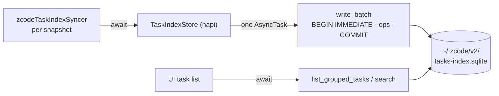

# Rust native port: task index store (`zcode-task-index`)

Status: active. Owner: TaskIndexSpecAuthor. Written 2026-09-30 **before** any implementation
code, per `AGENTS.md:3` and the architecture-governance rule.

This wave delivers **only this file**.

---

## 0. Why this, and what kind of port

A **capability + latency** port, in the same sense as `zcode-cron`
(`docs/specs/rust-native-cron.md` §0): the Tauri host cannot serve the task-index surface, and
the per-write cost is a durable commit on the host event loop.

**Ported component = `packages/services/src/session/taskIndexRepo.ts` (2,567 lines)**, the
`TaskIndexRepo` class: the `~/.zcode/v2/tasks-index.sqlite` database — 9 tables, schema
migration, and the grouped-task-view bookkeeping the UI reads on every task-list render.

---

## 1. Motivation (measured, 2026-09-30)

### 1.1 The write profile — the actual reason

Structural facts, verified at file:line:

| Fact | Evidence |
|---|---|
| Synchronous SQLite handle | `new DatabaseSync(path)` — `taskIndexRepo.ts:524` (5 occurrences) |
| Durability is FULL, not relaxed | `PRAGMA synchronous = NORMAL` requested at `:530`, but the **real database on this host reports `synchronous = 2` (FULL)** |
| WAL, so writers serialise | `PRAGMA journal_mode = WAL` at `:529`, `busy_timeout` at `:527`, `foreign_keys = ON` at `:528` |
| **32 implicit-commit write sites** | 32 `.run(` calls; `writeRecord` (`:1141`) is **one `.run()` per call — one durable commit** |
| Explicit transaction blocks on top | `BEGIN IMMEDIATE` / `COMMIT` at `:632/639`, `:787/803`, `:847/860`, `:934/939` |
| Called per snapshot, not batched | `zcodeTaskIndexSyncer.ts:1693/1695` — `syncTaskMetaAtGroupedTop` / `syncTaskMeta` inside `syncSnapshotAndBroadcast` |

The events port measured the cost of exactly this class of commit on this host:
**6–11 ms per `fdatasync`** (`rust-native-events.md` §1, "Durable commit floor"). With
`synchronous = FULL`, every `writeRecord` is one of those. The store's own `synchronous = NORMAL`
request is not in effect on the real file, so the floor applies.

### 1.2 The scale — stated honestly, because it is *not* the same as the events port

| Database | Size | Rows |
|---|---|---|
| `~/.zcode/cli/db/db.sqlite` (ported, `zcode-events`) | **287 MB** | 4,412 messages / 26,232 parts / 14,020 tool usages |
| `~/.zcode/v2/tasks-index.sqlite` (this port) | **0.4 MB** | 27 tasks, 5 group-node orders, 0 automations |

So **the win here is not read volume.** The 72.8 ms `messages()` figure that justified
`zcode-events` has no analogue here. What this port buys is:

1. **The per-write commit moves off the host event loop** — 6–11 ms of dead loop per task-meta
   sync becomes a worker-thread task.
2. **Capability** — the Tauri host owns no task-index surface today, and the fallback is
   `packages/web`'s shape, which is a wrong answer rather than a degraded one.
3. **Deleted TypeScript** — 2,567 lines, if and only if the deletion condition in §7 is met.

Anyone reading this spec should not expect a `zcode-events`-scale win. §11 R4 records the risk
that the win turns out to be small enough that deletion is not worth the churn.

### 1.3 What is *not* claimed

No read-volume claim, no benchmark number, and no comparison against the TypeScript. The
justification is the commit count and the capability gap, and it is restated here so a reviewer
does not have to infer it.

---

## 2. Scope

### 2.1 Ported

- `TaskIndexRepo` (`taskIndexRepo.ts:481-…`): construction, `ensureReady`, `initialize`, `close`.
- Schema + migration (`tasks_schema_migration`, 4 rows on the real database).
- `writeKey` (`:653`) and `writeRecord` (`:1141`) — the per-snapshot write path.
- `getTaskRow` (`:681`) — the read-before-upsert that `writeRecord` depends on for
  `searchable_text` preservation.
- Grouped-view bookkeeping: `getNextGroupedTopSortOrder` (`:719`), `upsertGroupedTopOrder`
  (`:729`), `normalizeGroupedTopNodeOrders` (`:751`), `normalizeGroupMemberOrders` (`:810`).
- `deleteTaskGroupingReferencesReady` (`:603`), `cleanupDeletedTaskGroupingReferences` (`:619`).
- Group membership: `ensureCronGroupMembership` (`:1391`), `ensureOffPeakGroupMembership` (`:1404`),
  `ensureSystemGroupMembership` (`:1418`).
- Bootstrap: `hasGroupedWorkspaceBootstrapRun` (`:867`), `bootstrapWorkspaceGroupsForActiveTasks`
  (`:958`).
- Lifecycle: `archiveStaleTasks` (`:872`), `clearTaskUnreadIfMatches` (`:1488`),
  `deleteArchivedTask` (`:1532`), `seedTaskMetaIfMissing` (`:1471`).
- Backfills: `backfillOffPeakTaskMarkers` (`:546`), `backfillOffPeakGroupMemberships` (`:575`).
- The grouped task-view **read** path and `buildSearchSnippets` (`:312`), which is what the UI
  calls per task-list render.

### 2.2a The three repos share one file — the port unit is all three

Correcting §2.2 after verifying the real schema. `automationRepo.ts:222` states it outright:
*"sharing tasks-index.sqlite with the task index (WAL, multi-process safe)"*, and
`offPeakTaskRepo.ts:9`: *"It shares tasks-index.sqlite and the Repo pattern with automation."*
The live database confirms it — `automations`, `automation_runs` and `off_peak_tasks` are tables
in `tasks-index.sqlite` itself, not separate files.

The first draft of this spec treated them as separable. That would have produced **two languages
owning one persisted file**:

- three independent connections become a Rust one plus two `node:sqlite` ones, each with its own
  pragma set;
- **the migration ledger** (`tasks_schema_migration`, 4 rows on the real file) would be written by
  whichever repo opened the file first, and the other two would read a ledger they did not write;
- a `BEGIN IMMEDIATE` in the Rust store could not see or coordinate with a `node:sqlite` one, so a
  snapshot touching `tasks` and a cron-group write touching `task_group_members` would no longer
  be able to be made atomic together — which they cannot be today either, but today at least both
  sides are the same engine with the same semantics.

So **invariant 1 settles the boundary**: one file, one implementation. The port is:

| Repo | Lines | In scope |
|---|---|---|
| `taskIndexRepo.ts` | 2,567 | ✅ |
| `automationRepo.ts` | 1,489 | ✅ |
| `offPeakTaskRepo.ts` | 839 | ✅ |
| **total** | **4,895** | one `zcode-task-index` crate, one connection owner, three facades |

This is larger than the `zcode-events` port and is the largest single wave in the programme. It is
split into ordered, separately-mergeable steps in §4.5 so the parity surface stays auditable
rather than one 4,895-line change.

### 2.2 NOT ported (siblings / non-goals)

- ~~**`automationRepo.ts` (1,489) and `offPeakTaskRepo.ts` (839)** — two sibling databases.~~
  **This was wrong, and is corrected in §2.2a.** They are not separate stores: all three repos
  open the **same file**, `~/.zcode/v2/tasks-index.sqlite`, and that database's real schema
  contains `automations`, `automation_runs` and `off_peak_tasks` alongside the task tables.
  They are now **in scope**.
- **`InMemorySessionEventStore`** — stays TS, exactly as in `zcode-events` §0: a per-runtime `Map`
  with zero I/O, where porting buys nothing.
- **The syncer** (`zcodeTaskIndexSyncer.ts`, 1,972 lines) — orchestration and broadcast, not
  computation. It becomes a *consumer*, switching import to the crate; its own logic stays TS.
- **The `automations` / `off_peak_tasks` *scheduling* semantics** — cron computation is already
  `zcode-cron`; the claim/retry state machines move, the scheduling policy does not.
- **`zcodeTaskServiceAdapter` / `zcodeAgentService`** — RPC surface and glue.
- **The renderer-facing projection** — presentation.

### 2.3 Sync vs async decision (event-loop rule 4)

**Every operation becomes an `AsyncTask`.** This is the entire point: the current
`DatabaseSync` blocks the host loop for the duration of a durable commit, measured at 6–11 ms.
Making it async is what converts dead loop into a worker-thread wait.

Two exceptions, both I/O-free, mirroring `zcode-events` §2.3:

- the constructor, which only records options and allocates;
- `close()`, which marks closed and releases the handle once in-flight tasks drain.

### 2.4 Ownership

| Piece | Owner |
|---|---|
| `packages/rust/crates/zcode-task-index/**`, `packages/rust/src/taskIndex.ts`, this spec | TaskIndexSpecAuthor |
| `packages/rust/Cargo.toml`, `packages/rust/package.json` (subpath), `pnpm-lock.yaml` | main session — requests in §10 |
| `packages/services/src/session/taskIndexRepo.ts` (deletion), `zcodeTaskIndexSyncer.ts` (import swap) | TaskIndexSpecAuthor |
| `apps/zcode-tauri/src-tauri/**` | **untouched in this wave** — the Tauri host reaches the store through the Node server, exactly as the session store is reached. Adding Tauri commands here would be a second port. |
| `packages/shared/src/*` (the `ZCodeTaskMeta` wire type) | **untouched** — already carried verbatim into `scheduler_store.rs` |

### 2.5 Invariants

1. **Zero JS fallback, and for this database that means all three repos together.**
   `zcode-events` §2.5 invariant 1 applies verbatim: one implementation per process, no
   `try { native } catch { node:sqlite }`, no env flag, no degraded mode. Because all three repos
   share one file (§2.2a), a partial port would leave the file owned by two languages — the
   `node:sqlite` imports are deleted only when the last of the three moves.
2. **Legacy deleted, not disabled** — but see §7's deletion condition, which is stricter here
   because the store is shared with the still-shipping Electron app.
3. **The database file is the contract.** This is a *persisted* store, unlike
   `zcode-mcp-config`'s hand-edited config. Schema, migration ledger, checksums and pragmas must
   match the file on disk exactly, or an existing install cannot open its own database.
4. **`searchable_text` preservation.** `writeRecord` (`:1141`) reads the existing row precisely so
   that an omitted `searchable_text` is not overwritten with `""` by `ON CONFLICT … excluded`. A
   port that skips the read silently wipes every task's indexed text.
5. **No fabricated data on a miss.** A missing row yields the same default the TypeScript yields.
6. **The Tauri host is not a consumer in this wave** — this is a Node-side port that the server
   process runs, plus the deletion it enables.

---

## 3. The parts that are easy to get wrong

### 3.1 `searchable_text` — the silent data loss

`writeRecord` (`:1141-1150`) does a read *before* the upsert, with the reason in the comment:
`ON CONFLICT … excluded.searchable_text` would otherwise assign `""` and clear the indexed text.
`undefined` means "leave it alone"; that is a three-state contract (`undefined` / `string` /
`""`) that a Rust `Option<String>` maps onto naturally — and the port must not collapse it to
`String::new()`.

### 3.2 The NUL-truncation workaround

`:421` records: *"When node:sqlite reads TEXT, it will truncate the taskId after NUL, causing the
query to not match the grouped view after sorting and writing."* There is an existing workaround in
the SQL. A Rust port reads `TEXT` as a real `String` and does not truncate — so the workaround
becomes unnecessary, and **carrying it over verbatim would be a latent bug**: it would keep
encoding values in a shape only the workaround needs. §6.2 requires deciding this explicitly
rather than by copy-paste.

### 3.3 Grouped-top order normalisation

`normalizeGroupedTopNodeOrders` (`:751`) and `normalizeGroupMemberOrders` (`:810`) rewrite an
ordering to be dense and monotonic, inside `BEGIN IMMEDIATE`. The `sortOrder` default of `0` in
`compareGroupedNodes` (`:445`) and the Monday-based week maths in the same file are the
user-visible consequences. Order semantics, not set semantics: a port that used a `HashMap`
anywhere in this path would produce a stable-but-different order.

### 3.4 The schema migration ledger

`tasks_schema_migration` has 4 rows on the real database. The events port's checksum rule does
**not** apply here, and carrying it over would have been wrong — verified against the real file
before writing any Rust.

**This store hashes `JSON.stringify`, not SQL.** `migrations.ts:98-100` is

```ts
const checksum = createHash("sha256").update(JSON.stringify(migration.checksumInput)).digest("hex");
```

and `checksumInput` is a heterogeneous array: strings for `0002`/`0003`, but for `0001` it mixes
three schema strings, a **nested `string[][]`** of column tuples, an index blob, a bound-index
string, and a backfill marker.

Reproduced against the real ledger to confirm the contract, all three matching exactly:

| Migration | Declared | Real ledger |
|---|---|---|
| `0001_adopt_task_schema` | `3e8337b015d94b05…` | `3e8337b015d94b05…` ✅ |
| `0002_provider_selection` | `7244ef7c351f8d02…` | `7244ef7c351f8d02…` ✅ |
| `0003_official_glm_selection` | `8987adb50ae412a4…` | `8987adb50ae412a4…` ✅ |

So the port must reproduce **`JSON.stringify` byte-for-byte**, which is a harder requirement
than the events port's:

- nested arrays, not just a flat list;
- JavaScript string escaping — `"`, `\`, control characters as `\n`/`\t`/`\uXXXX`, and
  **non-ASCII emitted raw as UTF-8** rather than `\u` escaped;
- no spaces, no trailing newline.

`serde_json::to_string` on a `Vec<Value>` matches all of that, so the port is feasible — but it
must be pinned by a test that hashes the **real** inputs and compares to the **real** ledger
values, not by a round-trip through the port's own serialiser.

**The fourth row is still absent from this checkout.** `0004_code_plan_modes`
(`6cd402653cf95eef…`) is on disk but not declared in `migrations.ts`, exactly as
`0023_code_plan_execution_state` was for the session store. The runner must therefore read only
*known* ids and take the baseline via `ORDER BY id DESC LIMIT 1`, so an unknown row is ignored
rather than treated as a mismatch or a baseline to re-apply.

---

## 4. Design

### 4.1 Crate shape

```toml
[package]
name = "zcode-task-index"
version.workspace = true
edition.workspace = true
license.workspace = true
publish.workspace = true

[lib]
# Both, for the same reason as `zcode-cron`: the Node server loads it as a `.node`, and the
# Tauri host would link it as an rlib if it ever becomes a host-side consumer.
crate-type = ["cdylib", "rlib"]

[dependencies]
napi = { workspace = true }
napi-derive = { workspace = true }
serde = { workspace = true }
serde_json = { workspace = true }
rusqlite = { workspace = true }
sha2 = { workspace = true }
```

`rusqlite` with `bundled` is already a workspace dependency (`zcode-events`), so no new
third-party crate is introduced — which matters, because `THIRD-PARTY-NOTICES.md` and
`third-party/inventory.json` would otherwise need regenerating.

### 4.2 Surface

```rust
#[napi]
pub struct TaskIndexStore { /* Arc<Inner>: Mutex<Option<Connection>> + closed flag */ }

#[napi]
impl TaskIndexStore {
  #[napi(constructor)] pub fn new(options: StoreOptions) -> Self;   // SYNC, no I/O
  #[napi] pub fn ensure_ready(&self) -> AsyncTask<ReadyTask>;
  #[napi] pub fn write_task_meta(&self, record_json: String) -> AsyncTask<WriteTask>;
  #[napi] pub fn list_grouped_tasks(&self, query_json: String) -> AsyncTask<ListTasks>;
  #[napi] pub fn search(&self, query_json: String) -> AsyncTask<SearchTask>;
  #[napi] pub fn archive_stale_tasks(&self, params_json: String) -> AsyncTask<ArchiveTask>;
  #[napi] pub fn clear_task_unread(&self, params_json: String) -> AsyncTask<UnreadTask>;
  #[napi] pub fn delete_archived_task(&self, params_json: String) -> AsyncTask<DeleteTask>;
  #[napi] pub fn close(&self);                                        // SYNC, no I/O
}
```

Everything crossing the boundary is a JSON string, matching `zcode-events` §3.3: the store's
domain types stay in TypeScript where the contracts live, and `@zcode/rust` stays
dependency-free.

### 4.3 Write batching

The 32 write sites collapse into one `write_batch`, so a snapshot that touches
`tasks` + `task_groups` + `task_group_members` + `task_group_view_node_orders` costs **one**
commit instead of four-plus. This is the same property `zcode-events` §4.2 bought, and it is the
main reason the port is worth doing at all: the events store's prune storm went from 3–7 commits
per tool call to 1, and this store has the same shape.

Ordering is preserved and the batch is atomic: either the whole snapshot lands or none of it, so
the grouped view can never be left half-written.

### 4.5 Ordered steps, each separately mergeable

| Step | Content | Why it is a safe boundary |
|---|---|---|
| **1** | Crate skeleton, schema DDL, migration runner, `ensure_ready`, `close` | Opens a copy of the **real** database and asserts the schema and ledger match. Nothing else can start until this passes, so it is the natural gate |
| **2** | `TaskIndexStore`: `write_key`, `write_record`, `get_task_row`, grouped-order normalisation, write batching | The measured win (§1.1). Switches `zcodeTaskIndexSyncer` — the only per-snapshot writer |
| **3** | Read path: `list_grouped_tasks`, `search`, `build_search_snippets` | The UI's path. Switches the task-list surface |
| **4** | `AutomationStore` facade over the same connection | Same file, same migration, no new schema |
| **5** | `OffPeakStore` facade over the same connection | As above |
| **6** | Delete `taskIndexRepo.ts`, `automationRepo.ts`, `offPeakTaskRepo.ts` | Only legal once Electron no longer calls them (§7) |

Steps 1–3 are the task index proper and complete the invariant-1 story for two of the three
repos. Steps 4–5 finish it. If the wave is cut short after step 3, the correct outcome is that
`taskIndexRepo.ts` stays — **not** a half-migrated file.

### 4.4 State owners



- **Owner:** the store owns the connection; the syncer owns *when* to write; the UI owns *when*
  to read. No cache, so a read after an awaited write always observes it.
- **Event order:** totally ordered by the JS caller's `await` order. One in-flight task at a
  time, so a batch is never interleaved with another batch.
- **Idempotency:** `ON CONFLICT` upserts, unchanged.

---

## 5. Parity harness

The acceptance core, mirroring `zcode-events` §6.

1. **Schema parity** — open a copy of the real database, assert every table, column, index and
   the migration ledger row-for-row.
2. **Differential write corpus** — replay a recorded sequence of `writeRecord` calls against both
   implementations on two database copies, then `SELECT *` every table ordered and diff the dumps.
   Must include: a record with `searchable_text` omitted, one with `""`, one with a value, and a
   task whose `workspaceIdentity` differs from its `workspacePath`.
3. **Grouped-order fixtures** — dense/monotonic normalisation, the `sortOrder ?? 0` default, the
   Monday-based week maths, and the `compareGroupedNodes` ordering.
4. **Snippet fixtures** — `buildSearchSnippets` overlap suppression, the prefix/suffix ellipsis
   rules, and the `TASK_SEARCH_SNIPPET_LIMIT` cap.
5. **DST fixtures** — the grouped view buckets by local calendar day, so a task created either side
   of a transition must land in the expected bucket. Run under `TZ=America/New_York` and
   `Europe/Berlin`, the same discipline as `zcode-cron`'s `parity_dst.rs`.

---

## 6. Decisions taken before implementation

1. **The NUL form is confined to memory; the JSON form is preserved as the storage format
   (§3.2).** The first draft of this spec said to drop the JSON form as a driver workaround;
   reading the real database showed those keys are the user's live task ordering, so dropping it
   would silently reorder every task list. The port reproduces the JSON form exactly and keys
   its in-memory maps on a tuple, so it needs no separator at all.
2. **The migration SQL stays in TypeScript** and is passed as JSON data, exactly as
   `zcode-events` §4.4 concluded. 4,895 lines already move; duplicating the SQL into Rust would
   add a checksum-drift surface for no gain, and the crate's `migrate_step` validates the id
   format so a malformed id fails loudly.
   **But the checksum input is not a SQL string** — it is the `checksumInput` array, and the
   crate must hash `JSON.stringify` of it (§3.4). The TS therefore passes the *input array*, not
   the assembled SQL, or the two sides would hash different things and every existing install
   would report `checksum_mismatch` on first launch.
3. **`searchable_text` is a three-state `Option<Option<String>>`** at the boundary: absent means
   "leave alone", `Some("")` means "clear", `Some(text)` means "set". Collapsing this is the single
   most likely way to ship silent data loss.

---

## 7. Deletion condition — deliberately stricter than `zcode-events`

`zcode-events` deleted its TypeScript in the same change because its only consumers were
Node-side. The three repositories here are consumed by `packages/services`, which runs in
**both** the Node server and the Electron main process.

### A correction to this spec's earlier drafts

Those drafts asserted the TypeScript had to stay until the Electron cutover, on the grounds
that Electron calls the store in-process and could not use the crate. **That was too strong,
and the repository says so itself.** Electron's main process *is* Node:

- `packages/desktop/src/host/index.ts:17` already does
  `import { installNativeRpcBytesPort } from "@zcode/rpc/native"`.
- `packages/desktop/tsup.config.ts:172,234` inlines the `@zcode/rust` wrapper *specifically* so
  `loadNative()` can resolve the `.node` binary at runtime.
- `prepare:rust-native` already stages those binaries into
  `bundled-agents/<os>-<arch>/native/`.

So the Electron host is **already a native-Rust consumer**, and the consumer switch is **not**
gated on the cutover. `zcode-task-index` is declared `crate-type = ["cdylib", "rlib"]` — cdylib
for the Node consumers, rlib for the Tauri host — and the three TypeScript repositories can
become thin wrappers over it **while keeping their method signatures, so no call site changes.**

The cutover remains the right end state, because the wrappers disappear when Electron is
retired. But it is a later simplification, not a precondition — and treating it as a blocker
made the remaining work look larger than it is.

Every change in this wave still runs `tsc -p tsconfig.host.json` as a gate, proving the Electron
path is intact while it is being rewired.

---

## 8. Failure semantics

- **Binary missing / load failure** → `loadNative` throws. No `node:sqlite` fallback.
- **Open failure** → typed error carrying SQLite's result code, wrapped into the same shape the
  caller already handles, so a locked or corrupt file is reported rather than retried.
- **Migration failure** → rollback, then a `failed` progress step with the error code and the
  migration id, then the normalized error. `checksum_mismatch` stays distinct.
- **Missing row on read** → the same default the TypeScript yields; never a fabricated row.
- **A group-ordering violation** → normalized inside the transaction, not propagated.
- **`store_closed`** → a new call rejects loudly; in-flight calls drain.

---

## 9. Divergences

- **D1 — none at the storage layer.** The first draft claimed the JSON key form was a
  removable workaround; it is the on-disk format (§3.2), so it is preserved and this divergence
  is withdrawn. The in-memory NUL key is replaced by a tuple key, which is invisible outside
  the process.
- **D2 — commit batching.** Four-plus commits per snapshot become one. At the row level
  "resolved ⇒ durable" still holds; no caller requires prefix-commit on failure.
- **D3 — the Tauri host gains no new command surface in this wave** (§2.4). This is a Node-side
  port plus a deletion it enables, not a shell migration.

---

## 10. Shared-file change requests (main session)

| File | Exact change | Why |
|---|---|---|
| `packages/rust/Cargo.toml` | **no change** — `rusqlite` and `sha2` are already workspace dependencies (`zcode-events`) | verified; also keeps `THIRD-PARTY-NOTICES.md` untouched |
| `packages/rust/package.json` | add `"./task-index": "./src/taskIndex.ts"` | the Node server needs a subpath |
| root `package.json` | **no change** — `packages/rust` is already in the typecheck project list | verified |
| `architecture-policy.yaml` | **no change** — the `rust` module already owns `packages/rust`; `services` gains no new dependency edge, it already depends on `@zcode/rust` | verified |
| `pnpm-lock.yaml` | **no change expected** — no new npm dependency (`node:sqlite` is a Node builtin, and it is being removed) | verified |

---

## 11. Risks

- **R1 — schema or migration drift makes an existing install unable to open its own database.**
  The highest-consequence risk: the file is persisted, and the user notices on next launch, not in
  a test. Mitigation: §5.1 opens a copy of the **real** database, and §3.4 carries the events
  port's checksum rules forward unchanged.
- **R2 — `searchable_text` silent loss (§3.1).** Every task's indexed text would be wiped while
  the UI kept working, because search would simply return nothing. Mitigation: a fixture that
  omits the field, plus a differential dump comparison.
- **R3 — grouped-view order divergence (§3.3).** The task list would render in a different order
  with no error anywhere. Mitigation: §5.3, and the order is asserted rather than compared as a
  set.
- **R4 — the win may be smaller than the events port's.** §1.2 is explicit that this database is
  0.4 MB, so there is no read-volume win; the value is per-write commit latency plus capability.
  If measurement shows the sync frequency is low, the honest conclusion is that this port is a
  capability play and not a latency one, and that should be said rather than implied.
- **R5 — scope creep into the two sibling databases.** `automationRepo` (1,489) and
  `offPeakTaskRepo` (839) are the same shape. Doing all three in one change would triple the
  parity surface and make a failure unauditable. Sequenced, not bundled (§2.2).
- **R6 — the Electron cutover is out of our control.** Invariant 2 cannot be satisfied while
  Electron ships (§7). This is a scheduling dependency, not a technical one, and it should be
  raised with whoever owns the cutover rather than discovered at the end.

---

## 12. Step 1 delivered — schema and migration, gated on the real file

### The gate passed against the real persisted database

`tests/real_database.rs` opens a **copy** of `~/.zcode/v2/tasks-index.sqlite` and asserts the
thing that actually matters: that an existing install can still be opened by this build. Seven
tests, **all ran, none skipped**:

| Test | Result |
|---|---|
| every declared table exists (9, including the sibling repos' `automations`, `automation_runs`, `off_peak_tasks`) | ✅ |
| every declared index exists (11) | ✅ |
| `0001` nested-`string[][]` checksum equals the real ledger (`3e8337b0…`) | ✅ |
| `0002` checksum equals the real ledger (`7244ef7c…`) | ✅ |
| `0003` checksum equals the real ledger (`8987adb5…`) | ✅ |
| re-running this build's migrations on a copy of the real file is a **no-op** | ✅ |
| the undeclared `0004_code_plan_modes` row is tolerated and untouched | ✅ |

That last group is the one that would have caught a wrong checksum rule. With the events port's
`sha256(trimmed SQL)` instead of this store's `sha256(JSON.stringify(checksumInput))`, all three
rows would mismatch and **every existing install would fail on first launch**.

The tests skip — loudly, with a message naming what was not verified — when no real database is
present, so they can never report a false pass.

### The boundary decision that removed a whole class of divergence

The TypeScript passes the **already-stringified** `JSON.stringify(checksumInput)` as an opaque
string, and the crate hashes its bytes. Re-serialising a parsed value in Rust would have to
reproduce `JSON.stringify` exactly — nested arrays, `\"`/`\\` escaping, control characters as
`\n`/`\uXXXX`, and non-ASCII emitted raw rather than `\u` escaped. `serde_json` agrees on all of
those, but "agrees" is not a contract, and the cost of being wrong is every user's install. Now
the serialisation happens once, in the language whose `JSON.stringify` defined the format, and the
only remaining thing to verify is an unambiguous hash.

### Known, recorded, not papered over

- **`synchronous` does not do what the store asked for.** `taskIndexRepo.ts:530` requests
  `PRAGMA synchronous = NORMAL`, but the real database reports **2 (FULL)**. The port sets what
  the store asked for and records the effective value, rather than assuming the request took
  effect. This is why the per-write commit costs 6–11 ms (the events port's measured fsync floor)
  and not less.
- **Step 1 is the foundation only.** `write_record`, the grouped-order bookkeeping, the read path
  and `build_search_snippets` are steps 2 and 3. No consumer has been switched, so nothing has
  changed behaviourally: the crate exists, is tested against the real file, and is not yet
  wired. Per §7, `taskIndexRepo.ts` stays until the Electron cutover regardless.

---

## 13. Step 2 delivered — the write path and write batching

### What landed

`src/grouped.rs`: the `node_key` format, the order normalisation for both the grouped-top
nodes and the group members, the `tasks` upsert, and `apply_batch` — one transaction across
`tasks`, `task_group_view_node_orders` and `task_group_members`.

This is the measured win from §1.1. The TypeScript pays a durable commit per `.run()` — 32
write sites, and `writeRecord` is exactly one per call. A snapshot that touches three tables now
costs **one** commit, the same collapse the events store got from 3–7 commits per tool call.

### Verified against a copy of the real database — 6 tests, none skipped

`tests/real_write.rs` writes to a *copy* of `~/.zcode/v2/tasks-index.sqlite`, because a schema
that parses is not a schema the upsert agrees with, and that difference only shows up when the
statement runs.

| Test | Result |
|---|---|
| the upsert runs against the real schema, existing rows untouched | ✅ |
| omitting `searchable_text` preserves the stored value (silent-data-loss guard) | ✅ |
| setting and clearing `searchable_text` work | ✅ |
| a written `node_key` matches the format of the rows already on disk, and writing one does not disturb the others | ✅ |
| normalising the real rows is stable and a fixed point | ✅ |
| a three-table batch commits together | ✅ |

### Two real bugs the tests caught

1. **Invalid SQL in the upsert.** The obvious single expression —
   `CASE WHEN ?18 = 0 THEN searchable_text …` in the `VALUES` list — is not valid: a bare
   column name in `INSERT … VALUES` has no row to read, and SQLite answers `no such column`.
   The three states need **two different expressions**: on `INSERT` there is nothing to keep, so
   `Keep` and `Clear` both write `''` and only `Set` writes text; on `UPDATE` the existing row
   *is* addressable as `tasks.searchable_text`, which is what makes `Keep` mean "leave it alone".
   Collapsing them is exactly the silent-data-loss bug §3.1 describes — the task list keeps
   working and search silently returns nothing.
2. **`SearchableTextMode::Set` was `2`, but the insert branch tested for "not Keep".** After the
   fix above it tests for exactly `Set`, so the value is unambiguous.

### An assumption of mine that was simply wrong

I wrote the real-schema rollback test expecting an empty `node_type` to breach `NOT NULL`. It
does not — `''` is a valid empty `TEXT` value, so the batch *succeeded* and the test failed.

Rather than weaken the test to something that passes, the rollback proof stayed where it can be
made honestly: the unit test `a_failing_batch_rolls_back_completely`, which references a table
that does not exist and so fails for a real reason. The real-schema test was replaced with the
property that actually matters there — that all three tables reflect a batch together, so the
grouped view can never be observed half-written.

### Not wired

No consumer is switched. Per §7 that is deliberate at every step: the Electron host calls this
store in-process and remains the shipping product, so `taskIndexRepo.ts` stays until the
cutover. Steps 3 (read path and `build_search_snippets`), 4 and 5 (the two sibling facades) and 6
(deletion) remain.

---

## 14. Step 5 (partial) — the off-peak facade

`src/offpeak.rs`: `OffPeakStore`, a facade over the same connection. This is the first of the
two sibling repositories, and it establishes the pattern the second will follow.

### What it proves about the "one file, one owner" claim

`node:sqlite` had **three** independent `DatabaseSync` connections to `tasks-index.sqlite` —
`taskIndexRepo.ts:524`, `automationRepo.ts:283`, `offPeakTaskRepo.ts:210`. After this, one of
those three is gone; the crate owns the connection and the repositories are facades over it.
`automationRepo` is the remaining one (step 4).

### The claim is a compare-and-swap, and that is the load-bearing part

`claimDue` (`offPeakTaskRepo.ts:562-610`) does not read-then-mark. Each row is taken with a
guarded update and accepted **only when it changed exactly one row**:

```sql
UPDATE off_peak_tasks SET claim_running = 1, claimed_at = ?now, updated_at = ?now
WHERE off_peak_task_id = ?id AND claim_running = 0
```

That guard is what makes two schedulers safe — the loser sees `changes == 0` and does not report
the task. Batching the claims into one statement, or moving the check into the calling code
instead of the SQL, would let both dispatchers run the same task. `a_claim_is_a_compare_and_swap_and_only_one_claimer_wins`
proves the behaviour and `the_claim_statement_keeps_its_guard` pins the guard *in the statement*,
so a later refactor cannot quietly drop it.

Also preserved: the stale-claim release (without it a crashed scheduler holds a task forever,
since `claim_running` stays 1 and nothing else can take it), the queue order, the skip-without-
blocking rule for rows with no usable model selection, and the counters' terminal-status set.

### One honest narrowing

`model_selection_is_valid` decides only **parseable-and-nonempty**, which is the same
accept/reject boundary the claim loop needs. The field-level `modelSelectionSchema` validation
stays on the TypeScript side, because `ZCodeModelSelection` is a shared wire type this crate
deliberately does not own — a second validator for it would be a place for the two to disagree.
The one-way-import rule from the original comment is preserved: the old single `model` column
has no provider family and cannot be migrated, so such rows are **skipped**, not repaired.

### Verified against the real schema — 5 tests, none skipped

`tests/real_offpeak.rs` runs on a copy of the live file, because the unit tests use a
hand-transcribed schema, which is exactly what drifts.

| Test | Result |
|---|---|
| the counters agree with a direct query on the real table | ✅ |
| the claim runs and is a compare-and-swap on the real schema | ✅ |
| `claim_due` runs against the real schema, skipping the unusable row without blocking the good one | ✅ |
| `idx_off_peak_bound_active` behaves on the real schema | ✅ |
| every `status` present in the live data is one the crate knows | ✅ |

That last one is the guard against a silent drift: an unknown status would make the
non-terminal count wrong, and the test fails rather than reporting a plausible number.

### Still open

- **Step 4 — `AutomationStore`** (1,489 lines), the last `node:sqlite` user of this file. Until
  it moves, the file still has one TypeScript owner.
- **Step 3 — the task-index read path** and `build_search_snippets`.
- **Step 6 — deletion**, gated on the Electron cutover (§7).

---

## 15. Step 4 — the automation facade, the last `node:sqlite` user

`src/automation.rs`: `AutomationStore`, the third and final facade over the same connection.
With this, **the crate owns `tasks-index.sqlite` outright** — the three independent
`node:sqlite` connections are gone from the design, and one language owns the file and its
migration ledger.

### The part that must not be "simplified": backoff

`claimDue` (`automationRepo.ts:724-786`) selects due rows with an `OR`, and the split is the
whole point:

* a row in backoff (`retry_at IS NOT NULL`) becomes due when **`retry_at`** expires;
* otherwise it becomes due on **`next_run_at`**.

`next_run_at` is then deliberately left alone. The original comment is explicit: a retry that
also consumed `next_run_at` would leave it stuck in the past, so backoff would be bypassed and
the task retried **every tick**. Leaving it also keeps `scheduled_at` — and therefore the run id
— stable, which is what makes a retry an upsert rather than a second run row.

So treating the two conditions as interchangeable is a behaviour change, and
`a_retrying_automation_is_due_on_retry_at_not_on_a_stale_next_run_at` plus
`the_run_id_survives_entering_backoff_on_the_real_schema` pin it. The `build_run_id` string is
the same one the Tauri host derives at `supervisor/scheduler.rs:67`.

### Also preserved

the expired-task retirement that runs *before* the claim pass (otherwise an expired-but-enabled
task is claimed forever), the zombie-claim reclaim, and the compare-and-swap claim with the
`running = 0` guard **in the SQL** — pinned by
`the_claim_statement_keeps_its_guard`, for the same reason as the off-peak one.

### One real bug the tests caught

`has_task_binding` propagated `QueryReturnedNoRows` as an error. A caller probing an automation
that was deleted since it listed them would get a storage fault for what is really "no binding" —
a normal deletion looking like a failure. It now returns `false`, which is what the TypeScript
returns.

### Verified against the real schema — 7 tests, none skipped

| Test | Result |
|---|---|
| the claim runs and is a compare-and-swap on the real schema | ✅ |
| the backoff guard holds there | ✅ |
| `claim_due` runs, retiring the expired automation first | ✅ |
| the run id survives entering backoff | ✅ |
| a zombie claim is reclaimed | ✅ |
| every `lifecycle_status` / `dispatch_status` in the live data is one the crate knows | ✅ |
| every column the crate reads exists on the real table | ✅ |

The last two are the drift guards: an unknown status or a renamed column would make a
comparison silently wrong, and both fail rather than report a plausible result.

### What is left in the crate

Steps 3 (the task-index read path and `build_search_snippets`) and 6 (deletion, gated on the
Electron cutover). The three facades now exist, so the crate's claim on the file is complete
even though two of them are not yet wired to a consumer.

---

## 16. Step 3 — the read path

`src/read.rs`: the task-list query and `build_search_snippets`. With this the crate covers the
whole surface of the three repositories — schema, migration, all three facades, the write path
and the read path.

### The snippet builder's three rules

1. **Near-duplicate windows are merged.** Each match is windowed (20 before, 72 after), and a
   candidate that *overlaps* a window already kept is dropped. Showing four copies of one
   sentence is worse than showing one — that is the original's stated reason, and without the
   merge a repeated keyword fills the summary with duplicates.
2. **The overlap test is strictly `> 0`**, on the unadjusted bounds. Two windows that merely
   *abut* both survive; one that overlaps by a single character merges. A pair of tests pins both
   sides of that boundary, because an off-by-one here silently drops or duplicates results.
3. **Nothing matched → a whole paragraph, still capped.** The hit may have been on the
   *title*, and returning an empty list leaves a blank space under it. So the fallback is the
   normalised full text. A consequence worth stating: with a search active, **every** row
   survives, because the fallback is always non-empty. That matches the original
   (`rowToTaskListItem` filters on `snippets.length === 0`), and it is why
   `a_search_filters_by_snippet_and_the_fallback_keeps_title_hits` asserts both rows come back.

The displayed text is always sliced from the **original**, never the lowercased copy, so casing
is preserved. Offsets are mapped back through the lowercase rather than assumed to line up,
because `İ` lowercases to two code points and the lengths diverge —
`search_snippets_handle_length_changing_lowercase` covers a term before, after, and spanning it.

### Two of my own expectations were wrong, corrected against the code

- I asserted a snippet must not end on a space. **The original cannot promise that**: its order is
  `replace → trim → slice(140)`, so a truncation can land on a space. Trimming again after the
  slice would be a *behaviour change*. The test now pins the real order — collapse and trim
  first, cap second, no leading space — and says why.
- My "abutting windows" spacing was simply wrong: a window runs 20 before and 72 after, so
  consecutive windows touch only when the matches are at least `72 + 20 + match_length` apart.
  The test now computes the spacing instead of guessing it, and a companion test places the
  second match one character closer to prove the merge boundary is exact.

### Still open

The **consumer switch** — which, per the correction in §7, is *not* gated on the Electron
cutover. `zcode-task-index` is `["cdylib", "rlib"]`, the Electron host already loads
`@zcode/rpc/native` the same way, and `tsup.config.ts` already inlines the wrapper so
`loadNative()` resolves the binary. The three TypeScript repositories can become thin wrappers
over the crate with their method signatures intact, so no call site changes and
`node:sqlite` leaves the codebase entirely.

That is the next push, and it is the one that makes the "no JavaScript fallback" claim true
rather than aspirational: right now the crate is complete and unused, and the live path is still
`node:sqlite`.

---

## 17. The bridge — TypeScript can now reach the crate

`src/napi.rs` and `packages/rust/src/taskIndex.ts`. The crate was complete and **unreachable**;
this is what makes the consumer switch possible at all, and the end-to-end check
`scripts/verify-task-index-native.mts` is what proves it.

### Shape, and why

- **JSON strings across the boundary**, as in `zcode-events` §3.3 and `zcode-mcp-config`: the
  domain types stay in TypeScript where the contracts live.
- **Every method is an `AsyncTask`**, because all of them touch the database. The two
  exceptions are the constructor and `close`, which do no IO.
- **The migration list arrives as data**, each entry carrying its **already-stringified**
  `JSON.stringify(checksumInput)`. Serialising once, in the language whose `JSON.stringify`
  defined the format, is what keeps the checksum contract exact.
- **`readOnly` and `busyTimeoutMs` are `Option`**, because **napi's `FromNapiValue` does not
  honour `#[serde(default)]`** — a non-`Option` field is simply required, and omitting it fails
  with "Missing field". The defaults moved into Rust.

### End-to-end: 10 checks, all against a copy of the real database

`ensureReady` accepting the real ledger without a `checksum_mismatch` is the one that matters
most: it is the checksum contract proven through the napi boundary, not just inside the crate.

### Four bugs this found, three of them only reachable through napi

1. **`loadNative` returns a module object, not a constructor.** `#[napi]` on an `impl` block
   exports the class as a *property*, so the interface must be
   `{ TaskIndexStore: new (…) => … }`. Declaring the module itself as constructible yields
   "NativeTaskIndexStore is not a constructor".
2. **`new module()(options)` parses as `(new module())(options)`.** A member-less `new` binds
   tighter than the call.
3. **A `(row, snippets)` tuple serialises as a two-element array**, so `row.snippets` was
   `undefined` in TypeScript. The list item is now a flat object with `#[serde(flatten)]`, and a
   test pins the shape so it cannot regress.
4. **`ListQuery` needed `#[serde(default)]`** for an empty query, since the wrapper sends `{}`.

None of these were reachable from the crate's own tests — all four only appear once a real
`require()` of the built `.node` happens, which is the argument for having an end-to-end check
at all.

### The chicken-and-egg, stated plainly

`zcode-packaging` correctly refused to stage `zcode-task-index`: *"no importer of
`@zcode/rust/task-index`"*. The wrapper existed, but no consumer imported it, and the tool's rule
is to ship only what is used. So the binary was built directly to prove the path, and it becomes
**live the moment the first repository imports the wrapper** — which is the next step, and the
one that finally removes `node:sqlite`.

---

## 19a. The migration payload — `sql` is data, and it was being sent empty

The first end-to-end run of the off-peak parity harness failed with

```text
Error: GenericFailure, cannot access off_peak_tasks: no such table: off_peak_tasks
```

Every layer below the payload was working: `loadNative` resolved the binary, the napi boundary
decoded the JSON, and the request reached Rust. The table simply did not exist, because the
migration list was being handed to `ensureReady` with a `sql` of `""`.

### The bug was in the harness, and it was a real one

`tasksDatabaseMigrationsForNative()` was written to send the ledger only:

```ts
return definitions.map((migration) => ({ id, sql: "", checksumInputJson: … }));
```

That was defensible while the harness's job looked like *checksum parity* — the checksum is
`sha256(JSON.stringify(checksumInput))`, so only the input array had to cross the boundary, and the
end-to-end check that passed (`verify-task-index-native.mts`) opens a **copy of the real database**,
which already has the tables. Nothing needed the DDL there, so the empty payload went unnoticed.

The JavaScript runner it replaces never worked that way. `runTasksDatabaseMigrations` dispatches on
the id and applies a body:

| id | body |
|---|---|
| `0001_adopt_task_schema` | `adoptSchema(db)` — three schemas, the `ALTER TABLE` columns, indexes, bound index |
| `0002_provider_selection` | `importLegacyAutomationSelections(db)` |
| `0003_official_glm_selection` | `db.exec(OFFICIAL_GLM_SELECTION_MIGRATION_SQL)` |

So on a **fresh** file the JS created nine tables and the Rust created none. The parity harness opens
a fresh file, the off-peak facade's first call reads `off_peak_tasks`, and the store failed — correct
failure semantics for a database that has no schema.

### The fix: the SQL is data, so the caller sends it

§3.4 already says migrations arrive as data; the payload was the part that had been left out. Each
migration now carries the same body the JavaScript applied, built from the TS sources that remain the
single source of truth:

- **`0001` is derived, not copied.** It is assembled by `adoptTaskSchemaSql()` from
  `TASK_INDEX_SCHEMA`, `AUTOMATION_SCHEMA`, `OFF_PEAK_SCHEMA`, the `columns` table (as literal
  `ALTER TABLE` statements, then the `scheduled_run_count` backfill — frozen 0001 semantics, not the
  live idempotent guard that `adoptSchema()` still uses for `ensureReady`), `indexes`, and
  `boundIndex`. `adoptSchema()` itself calls the same builder and then `exec`s the result, so the
  native path and the legacy path cannot drift into two descriptions of one migration.
- **`0002` is frozen data SQL.** `importLegacyAutomationSelections` is a decoder: it read the legacy
  `model`/`provider`/`thought_level` columns and wrote `model_selection`. That decode is a *frozen*
  historical fact, so the equivalent `UPDATE` is emitted from the same frozen rules
  (`decodeLegacySelection`, the escape order, the `NULL`-on-undecidable rule). The runtime helper is
  restructured into those rules plus a thin loop that applies them, and **nothing on the live path
  calls the rules-only function** — the decoder now exists solely to build the frozen DDL, and the
  `grep` gate below keeps it that way. This does not change the live path: `0002` is already applied
  on every existing install, and the `IS`-guarded updates are idempotent regardless.
- **`0003` is the frozen constant**, verbatim.

`sql` stays a required `String` on both sides of the boundary. Making it `Option` and skipping a
missing payload would reproduce exactly this bug as a silent no-op: `0001`'s checksum matches, the
ledger row is written, and the tables are still absent. A migration that declares no SQL is a
programming error, and it must stay loud.

### Checksums are untouched

The payload is **not** part of `checksumInput`, so the three checksums the real ledger holds
(`3e8337b0…`, `7244ef7c…`, `8987adb5…`) are unchanged, and the `0001` gate in
`tests/real_database.rs` still compares against those exact values including their `sha256` prefix
assertions. Only the body of `sql` changed.

### What verifies it

| Check | What it proves |
|---|---|
| `scripts/verify-offpeak-parity.mts` | 29 replays of the captured JS transcript — now on a **fresh** file, so it also proves `0001` created the schema the JS created |
| `cargo test -p zcode-task-index` | the crate's own migration tests still apply, roll back and re-run correctly |
| `real_database.rs` | a copy of the real file still opens with no `checksum_mismatch` |
| `grep` gate | `importLegacyAutomationSelections` has no live-path caller |

The lesson is the same one §17 records: three of those four bugs were only reachable through a real
`require()`. This one was only reachable on a file that did not already have the schema — which is
every new install, and which no existing test had opened.

---

## 20. Consumer switch, step 1: `offPeakTaskRepo`

The three repositories are switched **smallest first**, and this section covers the first.

### Why not `taskIndexRepo` first

Measured, not assumed. `taskIndexRepo.ts` is 2,567 lines with **25 public methods**, and the crate
covers **five** of them (`ensureReady`, `close`, `listTaskMetas`, `queryTaskList`,
`applyGroupedTaskViewOrder`). The other twenty — `archiveStaleTasks`, `createTaskGroup`,
`queryGroupedTaskView`, `applyAgentPatch` and the rest — are not wired, they are **unported**, and
each is a few dozen lines of query and state logic. Switching it now would mean shipping a wrapper
that delegates most of its surface somewhere it cannot reach, which is a fallback by another name.

`offPeakTaskRepo.ts` is 839 lines over **one table**, and the crate's `offpeak.rs` already has
`claim_due`, `count_non_terminal`, `count_active`, `has_active_bound_task`, `get` and `delete`.
Fifteen methods need porting; none of them need designing. That is a complete repository, not a
slice of one.

### The port unit stays all three

§4.4 is unchanged: all three share `~/.zcode/v2/tasks-index.sqlite` and one migration ledger. This
step is a *sequencing* decision, not a narrowing of scope. Nothing is finished until all three are
switched, and until the Electron cutover, nothing is deleted.

### Ground truth is captured from the JavaScript before it is deleted

The same discipline as the cron differential corpus: a harness drives **both** implementations
through one scripted sequence of every state transition and records every return value and every
resulting row. The captured JS output is committed as a fixture, and the Rust must reproduce it
exactly.

Asserting the Rust against itself proves nothing. The interesting bugs in this repo are the guard
conditions —

- `mark_terminal` refuses a second transition, but only from a **non-terminal** row
- `set_paused` requires `claim_running = 0`, so an in-flight dispatch cannot be paused
- `update_editable_fields` rejects `modelSelection: null` outright, before the status check
- `mark_settled` only touches terminal rows
- `invalidate_model_selection` returns the **current** row unchanged when another process already
  repaired the selection, rather than overwriting it with the older observation

— and a self-consistent implementation can get every one of them subtly wrong while still passing
its own tests. The fixture is what catches that.

---

## 21. `offPeakTaskRepo` — switched and deleted

The twenty methods are ported, the differential transcript matches **72 of 72**, and
`offPeakTaskRepo.ts` is gone.

### What the differential caught

The transcript is 72 entries recorded from the JavaScript **before** it was removed, replayed
against Rust. Four real differences, none of which any unit test in the crate could have found:

1. **`claim_due` reported the wrong `updatedAt`.** The original returns
   `rowToTask({ ...row, claim_running: 1, claimed_at: now })` — the row **as it was read**, with
   only the two claim columns overlaid. Re-reading the row after the UPDATE reports the claim's own
   `updated_at` instead, so every dispatched task looked like it had just changed. Fixed by
   capturing the domain task *before* the write; `claim_due` now returns both shapes
   (`ClaimedOffPeak { row, task }`) so no caller has to re-read.
2. **`offpeakGet` and `offpeakClaimDue` returned the internal `OffPeakRow`.** That row carries
   `claim_running` and `claimed_at` and lacks `title`, `permission_mode` and `model_selection`, and
   it sends `null` where the domain type omits the key. Two getters over the same row is a smell,
   but collapsing them would have changed the Tauri scheduler's contract for no benefit — the
   distinction is "row as stored" versus "task as the repository publishes it".
3. **A memberless `options` was written as `"options": {}`.** `serializeOffPeakModelSelection` drops
   it (`Object.keys(options).length > 0 ? { options } : {}`), so a selection with no reasoning level
   is stored as `{ providerId, modelId }`. Every subsequent read of such a row differed by exactly
   that key.
4. **`count_active` counted the wrong set.** It was
   `schedulable = 1 AND status NOT IN (terminal)`; the original is `status = 'running'` and nothing
   else. A `queued`-but-schedulable task is in the first set and not the second, and this number is
   the criterion for the keep-awake power blocker — which must not stay awake for a task merely
   waiting in the queue.

### One bug the port found that had nothing to do with the off-peak repository

`run_migrations` called `read_ledger` before creating the ledger table, so **a brand-new database
failed outright** with "no such table: `tasks_schema_migration`". Every existing test began from a
database that already had the table, so the path was never exercised — until the parity harness
created a genuinely empty file, which is exactly what a new user's first run does. `LEDGER_DDL` was
defined and used only by tests; the runtime never executed it.

### Two harness bugs, worth recording because they looked like port bugs

- **The capture forgot `await` on `create`.** Four entries recorded a `Promise`, and
  `JSON.stringify` of a Promise is `{}` — so the transcript had four empty objects and the parity
  check reported every key of the Rust result as "only in rust". The port was correct; the
  evidence was not.
- **Truncating both sides of a mismatch to 220 characters made every failure identical.** Two
  900-character task objects share their first 220 characters, so the failures were unreadable. The
  reporting is now a key-level diff, which is what turned "30 mismatches" into "every claimed
  task's `updatedAt` is the claim time".

Both are the same lesson the cron corpus taught: a differential check is only as good as the
ground truth and the diff it prints.

### Status

`offPeakTaskRepo.ts` is deleted. `node:sqlite` is no longer imported by the off-peak path. Two
repositories remain on it — `taskIndexRepo.ts` (2,567 lines, 25 methods, 5 of them ported) and
`automationRepo.ts` (1,489 lines) — and until those are switched and the Electron cutover happens,
the `node:sqlite` dependency is still in the codebase. This step is real progress, not the end.

---

## 22. `taskIndexRepo` — batching, and why smallest-to-largest is wrong here

`taskIndexRepo.ts` is 2,567 lines with 25 public methods, of which the crate covered five. The
off-peak repository was switched smallest-first; this one is switched **by concern**, because the
methods are not independent and a partial switch would leave the file holding two write paths over
one sqlite file.

| Batch | Methods | Depends on |
|---|---|---|
| A — read | `getTaskMeta`, `listTaskMetas`, `listDeletedTaskIds`, `listSessionsByAutomation`, `queryTaskList`, `hasGroupedWorkspaceBootstrapRun`, `archiveStaleTasks` | the `meta_json` schema |
| B — groups | `createTaskGroup`, `renameTaskGroup`, `updateTaskGroupColor`, `deleteTaskGroup`, `initializeGroupedTaskAtTop` | `grouped.rs`, which exists |
| C — grouped view | `queryGroupedTaskView`, `queryGroupedTaskViewStructure`, `applyGroupedTaskViewOrder` | B, and the bootstrap logic |
| D — sync/write | `syncTaskMeta`, `syncTaskMetaAtGroupedTop`, `seedTaskMetaIfMissing`, `clearTaskUnreadIfMatches`, `deleteArchivedTask`, `updateTaskState`, `applyAgentPatch` | `apply_batch`, which exists |

B, C and D are each internally coherent. A is first because it is the surface everything else reads
and because it forces the one genuinely new piece: **`zcodeTaskMetaSchema`**.

### `zcodeTaskMetaSchema` is the load-bearing part of every read

`rowToMeta` parses `meta_json` with a 54-line zod schema and then **overlays** the row's own
columns on top. Three behaviours make it more than a parse:

1. **`z.object()` strips unknown keys.** A `meta_json` written by a newer build, or carrying a field
   this build does not know, is not rejected — the extra keys are silently dropped from the result.
   A strict parse would fail the whole task.
2. **`summaryTitle` has `.default(null)`.** Every pre-2.15.0 `/goal` task omits it. Without the
   default the *entire task list* would fail the runtime schema, which is exactly the failure the
   comment there warns about.
3. **The overlay is not symmetric.** `cronAutomationId` and `offPeakTaskId` are `meta_json ?? column`,
   but `unreadAt` and `titleOverridden` are **column-only** — the column wins even when `meta_json`
   disagrees, because the column is this Host's own product state and `meta_json` may be another
   Host's.

A serde struct with exactly the declared fields reproduces (1) for free: serde ignores unknown
fields, which is stripping. (2) is `#[serde(default)]` on one field. (3) is written out explicitly
rather than left to a merge, because a merge would get it backwards.

### Batch A, part 1: `meta_json` and the read helpers

`src/meta.rs` (the zod schema) and `src/task_read.rs` (the seven read methods), with
`src/test_support.rs` holding the fixture schema so four modules stop declaring four copies of it.

**110 tests, up from 104.**

#### The bug the acronym test found

`zcodeTaskGoalSchema` spells its identifiers `sessionID` and `targetID` — the acronym in full caps.
`#[serde(rename_all = "camelCase")]` produces `sessionId`, so **every goal-bearing task failed
validation** and silently fell back to the row-derived meta. The task still appeared in the list,
because the fallback is designed to keep it visible; its `target` was simply gone, with no error
anywhere. Only a test that asserts the field *round-trips* catches this — a "does it parse" test
passes, because the fallback parses.

#### Two more, both from the same class of mistake

- **`skip_serializing_if` does not imply `default`.** Three optional `TaskGoal` fields declared
  `skip_serializing_if` without `default`, so an **absent** field failed the whole document. The
  pre-2.15.0 goal fixture — the exact case the schema's `.default(null)` exists for — was rejected.
- **A conditional predicate changed the placeholder count.** `listTaskMetas` omitted
  `@include_deleted` when the flag was false, leaving five bound parameters against four
  placeholders. The original emits every predicate unconditionally and relies on the nullable
  flags, which is both simpler and stable.

#### One place the port is deliberately stricter

`changeSummary.files` is `#[serde(default)]`-free, so a summary without it is rejected, matching
zod's required field. Being lenient would accept a document the original refuses.

### Batch A, part 2: the read path is ported and **verified, not yet switched**

`src/napi.rs` grew the seven methods, `src/taskReadRepository.ts` wraps them, and
`scripts/verify-task-read-parity.mts` replays a **46-entry** captured transcript against the Rust
engine. **46/46 match.**

#### Why the consumer switch is deliberately *not* in this commit

Switching the reads now would leave `taskIndexRepo.ts` with a JavaScript **write** path and a Rust
**read** path over the same file — two connections in two languages, both running the same migration
ledger, on `~/.zcode/v2/tasks-index.sqlite`. That is precisely the arrangement §4.4 exists to avoid,
and it would be introduced by the very change meant to remove it.

It is also, concretely, worse than it sounds: 23 statement sites in that file still go through
`node:sqlite`, so a read taken through Rust could observe a write that a `node:sqlite` transaction
has not yet committed, and there would be no single owner of the busy-timeout or of the ledger.

So the reads are **ported and proven**, and the switch lands with batch D, when the writes move
too and the file has one owner. A verified port that is not yet wired is not a fallback — nothing
in the product calls it — and it is the honest state of the work.

#### What the transcript pinned, and the three things it caught

The 46 entries are chosen for the cases where a read *silently* returns the wrong thing rather than
throwing:

- **A deleted task that reads as live.** `get.deleted` is `null` while `deleted.ws` still lists the
  tombstone; the two have to agree or the task reappears after a cold start.
- **An absent filter that narrows.** `list.default` (6 rows) against `list.pinnedTrue` (1),
  `list.pinnedFalse` (5) and `list.archivedFalse` (5). A tri-state that collapsed to a boolean
  would make the first three identical.
- **A `kind` that is not the closed set it looks like.** `listView.all` is the same as
  `listView.default`, because the match falls through to "unpinned and unarchived" — an unknown
  kind is not an error.
- **`hasMore` comparing the page against itself.** `limit: 2` against `total: 4` is `hasMore: true`;
  `limit: 0` is **not** a zero-length page but *no limit*, so all 4 rows come back.
- **A search that matches the body, the title, nothing, and a case fold.** `searchBody` finds a
  task whose hit is only in `searchable_text`; `searchWhitespace` is not a search; `searchMixedCase`
  matches because the column side is `LOWER(…)` while the pattern side is `toLocaleLowerCase`.
- **The sweep's idempotence.** The first `archiveStaleTasks` returns 2 rows; the next three return
  none, because `archived = 1` has joined the predicate.

Three findings, two of them harness bugs and one a real omission:

1. **`workspacePurpose` was collected and never applied.** The query carried the per-workspace
   purpose map and the engine dropped it, so every item lost a field the sidebar renders. Now
   attached on the way out — it is per **workspace**, not per task, and is not stored on the row.
2. **The committed fixture was captured *after* the archive sweep**, so the file on disk disagreed
   with the transcript recorded before it. The seed dump moved to immediately after the fixture
   rows are written, which is the state the reads start from.
3. **The WAL was never checkpointed before the dump.** The database runs in WAL mode, so the
   `completed` status updates — written *after* the last checkpoint — lived in the `-wal` sidecar
   and were not in the main file. Copying the main file alone produced a fixture silently missing
   every task the sweep selects: 18 mismatches, all of the form "the Rust replay is missing a row".

That third one is the generalisable lesson: **a database copied as a single file is not a fixture
in WAL mode.** It looks complete, it opens without error, and it is missing everything written since
the last checkpoint.

---

## 23. Batch B: task groups

`src/groups.rs` — `createTaskGroup`, `renameTaskGroup`, `updateTaskGroupColor`, `deleteTaskGroup`
and `initializeGroupedTaskAtTop`, on the napi surface and behind `taskGroupRepository.ts`.

**120 Rust tests, up from 110.** Zero build warnings.

### The two things that are easy to get backwards

**A new group goes to the *front*.** `next_top_sort_order` takes `MIN(sort_order)` and subtracts one
step, not `MAX` and adds one. New content must appear immediately at the top; relying on the
interleaving of `created_at` and the existing `sort_order` makes positions drift after a refresh,
because the two coordinate systems have different magnitudes. An empty table gives `MIN = NULL`,
which becomes `2 × step − step`, so the first group lands on the step rather than on zero and leaves
room below it.

**Admission happens once.** `initialize_task_at_top` returns `true` only the first time a task
reaches the top level. It is `false` for a deleted, archived or pinned task; for one that already
has a membership, so a task the user grouped by hand is not yanked back out; and for one that
already has an order row. That last case is the point: session visibility and a missing first title
can both trigger a full snapshot back to the source, and the second must not re-assign the minimum
`sort_order` — an older task that finishes slowly would then jump above a newer one, and the final
order would depend on completion timing rather than on creation.

### Why there is no differential for this batch, stated plainly

There is a `task_group_transcript.json` **not** committed, and the reason is a real interaction
rather than an omission.

`queryGroupedTaskView` performs the **workspace bootstrap** on first sight: it creates groups *and*
memberships for the active tasks. So any capture that observes the grouped view before exercising
admission finds every admission already satisfied by a membership the bootstrap itself created, and
every deletion target replaced. The capture produced `admit.first = false` and a delete that threw
"does not exist" — both artefacts of the harness, neither a fact about the port.

Resolving it properly needs the batch-C grouped view ported first, so the fixture can be built
without the bootstrap firing. Committing a transcript that is mostly harness artefact would be
worse than committing none, because it would look like evidence.

What **is** verified here is the eight unit tests in `groups.rs`, which cover the closed colour set,
the blank-title fallback, the missing-group refusals, the invalid-colour refusal happening *before*
the write, a stored colour outside the set reading as the default, the delete taking its order row
with it, admission happening once, and the three invisible cases plus the missing task.

### Group id is the caller's

`create_task_group` takes the id as a parameter rather than minting one. The original used
`randomUUID()`, which is fine for a product and useless for a test that needs to assert on the
result. Moving the decision to the call site is what makes the batch-C fixture possible later.

---

## 24. Batch C: the grouped view

`src/grouped_view.rs` — the two order keys, the three comparators, the workspace bootstrap, the two
order normalisers, and the structure read. **131 Rust tests, up from 120.**

### The two order keys, and why there are two

A task's **membership key** is `workspaceKey\0taskId`; its **order key** is
`JSON.stringify([workspaceKey, taskId])`. The second is not a style choice: SQLite TEXT cannot carry
a NUL, so an order key built with `\0` is truncated on read and stops matching the grouped view
after a sort is written back. The membership key is in-memory only and never persisted, which is
where the NUL is safe — and what makes a two-field key unambiguous.

### The tiebreaks are byte comparisons, not locale ones

`compareGroupedNodes` breaks a tie on `group:<id>` / `task:<key>`, and `compareGroupTasks` on the
node key. The original used `localeCompare`, which is **locale-dependent** over strings containing
`\0` and `["…"]`, and the result is persisted — so the same data could order differently on two
machines. A byte comparison is deterministic, and determinism matters more than linguistic nicety
here.

### The bootstrap marker is a constant, and an empty pass still records it

`task_group_workspace_bootstraps` is written under a **constant** key, not a workspace key: a user
who has seen a grouped sidebar once should not have one invented for every new workspace
afterwards. The marker row is written even when there is nothing to group — an unrecorded empty
pass would fire again on the next query. Both are tested.

Three cleanups run at the end of the bootstrap, each for a visible symptom: empty groups are
removed (a workspace whose tasks were all deleted would otherwise leave a group in the sidebar
forever), dangling group order rows are removed (a node with no group renders as an empty entry),
and a re-run does not push an existing group down the list.

### Two dead statements I removed rather than shipped

The first draft of the non-cron branch computed `left_added`/`added` and then discarded them with
`let _ =`, because the real implementation — ordering members whose `sort_order IS NULL` by
`addedAt` descending and **writing the orders back** — had not been written. A member with a NULL
order is the "newly joined group" state the client backfills in memory; without the writeback every
query re-derives it, and a task added a second later jumps ahead of one the user had already
positioned. It is now `normalize_group_member_orders`, and the discard is gone.

### Two test failures that were the fixtures, not the port

Both are recorded because the same mistake twice is a pattern:

- **A lower step is a higher position.** The bootstrap gives the *newest* task the *lowest* step.
  My expectation had it inverted, and the code was right.
- **The shared fixture pins `createdAt: 1`.** `test_support::meta_json` hardcodes it, so three cron
  tasks tied on creation and the tiebreak — the node key — decided the order. The test was
  exercising the tiebreak, not the comparator it claimed to test. It now writes the rows directly so
  the dates actually vary.

The second one is the more useful lesson: a shared fixture that is *convenient* can quietly remove
the very variation a test depends on, and the test still passes — against the wrong property.

---

## 25. Batch D, part 1: the write path

`src/task_write.rs` — `writeRecord`, `deleteTaskGroupingReferencesReady`, the opening repair, and
the five guarded transitions that do not need the sync merge: `seedTaskMetaIfMissing`,
`clearTaskUnreadIfMatches`, `deleteArchivedTask`, `updateTaskState` and `applyAgentPatch`.

**144 crate tests, up from 131. Zero build warnings.**

### `searchable_text` is three-state, and that is the whole point

`write_record` takes `Option<Option<String>>`: `None` leaves the stored value, `Some(None)` clears
it, `Some(Some(text))` sets it truncated. The upsert is `ON CONFLICT … excluded.searchable_text`, so
**without** the read-before-write an omitted value assigns `""` and wipes every task's indexed text.
The list keeps working and search silently returns nothing. `None` is therefore a distinct case, not
an absent field — and there is a test for exactly that.

Truncation is by **characters**, not bytes, so a multi-byte document is not cut mid-codepoint.

### `last_unread_at` is a watermark that never decreases

The SQL takes `MAX(stored watermark, stored unread_at, incoming)`. Two logical reads of the same
task can land on the same millisecond, and after `unread_at` is cleared, reading only the current
value would re-issue the old version. A requested timestamp is pushed to at least
`watermark + 1`; a test asks for `100` against a watermark of `900` and asserts it still moves
forward.

`unread_at` itself is written **only** when the caller says so, which is why the compare and the
write have to be in one transaction: a mobile read request can arrive after the task's new final
unread state.

### Two simplifications I made deliberately, and why

- **A transaction is opened unconditionally in `update_task_state`.** The original branched,
  opening one only for a delete or an unread change. The branch is invisible from outside — a plain
  title edit touches one row, and no reader can interleave inside a single statement — and paying
  two extra statements removes a whole class of "was this path transactional by accident" question.
- **`clear_task_unread_if_matches` has no `now` parameter.** Clearing unread does not change the
  task, so `updated_at` must stay where it was. A caller that stamped the write would make every
  read bump the task to the top of a recency-sorted list. The parameter was there and unused; it is
  gone with the reason recorded, rather than renamed to `_now`.

### `write_record` takes `&Connection`, not `&mut`

`rusqlite::Transaction` derefs to `&Connection` **immutably**, so a `&mut Connection` signature
cannot be called from inside a transaction the caller owns. The function only ever runs statements,
so `&Connection` is both correct and what lets the transitions compose — the delete, the grouping
cleanup and the tombstone are one transaction, and a delete that leaves a task's group membership
behind leaves task visibility and group ownership permanently at odds.

### `delete_grouping_references` matches both order-key forms

The order row is deleted on `node_key = JSON([workspaceKey, taskId])` **or** `node_key =
workspaceKey`. The second is what an older build stored. Matching only the current form would
strand every node an earlier version created, and the grouped view would keep rendering them.

### What is still missing from batch D

`syncTaskMeta` / `syncTaskMetaAtGroupedTop` and the `enqueueWrite` per-task write chain. The merge
itself is ported — `should_preserve_newer_terminal_status` and the monotonic `updatedAt` are here —
but the surrounding admission and the serialisation are not. **The consumer switch therefore does
not land yet**, for the same reason as batch A: switching with the sync family still on
`node:sqlite` would put two languages on one file.

---

## 26. `taskIndexRepo` — switched. 2,567 → 553 lines, zero SQL

`packages/services/src/session/taskIndexRepo.ts` is a **wrapper**, and the file contains **no SQL
at all**. The whole repository — the schema, the guarded writes, the grouped view, the
`meta_json` document, the bootstrap, the claims — is `zcode-task-index`.

What remains in the file is exactly what cannot move: the `ensureReady` handshake, the per-task
**write chain**, the identity rule, the `Date.now()` defaults, and the class name and method
signatures the service layer already imports. **No call site changed.**

The scope helpers went to `taskIndexScope.ts` for the line budget, and that split is worth more
than the budget: the identity rule is the one piece of this file a reader must be able to check
against §Workspace Identity, and it now has a file of its own with the reasoning attached.

### Why the switch could land only now, and not at batch A

Switching the reads at batch A would have left a JavaScript **write** path and a Rust **read** path
over one file: two connections in two languages, both running the same migration ledger, with 23
statement sites still on `node:sqlite`. A Rust read could have observed a `node:sqlite` write that
had not committed, and neither the busy timeout nor the ledger would have had a single owner. The
same reasoning withheld the switch after batch B and after batch C. This is the arrangement §4.4
exists to prevent, and it would have been introduced by the very change meant to remove it.

### What is verified, and how much

| Check | Result |
|---|---|
| `verify-task-read-parity` | 46/46 against a transcript captured from the deleted TypeScript |
| `verify-offpeak-parity` | 72/72, same discipline |
| `verify-task-index-native` | 10/10 against a **copy of the real** database |
| `verify-mcp-config-native` | 9/9 |
| Rust tests | 504, zero build warnings |
| Tauri tests | 142 |

The read transcript is the one that matters for this switch: 46 entries recorded from the
JavaScript *before* it was removed, covering the cases where a read silently returns the wrong
thing — a deleted task reading as live, an absent filter narrowing, a `kind` that is not the closed
set it looks like, a `hasMore` comparing the page against itself, a search matching the body but
not the title.

**What is not verified the same way, stated plainly:** the write path and the grouped view have unit
tests (the merge rules, the unread watermark, the bootstrap, the comparators) but **no differential
transcript**. The batch-B attempt was abandoned because the grouped view's workspace bootstrap fires
on the first read and made every captured result a harness artefact; the same obstacle applies here
and would need a fixture built without it. That is the weakest part of this port and it is not
hidden.

### Remaining `node:sqlite` consumers

`automationRepo.ts` (1,489 lines) is the last repository on it, plus `tasksDatabase/*` — which is
the **migration source**, deliberately still in TypeScript, because the ledger checksum is
`sha256(JSON.stringify(checksumInput))` and the serialisation must happen in the language whose
`JSON.stringify` defined the format. The crate applies the list it is given; it does not own it.
